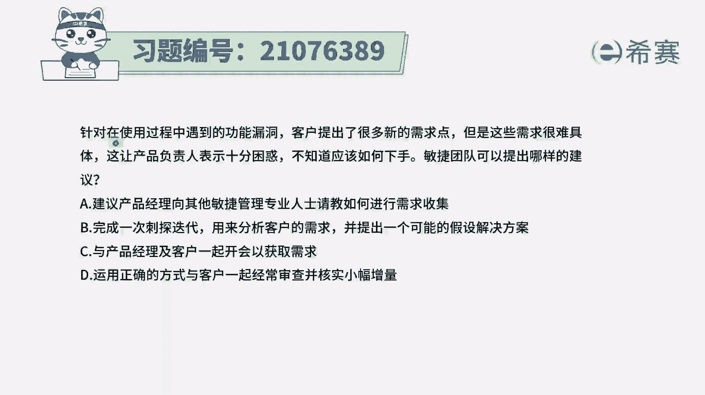
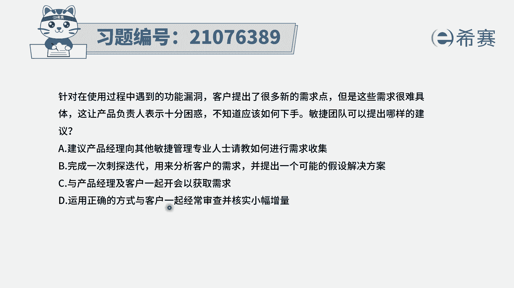
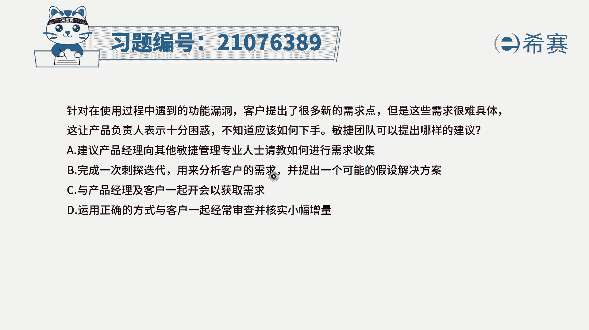
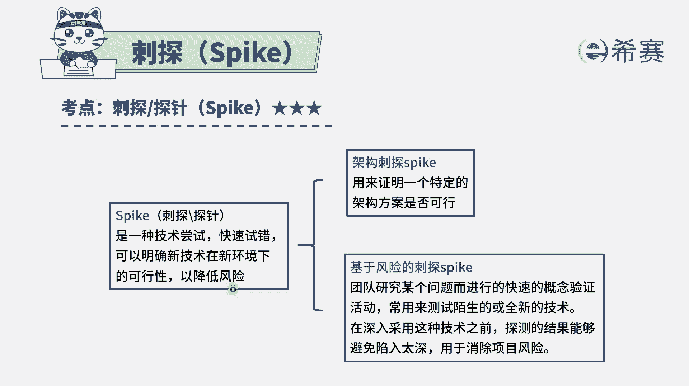
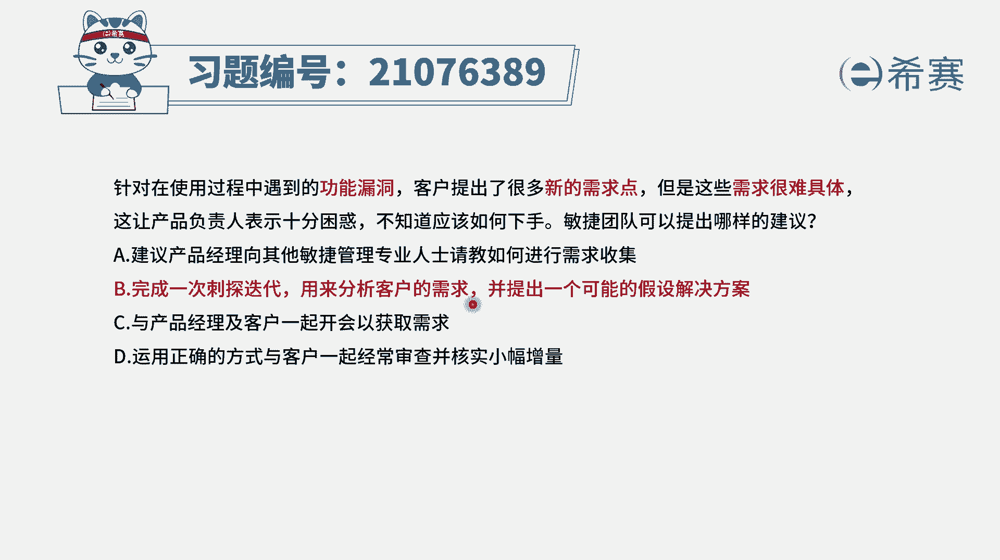
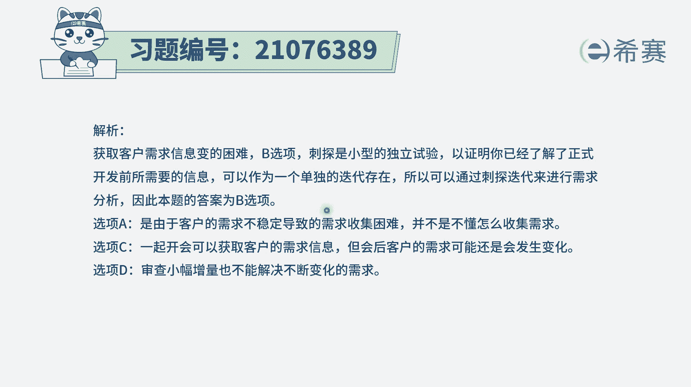

# 搞定PMP考试50%的考点，180道敏捷项目管理模拟题视频讲解，全套免费观看（题目讲解+答案解析） - P69：69 - 冬x溪 - BV1A841167ek

针对在使用过程中遇到的功能漏洞，客户提出了很多新的需求点，但是这些需求很难具体这样，产品负责人表示十分困惑，不知道应该如何下手，敏捷团队可以提出哪样的建议，选项A。

建议产品经理向其他敏捷管理专业人士请教，如何进行需求收集，选项B完成一次次趟迭代，用来去分析客户的需求，并且能够提供一个假设解决方案，选项C与产品经理以及客户一起开会，以获取需求选项D。

并用正确的方式与客户一起经常检查。

并核实小幅增量，那这里我们需要去看到在做项目的过程中啊，因为客户提了很多新的一些需求点，而这些需求点很难去具体，那要怎么办呢，首先呃B选项跟客户来去，经常审查能不能解决这个问题，其实不太能够解决。

因为你不太了解他的需求点是什么，那么这一轮迭代要做什么东西都不太清楚，所以这个选项它并不能够解决，对于需求不清晰的事情，而A选项建议产品经理向其他的敏捷管理，专业人士来请教如何收集需求。

那现在不是说不会去收集需求，关键是客户的这些需求有太多的不确定的东西，没有定下来，不知道该怎么弄，所以呢这种方式理论下来，我们会假设这些人他都是专业的，理论上面我们都会假设这样一些产品经理。

他都是专业的，Product owner，都是专业的，所以这个也不合适选，至于说B和C，首先C选项是可以选的啊，其实是一个可选项，说与产品经理以及客户一起来开会去获取需求，这肯定是一个可选项。

就是我们一起来开会，来正式去更多的了解大家的需求，只是说在整个敏捷中呢，客户他的需求是持续会提出来的，我们不是有一个词叫拥抱变化吗，所以他有可能会是反反复持续会提很多需求。

那我们可能要做很多人这样的事情嘛，可能不太能够去完整的解决它，而至于说B选项，它会是一个很有很有意思的尝试，说完成一次次大的迭代来去分析客户的需求，也就是说我们会把对于客户的需求，这样一个事情的理解。

我们来把它当做一个迷你的迭代，然后用刺探的这种方式，用尝试的方式来去完成刺探。

它是什么意思呢，刺探是指我们做一种技术的尝试，通过这种快速试错或者快速是对的方式，来了解一些信息，来了解某个东西的可行性，一般来大部分时候是用来，去帮助我们确定一些事情，从而避免风险。

而在这里的话呢，其实是可以去帮助我们去确定这些需求，从而避免这种需求不确定的这一个方式，所以它是一个可选项呃，就是以后你其实在敏捷这样一个题目中呢，当你遇到很多这种不确定的东西的时候呢。

你都应该要考虑一个词叫能用刺探，叫刺探，OK用这种刺探的方式来去解决这一不确定性，所以这个题目的答案就是选B选项，完成一次次上迭代，用来去分析，那我也说了，C选项其实是一个可选项。

与产品经理和客户一起来开会去获取，它是一个可选项，只是说因为客户他的需求总是会发生变化，所以我们其实来做一轮也只能是得到这一轮，而如果说我们可以通过某些方式，能够帮助客户去清晰某些东西。

那有可能后续的这些事情都能够更好的去清洗，但这也只是一个设想啊。

对于考试而言的话，选B会更推荐。

