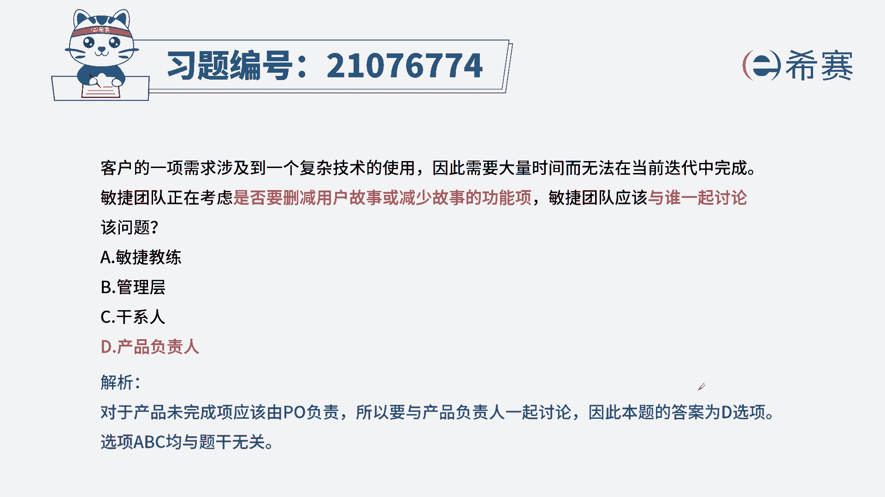
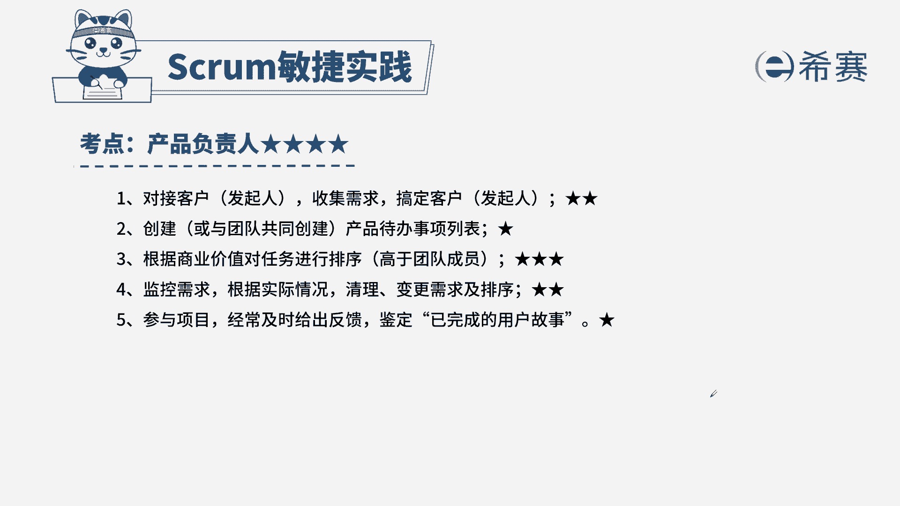

# 搞定PMP考试50%的考点，180道敏捷项目管理模拟题视频讲解，全套免费观看（题目讲解+答案解析） - P6：6 - 冬x溪 - BV1A841167ek

客户的一项需求涉及到一个复杂的技术使用，因此需要大量时间而无法在当前迭代中完成，敏捷团队正在考虑，是否需要删减用户故事或者减少故事的功能项，敏捷团队应该与谁一起讨论该问题。

A敏捷教练B管理层C干洗D产品负责人，解题思路，首先从题干中找到关键信息，题干告诉我们，我们要去删减故事或者功能上，也就是说调整需求的优先级和多少，想到我们在敏捷项目中按照产品待办事项列表。

而产品待办事项列表的最终负责人是产品负责，所以题目问的是和谁来讨论呢，一定是和产品负责人来讨论，所以正确答案是D，我们来看看其他三个选项，A敏捷教练，敏捷教练是帮助团队践行敏捷原则，以及排除障碍。

所以不选B管理层，我们在项目的范围内，所以不需要找我们的管理层，C干洗，干洗就包括了我们的客户和利益相关方，即便是需要他们的反馈，也是通过产品负责人，我们团队不能直接对接干洗，这是我们本集的解析。

大家可以暂停看一下，本题的考点是产品负责人的岗位职责，此类型的题目一定是从内容出发，所以我们要知道产品负责人的岗位。

职责边界在哪，哪些归他管。