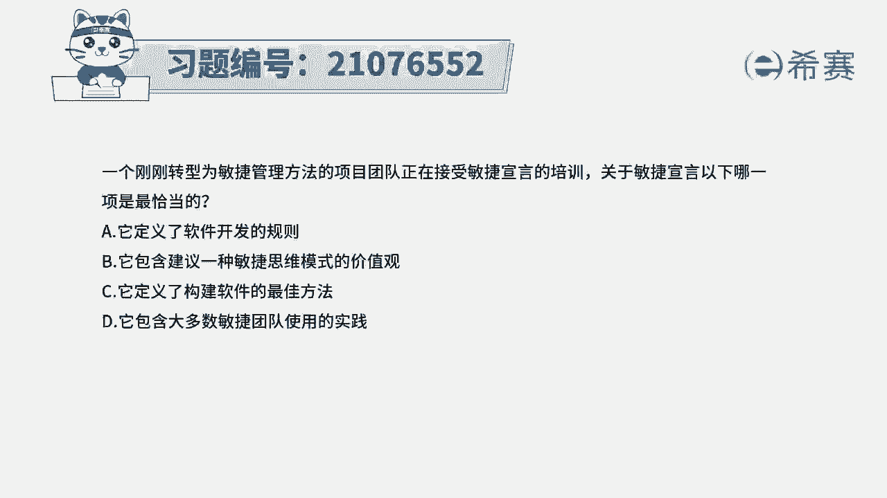
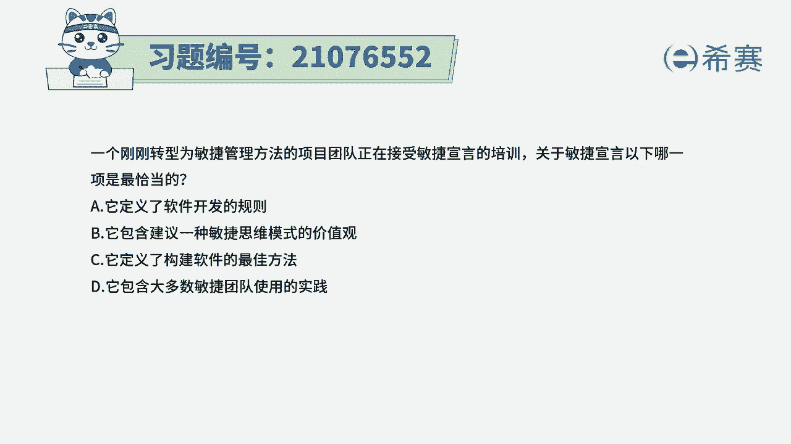
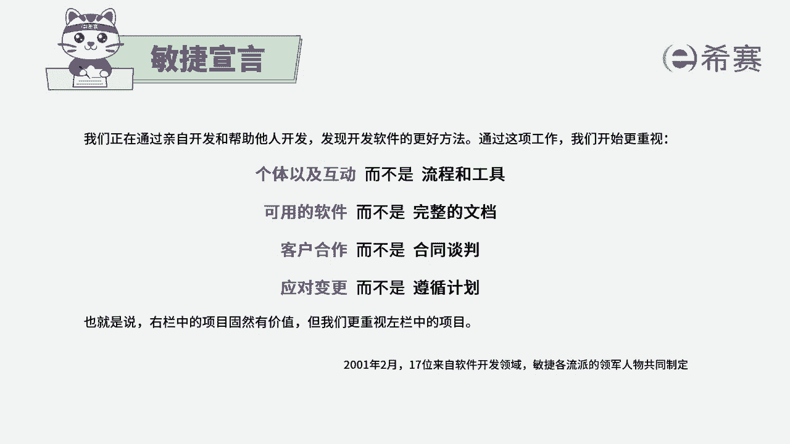
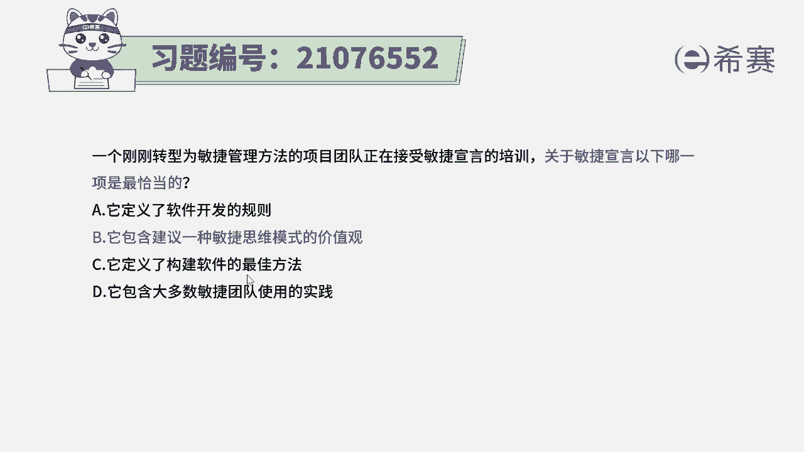
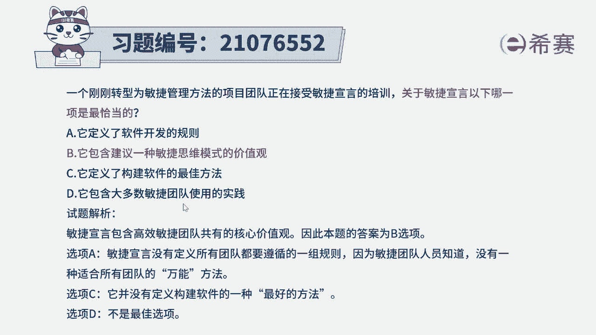

# 搞定PMP考试50%的考点，180道敏捷项目管理模拟题视频讲解，全套免费观看（题目讲解+答案解析） - P70：70 - 冬x溪 - BV1A841167ek

一个刚刚转型为敏捷管理方法的项目团队，正在接受敏捷宣言的培训，关于敏捷宣言，一下哪一项是最为恰当的选项，它定义了软件开发的规则选项B，它包含建议一种敏捷思维模式的价值观选项C。

它定义了构建软件的最佳方法选项D，它包含了大多数敏捷团队使用的实践。

那我们需要知道一下敏捷宣言都包含什么信息，其实敏捷宣言呢是一个非常简短的，这么几句话说，我们在通过开发的时候，发现一种更好的软件开发方法，我们会发现个体以及互动更胜过了流程和工具。

可用的软件更胜过了完整的文档，客户合作更胜过了合同谈判以及辩论，应对变更更胜过了遵循计划，也就是说它会告诉我们一个大方向，大流程，这是一个价值观的这个事情。

而没有涉及到这些很细节，具体的包括说具体软件开发的规则呀，然后具体软件开发的一些方法呀，以及具体的实践，那具体实践包括后面会讲到的一个像SRAM，像XP啊，看板呢，这是很多具体的实践，但是后面的。

而至于说是定义了构建软件的最佳方法，一般来讲说什么什么最佳，这种肯定都是错误的，因为没有哪一种方法是最佳，而只有合适合适某一个场景敏捷开发方法，它并不适用于所有软件开发方法，如果说我们做了一个项目。

它本身是比较确定性的项目，那用传统的方式来去做，用瀑布模型来去做是更合适的。

所以这个题目的答案是选第二个，那解析呢。

