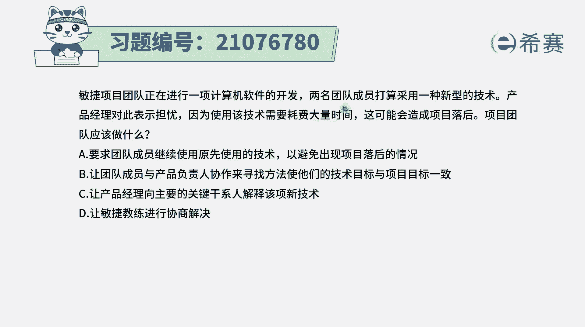
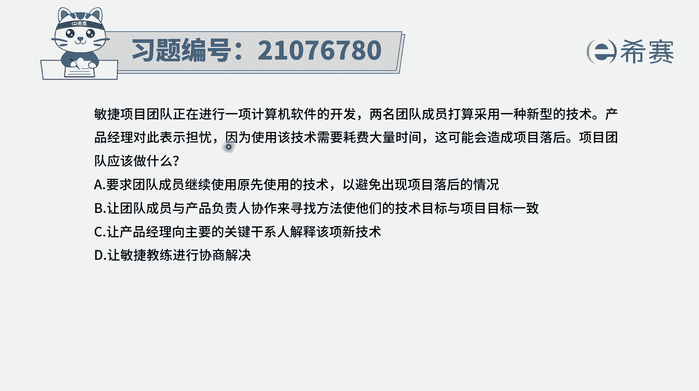
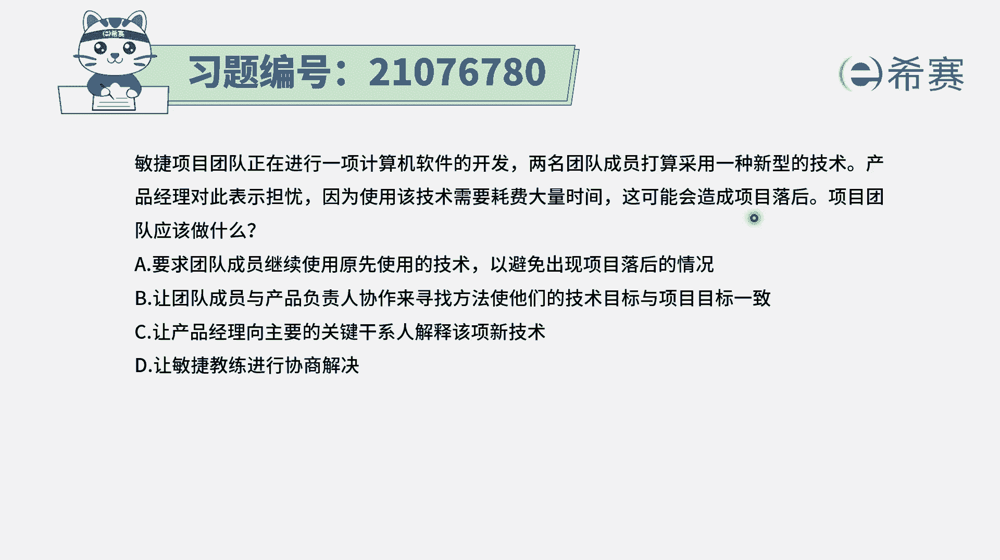
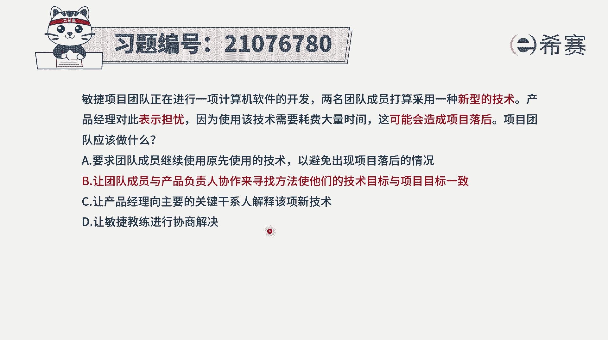
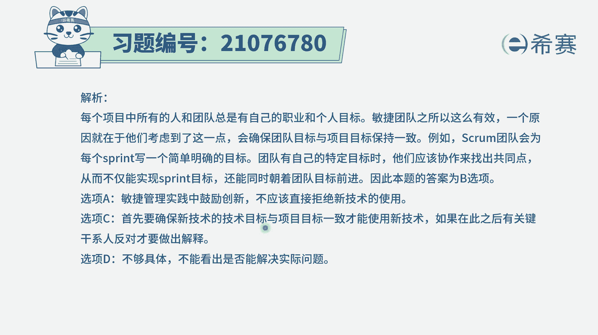

# 搞定PMP考试50%的考点，180道敏捷项目管理模拟题视频讲解，全套免费观看（题目讲解+答案解析） - P72：72 - 冬x溪 - BV1A841167ek

敏捷项目团队正在进行一项计算机软件的开发。

两名团的成员打算采用一种新型的技术，产品经理对此表示担忧。

因为使用该技术将会耗费大量的时间，而这可能会造成项目进度落后。

项目团队应该怎么做，这个的话我们首先知道，其实题干中已经显现出一种冲突，也就是有人想要采用新型的技术，而有人呢，他觉得这种新型技术可能会导致花更多的时间，导致记录游落后，是想要拒绝的。

那么不管是A方想要使用新技术，还是B方想要拒绝使用新技术，用原有技术，其实呢我们要去解决的话，都不能直接去取A方，也不能直接取B方，而最理想的是应该双方能够坐下来一起去沟通，协商，去解决这个问题。

有了这样一个信息以后呢，我们再来看这四个选项，选项A要求团队成员继续使用原先使用的技术，以避免出现项目落后的情况，那就很显然就是否定了这个A方，这种肯定是不选的啊。

选项B让团队成员与产品的负责人来去协作，以寻找一种方法，使他们能够去把这个技术目标和项目目标，达成一致，那这个刚好就是一个可选项，因为呃他是能够考虑到双方能够尊重双方，同时让他们一起坐下来去聊。

去协商去聊，至于聊完的结果，是使用新技术还是不使用新技术，那就是按照讨论结果来说了算了，所以答案是选第二个选项，选项C，让产品经理向主要干系人来解释该项新技术，那这个的话潜台词是什么。

潜台词就是已经接受了这样一个团队成员的，打算接手这样一个使用新型技术的方式，我们刚刚在解释A选项的时候，有讲过，说你直接去取A否定B，或者说是直接取B否定A都是不合适的，所以C选项呢也不选选项D。

让敏捷教练来进行写生，那在这里的话，到底是让敏捷教练来参与一些山更好一点，还是让团队成员自行来讨论解决更好一点，肯定是让团队成员自己解决，因为整个敏捷他的团队是一个自组织团队。

一般来讲优先让团队成员自我解决，在解决不了的情况下，才让敏捷教练参与进来去做干预解析。

