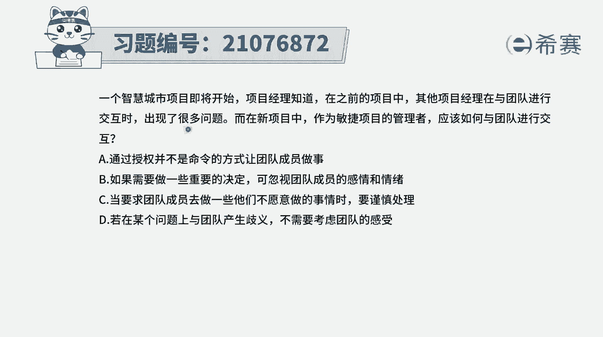
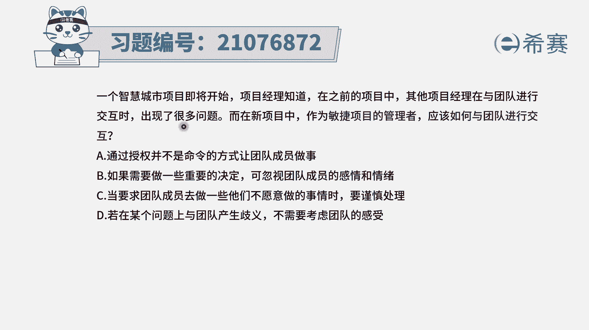
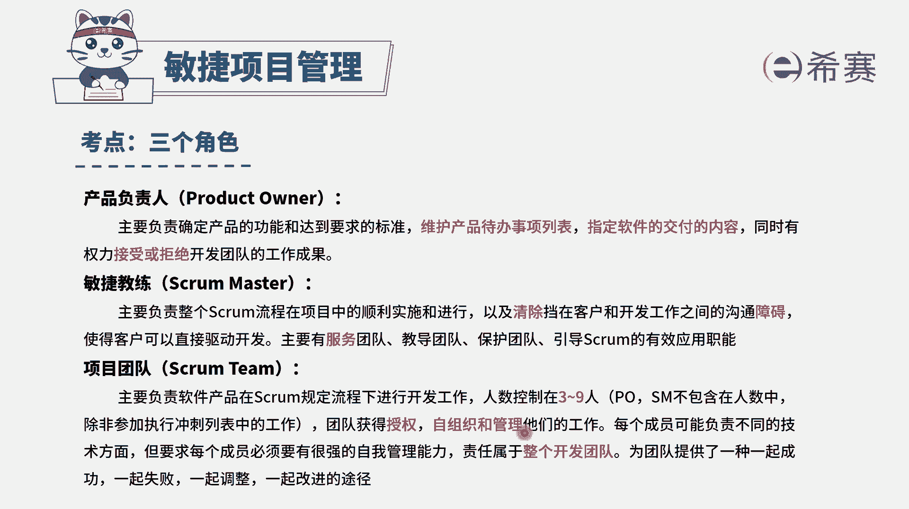
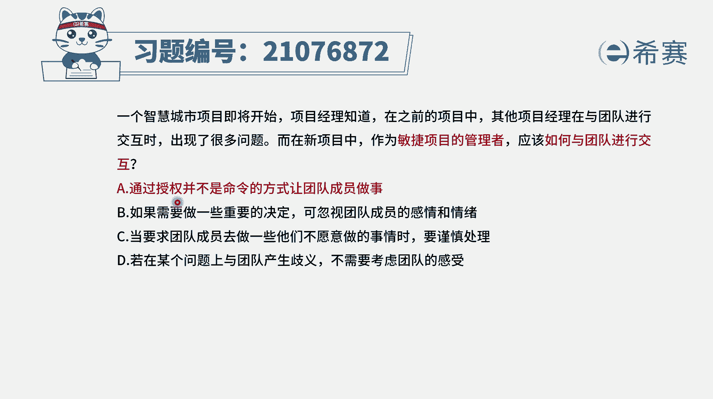
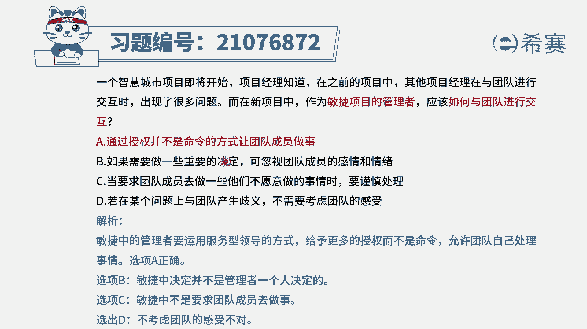

# 搞定PMP考试50%的考点，180道敏捷项目管理模拟题视频讲解，全套免费观看（题目讲解+答案解析） - P73：73 - 冬x溪 - BV1A841167ek

一个智慧城市项目即将开始，项目经理知道在之前的项目中，其他项目经理在与团队进行交互时，出现了很多问题，而在新项目中，作为敏捷项目的管理者，应该如何与团队进行交互呢，那么这里其实会告诉我们说。

作为一个敏捷项目管理的这样一个项目，管理人员，或者说是敏捷教练，我们在跟团队进行交互的时候啊，你通常充当的是一个叫仆人式领导的角色，而团队呢他是一个自组织的团队。

他的工作内容是由他自己去主动认领，所以在这里有这样一个信息，就是敏捷教练，你冲他的是帮他去清除障碍，当他去服务团队，然后保护团队，教导团队，你是充当这样一个资源库，资源池的这样一个角色。

而团队是一个获得授权，自我组织。

自我管理的这样一个团队，所以大家有各自的位置，不能够越界好，有了这个信息以后，我们再来看一下选项A通过授权，而并不是通过命令的方式来让团队成员做事情，这刚好就是符合，所以答案就是正确的on。

然后第二个选项如果需要做出一些重要的决定，可以忽视团队成员的感情和情绪，这肯定就是不对的，因为本身这个团队它是一个自组织团队，你去忽略他的这样一个情感和这种情绪，就直接做决定。

那大家就没有办法很好的去往前推进了啊，因为大家都是想要去一起成功，一起失败，一起调整，一起改进的这样一个角色，所以你需要去照顾到大家的情绪，让他自己做主选项C，但要求团队成员去做一些他们不愿意做的事情。

的时候，要谨慎处理，其实一般来讲，敏捷教练你是充当这样一个仆人式领导，你不会去要求他们做一些不愿意的事情，你最多是去引导他们去做他们该做的事情，形象地，如果在某个问题上与团队产生歧义。

不需要考虑团队感受，这个都是错的啊，所以BCD都是错误选项，答案是A，作为敏捷项目管理的这样一个专业人士，你跟团队交互的方式应该是通过授权的方式。

而不是命令的方式来让团队做事情。

