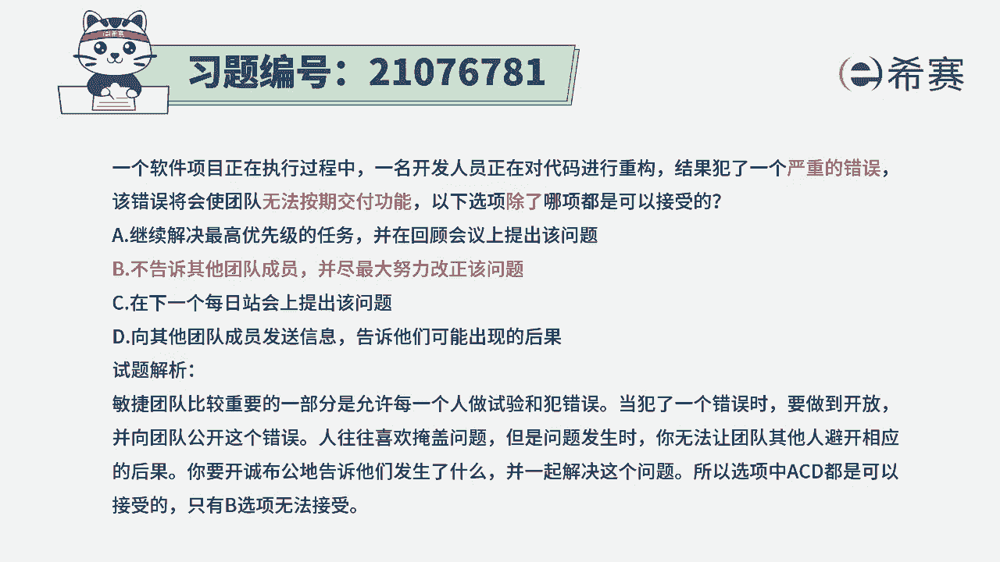

# 搞定PMP考试50%的考点，180道敏捷项目管理模拟题视频讲解，全套免费观看（题目讲解+答案解析） - P77：77 - 冬x溪 - BV1A841167ek

一个软件项目正在执行过程中，一名开发人员正在对代码进行重构，结果犯了一个严重的错误，该错误将会使团队无法按期交付功能，那么以下选项除了哪项都是可以接受的，请注意，这里说除了哪项。

也就是说有三项的这种措施，措施都是可以接受的，有一项不能接受，我们来看一下选项A，继续解决最高优先级的任务，并在回顾会上提出该问题，那这种方式的话呢，虽然说没有直接马上把这个问题给亮出来。

但是还是会积极主动亮出来，并且当下手头上会做优先级最高的事情，这是可行的啊，选项B不告诉其他团队成员，并尽最大努力去改正问题，这个尽最大努力去改正问题本身肯定是没问题，关键是不告诉团队成员。

那我们在其实不只是敏捷啊，整个pm这一套体系中会倡导的，我们是积极的，诚实的，正直的，善良的，尊重别人的，那你你犯了错误，你要去隐藏这种方式肯定就不合适了啊，所以这个B选项肯定是一个错误选项。

对于错误选项，那就是刚好是除了这一项，其他都能接受，所以这一项是不能接受的啊，不能说你犯了错误以后不告诉大家，然后自己偷偷摸摸的去改正，这种方式是不可行的，那么剩下的两个选项呢也都是可以接受的。

我们一起来简单看一下选项C，那就是马上就提出来，对不对，选项B向其他团队成员发送信息。

告诉他们可能出现的结果，这也是在勇敢的去承担承认，那这道题目会告诉我们，当我们遇到这样一些问题，或者是犯了一些错误的时候呢，不要去掩盖，而是要去面对这个问题，开诚布公地告诉团队成员。

并且一起想办法去解决这个问题，并且我们团队是一个自组织团队呀。

