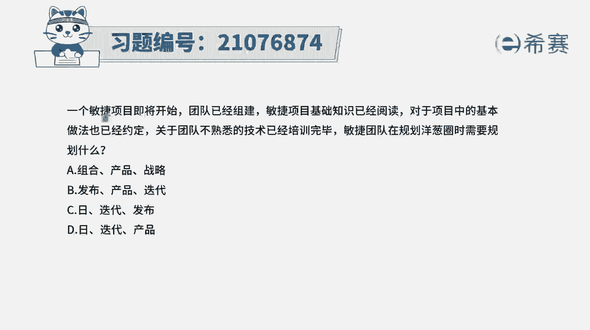

# 搞定PMP考试50%的考点，180道敏捷项目管理模拟题视频讲解，全套免费观看（题目讲解+答案解析） - P78：78 - 冬x溪 - BV1A841167ek

一个敏捷项目即将开始，团队已经组建敏捷项目，基础知识已经阅读，对于项目中的基本做法也已经约定，关于团队不熟悉的技术已经培训完毕，敏捷团队在规划洋葱圈时需要规划什么呃，这里面你看到他说是组合产品战略。

然后是发布产品迭代，然后日迭代，发布日迭代产品这些信息的话，其实会让他感觉一脸懵逼对吧，但是你如果说能够去回忆起洋葱圈的话呢。

你可能做起来又会容易一点，关于洋葱圈，它其实就是我们说一个大洋葱，它一层一层一层一层对吧，外面一层里面还有小的小的，里面还有更小的，里面还有更小的，然后这个图形呢就有点像洋葱，所以才叫它洋葱圈。

最外层的是我们所关注的啊，最外层是愿景，然后其实是产品路线图，然后是发布计划到迭代计划，到每日计划或者是单日计划，一般来讲，开发人员所关注的是什么，开发人员所关注的也就只有发布计划。

迭代计划和每日计划这些内容，当然了，如果说要再往上面走呢，其实还有公司整个它的一些战略呀，资产啊，产品啊之类的。

有了这些信息以后，我们再来看一下这几个选项中，他说敏捷团队所需要去关注的，那敏捷团队需要去关注，基本上也是洋葱圈的最里面那三层，也就是说是发布计划，迭代计划和每日计划。

所以答案是选C，那解析在这边需要的同学可以自行查看一下，这是一个属于实际类的题目。

