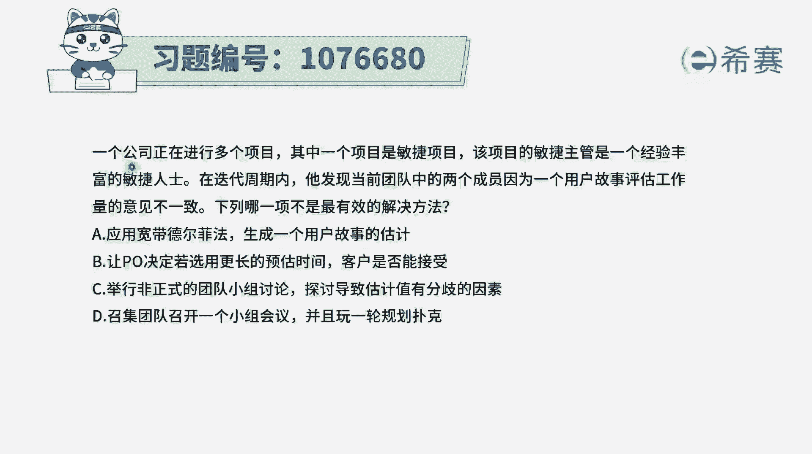
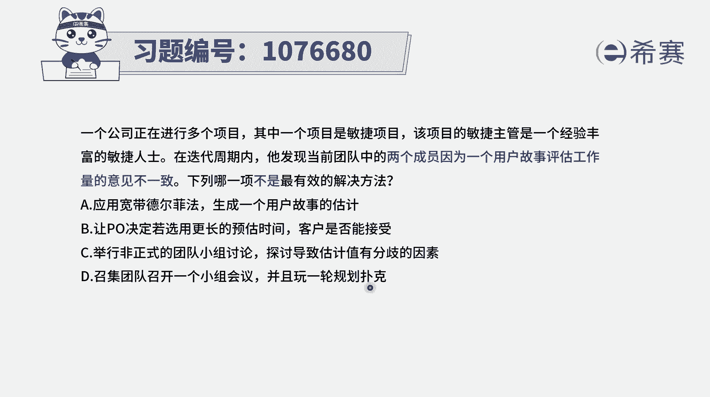
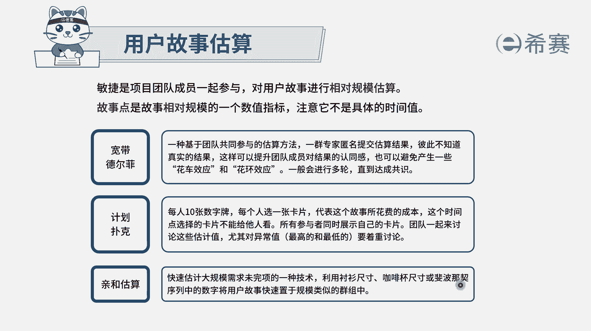
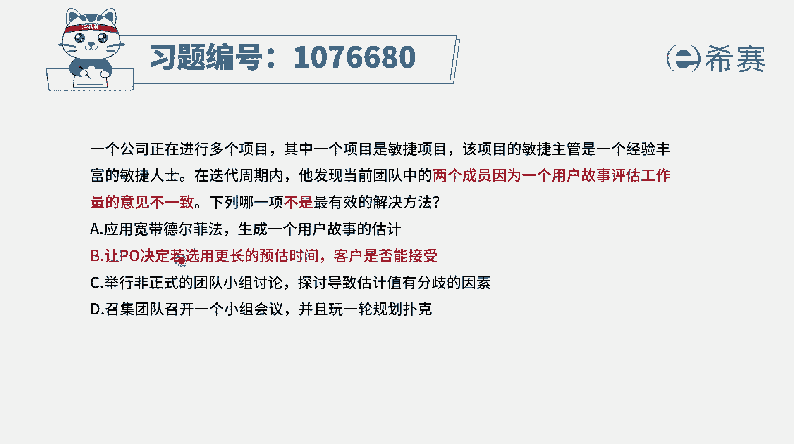
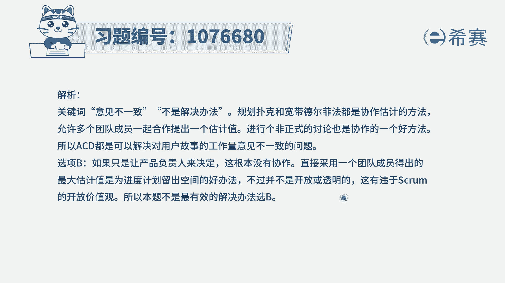

# 搞定PMP考试50%的考点，180道敏捷项目管理模拟题视频讲解，全套免费观看（题目讲解+答案解析） - P81：81 - 冬x溪 - BV1A841167ek

一个公司正在进行多个项目，其中一个项目是敏捷项目，该项目的敏捷主管是一个经验丰富的敏捷人士，在迭代周期中，他发现当前团队中的两个团的成员，因为一个用户故事评估工作量的意见不一致。

下列哪一项不是最有效的解决方法，请注意他说的是不是，也就是说至少有三种解决方法都是可行的，都是可选的，那我们就比较放心了对吧，来看一下选项，A，应用宽带德尔菲的方法，来生成一个用户故事的估计或估算。

这肯定是可行的一种方式，我们知道一般的估算也就是用到宽的德尔菲亚，用到清河图啊，咖啡杯啊，衬衫尺寸啊，这样一些东西，当然也可以用理想时间这种方式，所以这个肯定是可以选的，第二个让PO就产品负责人。

让PO来去决定如何选用更长的估算时间，客户是否接受，请注意，一般来讲我们说这样一个优酷故事的评估，谁来评估呢，就是由团队来去评估，因为是团队来去落实，去开发去执行，所以需要团队去评估。

而PO它更关注的是需求以及对于需求的验收，它是对于这样一个产品待办事项列表，这个事情来进行验收的，所以这个选项一看就明显是一个错误选项，而试卷题目中说的是哪项，不是，那就选它了。

它就不是其他几个正确选项，我们也来看一下啊，选项C举行非正式的团队小组讨论，来探讨导致估算值有分歧的因素，这肯定是可学的嘛，就是既然大家有分歧，我们来了解一下到底是什么原因导致的分歧。

我们做根本原因分析，通过这种讨论的方式，选项D召集团队来召开一个小组会议，并且玩一轮规划扑克，那这个规划这个词，有的时候跟计划这个词你可以替换着去使用，它只是翻译的不相同，这规划补课，所以就是计划补课。

那刚刚有讲过，通常估算的时候可以用到宽带，德尔菲，可以用到计划补课，可以用到这种亲河图，清河图可以用到衬衫尺寸，咖啡杯或是斐波拉契数列，那计划补课呢，也同样的可以用到这个非波拉契数列，都是可行的。

所以这个里面的话只有这个B选项。

让产品负责人PO来做决定，这种方式肯定是不可选的。

是错误选项。

