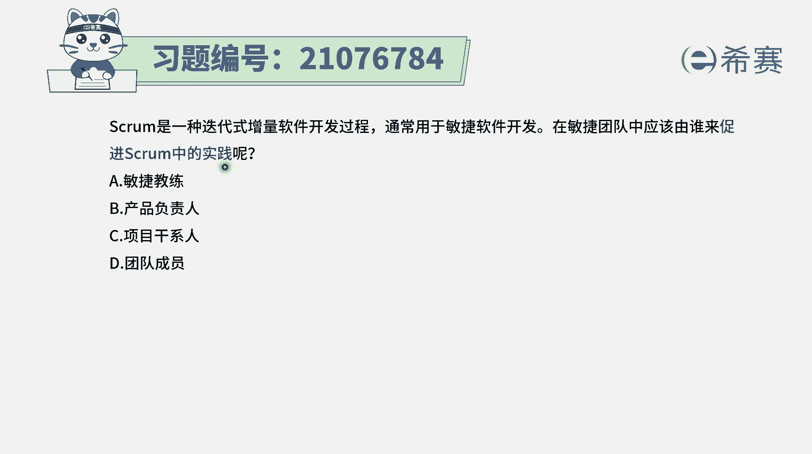
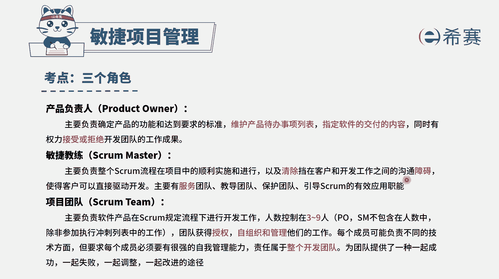
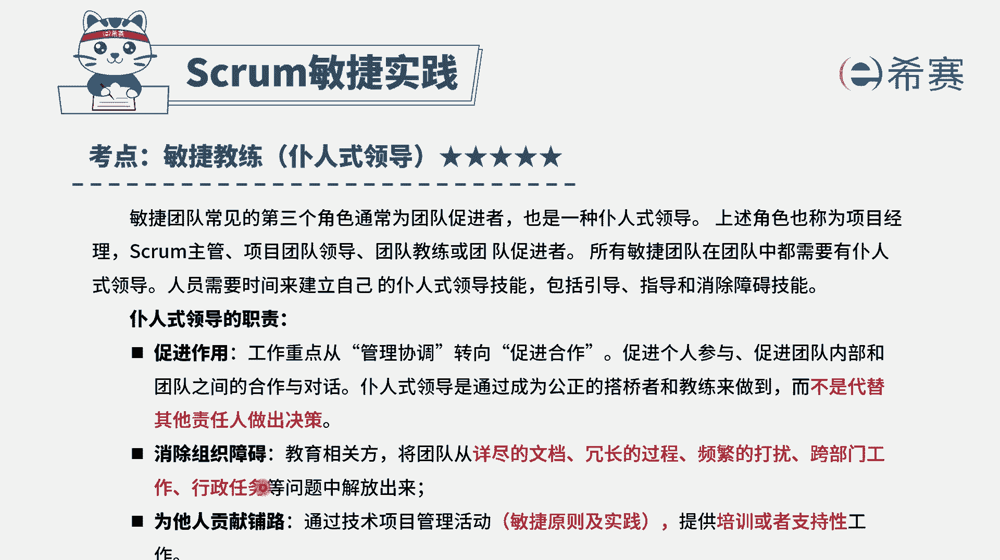
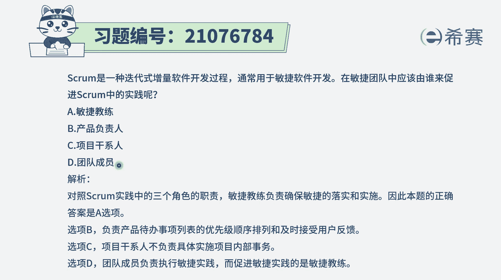

# 搞定PMP考试50%的考点，180道敏捷项目管理模拟题视频讲解，全套免费观看（题目讲解+答案解析） - P82：82 - 冬x溪 - BV1A841167ek

SM是一种迭代式蒸面软件开发的过程，通常适用于敏捷软件开发，在敏捷团队中，应该由谁来促进世冠中的这个实践呢，也许是谁来负责去推进这个one的实践。

我们要知道一下啊，就是有这样一个角色叫敏捷教练，这个敏捷教练呢，它是主要去负责整个square流程，在项目中的顺利实施和进行，如果说这个实况流程，在项目实施过程中遇到一些什么挑战，困难这些障碍。

那敏捷教练呢要负责去清除这些障碍。

所以呢这个角色答案就肯定是敏捷教练了啊，而敏捷教练他在这里有一个更详细的信息，他是把这种管理的方式，转化成一种促进和协作的方式，去促进团队内部也好呀，个人也好呀，还客户之间也好，要更好的去互动和协作。

去推动整个这样一个事情往前推进，然后包括说如果在做项目的过程中有什么障碍，要去清除这些障碍，然后团队如果不会。

我们需要去给他培训和支持，所以呢这个角色应该是由敏捷教练来负责，其他几个选项也简单看一下，那产品负责呢，它主要是对产品待办事项列表来负责的，然后项目干系人呢是所有会影响项目。

或者说是被项目影响的这样一些相关方，那这个的话它其实来源来源比较广，所以没有一个具体的说他是负责什么事情，选项D团队成员，那团队成员呢是一个自组织，团队是负责去落实或者去具体去开发。

去做这个项目来完成目标的这样一个群体解析，在下面。

