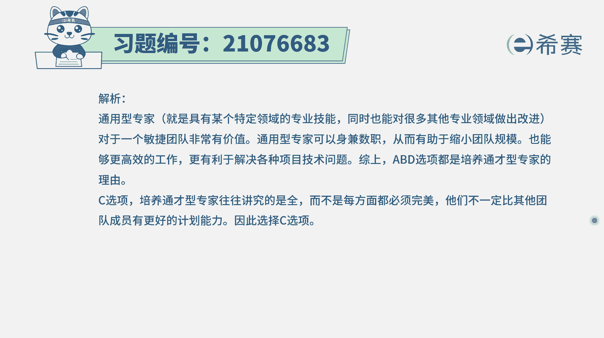

# 搞定PMP考试50%的考点，180道敏捷项目管理模拟题视频讲解，全套免费观看（题目讲解+答案解析） - P86：86 - 冬x溪 - BV1A841167ek

组织正在转型敏捷，这对敏捷团队成员做出了更高的要求，也对应的需要有更多相关培训和经验传授，在敏捷中，更提倡和鼓励团队成员成为通才型专家，那么以下哪一项不是组织这样做的理由。

也就是鼓励有更多人成为通才型的专家，就是我们所谓的叫T型人才，一专多能，就什么都懂一些，同时在某一方面很强，那哪一项不这样做，那么也就是有三项都是鼓励大家成为B形成的，这样一个好处对吧。

那我们就看一下啊，T型车都有哪些好处，选项A说培养通才型专家，有利于缩小项目团的规模，这样呢更符合敏捷性，这刚好是的对吧，如果说每一个能干的事情会比较多，种类比较多。

那我可能就不需要那么多人来形成一个团队，我少数几个人，每一个人都能够完成整个这个事，项目里面所需要做的全部事情，他就会更惊艳，然后我们也知道一个词叫船小好调头，所以它会更敏捷一些，在响应变更的时候呢。

它也会反应更迅速，更敏捷，所以A选项是它的一个合适的选项，选项B培养通常型专家团队，能够提高团队成员的工作效率，那肯定的，他既然都是一专多人，他什么东西都懂一些，同时在某一方面很擅长。

所以它一定是会能力比较强，效率更高，选项C培养通常型专家团队，能够提高团队在计划方面的能力，这个仍然在整个敏捷中，他其实没有那么推崇关于计划的这个事情，因为它更推崇的是关于拥抱变化，虽然说计划也很重要。

但是他更重视的是变化，所以在这一块呢，其实不会再成为他的一个关注焦点，所以这个呢不是他的这一个重要理由，选项D培养通常型专家团队，能够更有效地去解决技术问题，那肯定的呀，你想一想，每一个人都比较牛逼。

都比较强，同时呢他各方面都还懂一些他的那种知识，内容会比较丰富呃，比较广博，这样的话面对问题的时候，他也许可以通过不同的维度的东西来去参考，从而更有效的去解决问题对吧。

所以这个ABD都是这种鼓励通才型专家的，这个好处啊，而C选项不是我们都要去知道一下C选项，这个在米中它更提倡的是拥抱变化，而不再是那个遵循计划。

那么解析在这边，需要的同学们可以自行查看一下，我们需要去了解一个很重要的信息。

就是说整个敏捷团队呢他是一个自我组织，做管理的团队，那鼓励团队成员都是成为这种通常型的专家，也是所谓的T型人才，他既有专业化的地方，同时呢又在别的方面都会略懂一些，这样的话可以让我们是有更小的。

更少数的几个人就组成了一个团队，能够去解决更多的问题，同时团队越小的话呢，它也灵活性越高，同时团队他每个人都越越牛的话呢。

