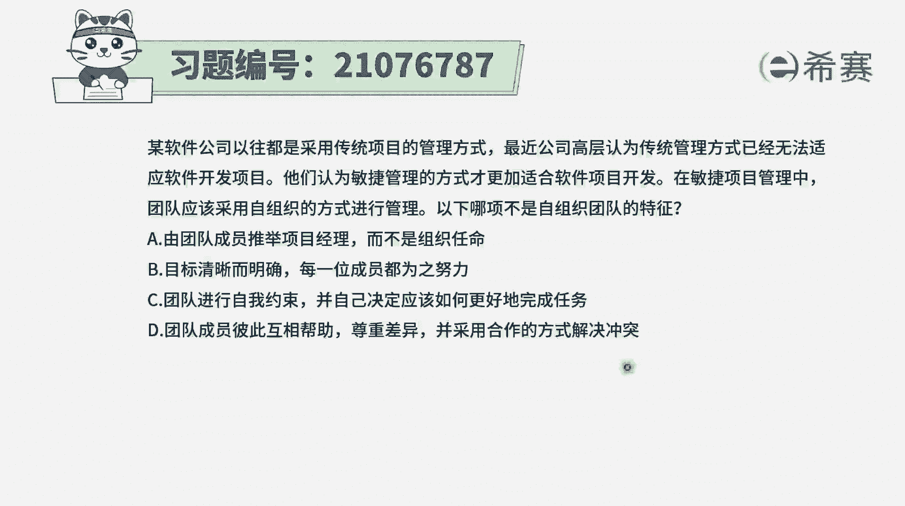
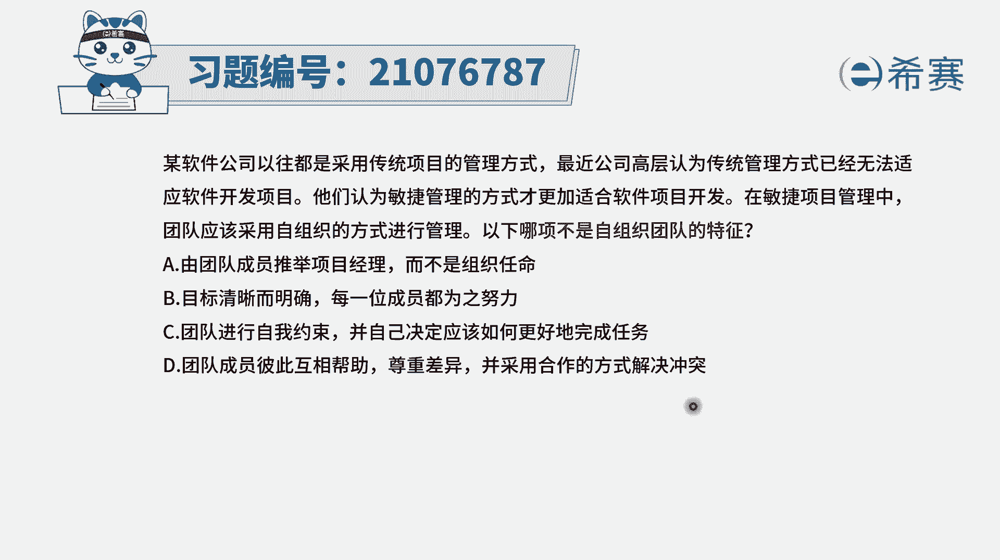
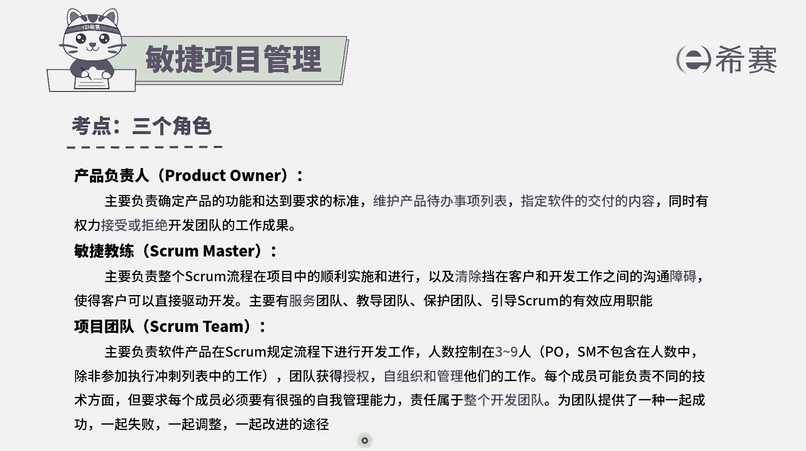
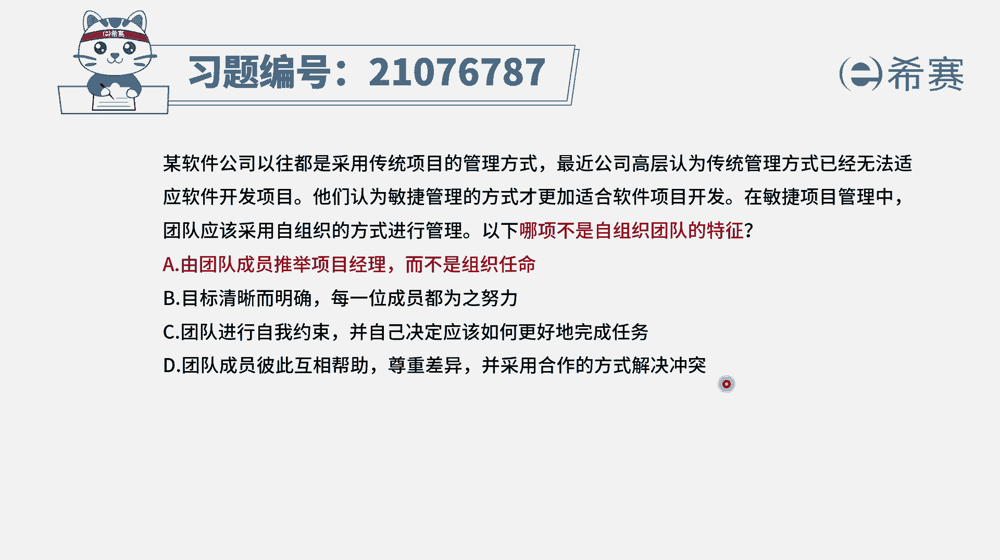
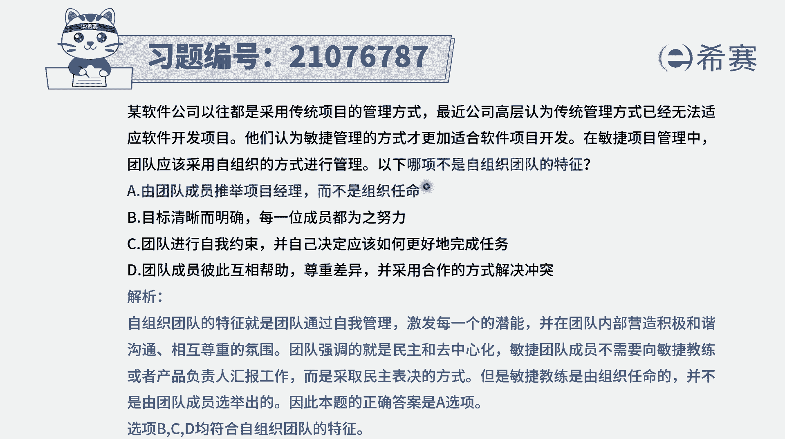

# 搞定PMP考试50%的考点，180道敏捷项目管理模拟题视频讲解，全套免费观看（题目讲解+答案解析） - P87：87 - 冬x溪 - BV1A841167ek

某软件公司以往都是采用传统项目管理方式，最近公司高层认为，传统管理方式已经无法适应软件开发的项目，他认为敏捷管理的方式，才更加适合软件项目的开发，在敏捷项目管理中，团队应该采用自组织的方式来进行管理。

那么以下哪一项它不是自组织团队的特征，请注意他说的是不是。

也就是说有三条都是自组织管理的特征，我们需要知道，在敏捷中，项目团队是一个自组织团队，他是自我组织，自我管理，那工作内容呢有时他们自我去认领，然后那种具体的工作这样一些情况呢，是自己去跟大家同步。

便是内部相互协调协作去完成事情，大家是一起成功，一起失败，一起调整，是这样一些信息。

有了这样一个内容以后，我们再来看一下这四个选项，选项A由团队成员推举项目经理，而不是有组织名，这个还真不是啊，因为那个敏捷教练也好，产品负责人也好，这是公司来去任命的，而不是由团队来任命的。

团队只能是去自组织团队内部的这些事情，团队不能自己去推出一个项目经理，来去领导这个团队，这个不可以的啊，所以答案A是错误选项，那其他几个选项就都是正确的咯，那我们一起来看一下选项B目标清晰而明确。

每一位成员都为之努力，那整个自组织团队中，其实就是虽然说要做的事情，它的范围可能会发生很多变化，但是我们整个要做的事情本身还是非常清晰的，并且呢每一个情绪都是有自我控制能力，是自己来去管理自己。

所以这个B选项是正确的选项，C团队进行自我约束，并自己决定应该如何更好地完成任务，所以团队他要求每一个人都是一个，通常性的专家，然后他都是一专多能的，然后能够更好地去积极上进的去解决问题。

这也是自组织里面的一个特点，还有C选项，团队成员彼此相互帮助，尊重差异，采用合作的方式来解决冲突，也就是尊重每一个人的差异，然后来去自己在能够的情况下呢，自己解决问题，自己解决冲突。

当然如果是有必要的话呢，可以引进外面的一些信息来去干预，比方说请敏捷教练来做干预，或者是寻求更多的帮助也是可以的，但是在问题还不是很严重的时候，或者是还有比较有时间充裕的时候呢，是可以团队内部来解决。

所以这个D选项也是正确的。

这样看下来的话就就很清晰了，就只有A选项是错误的啊，就敏捷教练和产品负责人。

