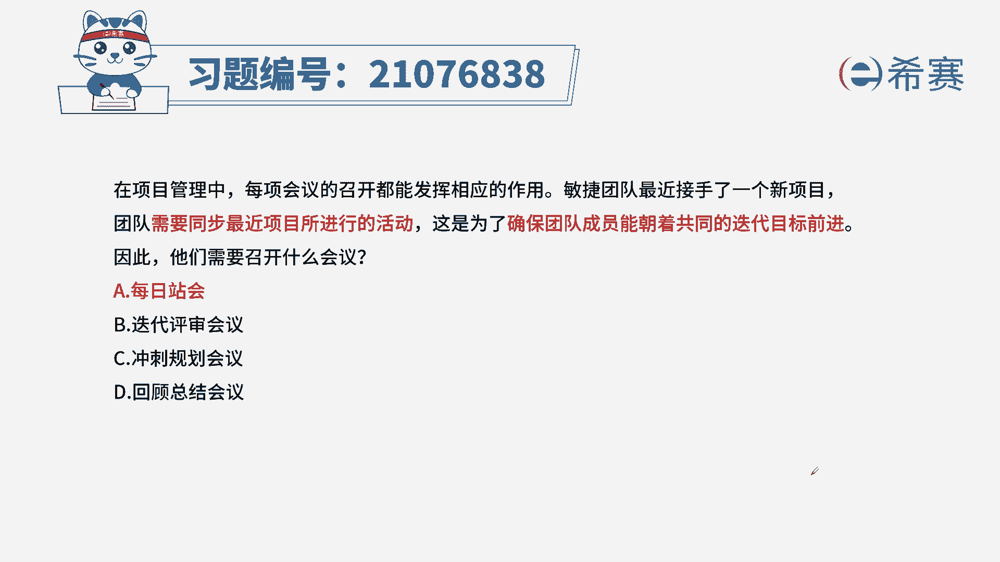
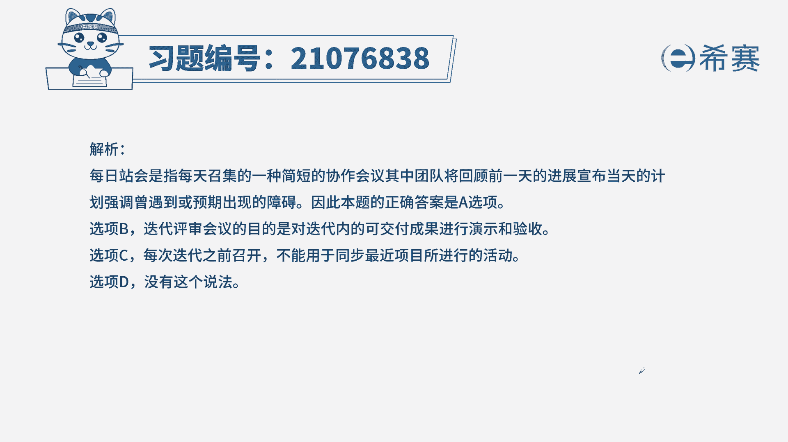
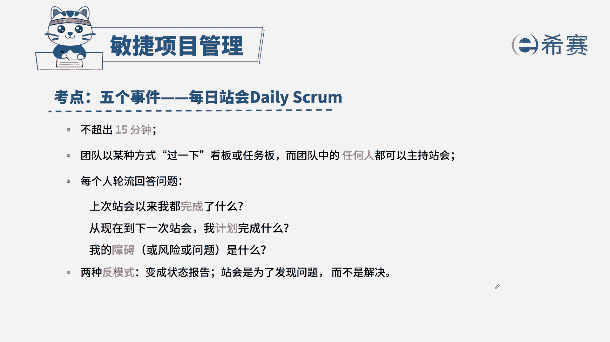

# 搞定PMP考试50%的考点，180道敏捷项目管理模拟题视频讲解，全套免费观看（题目讲解+答案解析） - P8：8 - 冬x溪 - BV1A841167ek

在项目管理中，每项会议的召开都会发挥相应的作用，敏捷团队最近接手了一个新项目，团队需要同步最近项目所进行的活动，这是为了确保团队成员，朝着共同的迭代目标前进，因此他们需要召开什么会议，B迭代评审会议。

C冲刺规划会议，D回顾总结会议，通过题干我们抓到关键信息，团队需要同步最近的活动，也就是同步信息，我们还要说一下具体遇到了什么样的问题，把这个问题抛出来，让大家都了解。

那这些问题就是妨碍我们实现目标的障碍，所以我们选择A选项，B迭代评审会议，评审会议是进行功能验收演示的会议，C冲刺规划会议是在每次迭代之前我们进行的，规划，会议要确定一下本次迭代我们需要做哪些需求。

D回顾总结会议呢，因为是翻译的问题，你可以把它理解成我们的回顾会议就可以了，回购会议是在我们本次迭代之后，对本次迭代进行工作总结，哪些地方做得好，哪些地方需要改进啊。

以及把相对应的好的经验，延续到下一个迭代周期里面，这是本题的解析。

大家可以暂停看一下，针对于此类型的题目，我们如何快速做对，首先内容要熟悉，我们可以分板块，并不一定要一条一条去记，比如时间人物你要说什么话。

