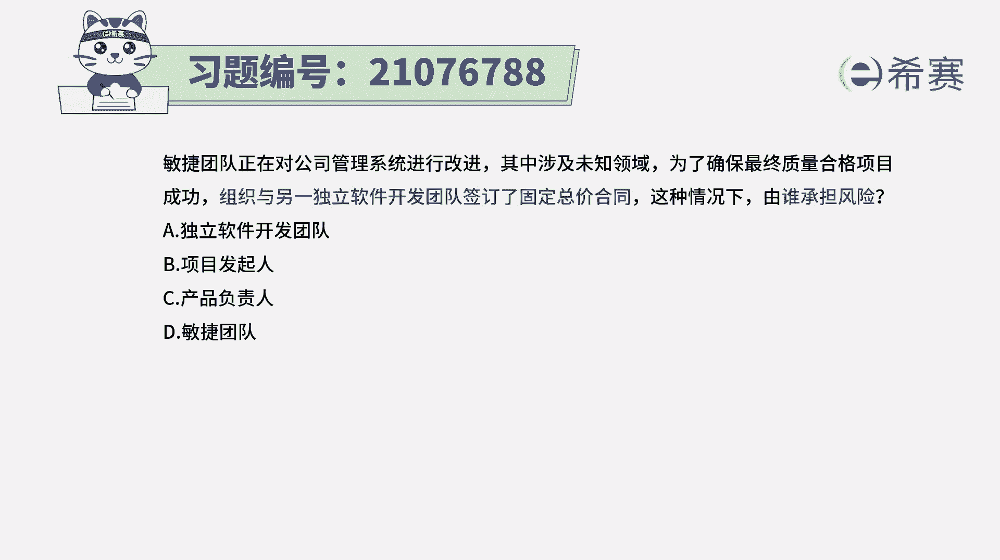
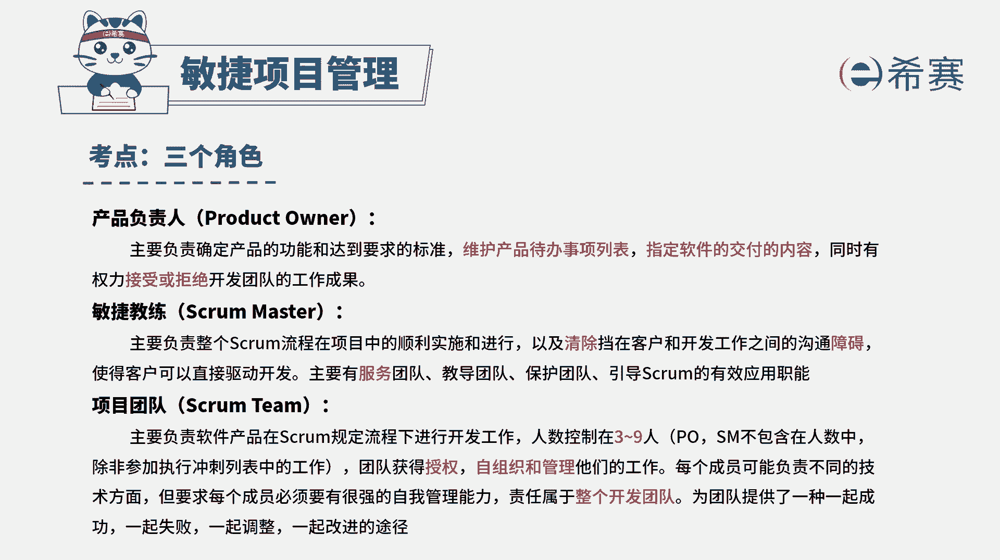
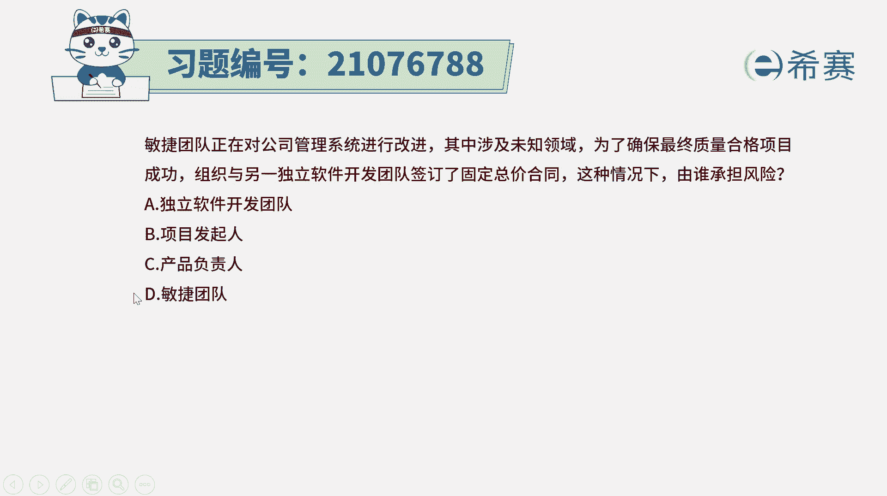
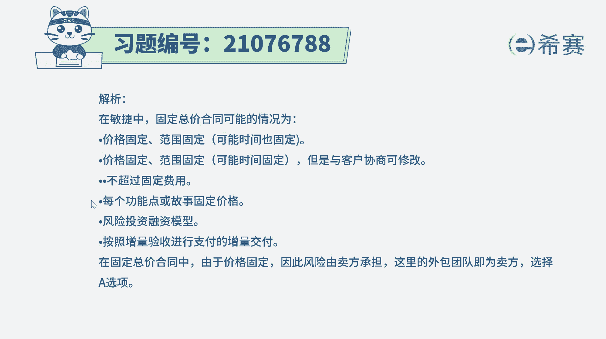
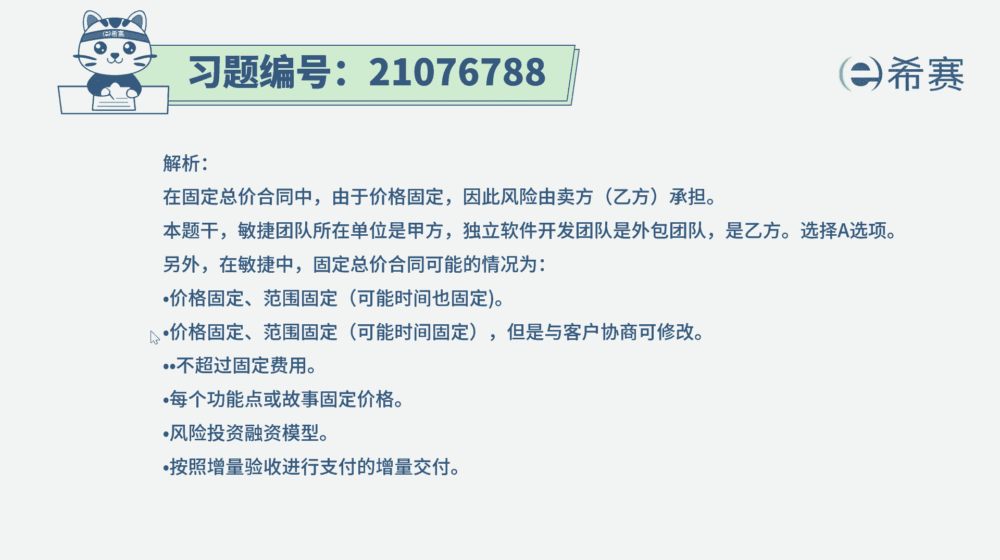
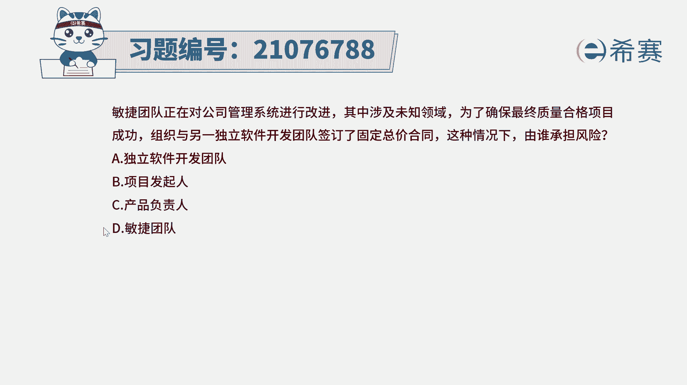

# 搞定PMP考试50%的考点，180道敏捷项目管理模拟题视频讲解，全套免费观看（题目讲解+答案解析） - P92：92 - 冬x溪 - BV1A841167ek

敏捷团队正在对公司管理系统进行改进，其中涉及未知区域，为了确保最终质量合格，项目成功，组织与另一个独立软件开发团队，签订了固定总价合同，这种情况下由谁承担风险，这个里面的话我们需要去知道两个信息。

首先第一个关于固定总价合同，那么风险在谁，固定总价合同，它特指的是这个项目总共要多少钱，就已经明确了，在这种情况下呢，乙方你不管怎么样，你要花掉多少钱，你最后只能得出我这边得到这么多钱。

并且你一定要交付我所需要的这个成果，所以在这种情况下呢，风险它是压在了乙方这一边，也就是说是承接这个项目的这一方这一边，这是第一个，第二个呢它是一个独立的软件开发团队。

然后并且是一个敏捷的这种方式来去做的，那关于这样一个题目呢，我们首先需要去知道两个重要的信息，首先第一个就是关于固定总价合同，那相比而言，固定总价合同他会是说我们要去做这个项目，总共要花多少钱。

把这个整体的价格就已经是框死了，那在这种情况下，乙方你需要去，不管你是花更多的钱还是更少钱去完成，你都是只能够拿到我这么多的钱，你同时要去交付我们合同中所约定的，这样一些工作内容。

所以这个时候呢压力都是存在在乙方这一边，也就是说像在这个题目中，组织与另一个独立软件开发团队签订合同，那么就是独立软件开发团队，他要去承担这一份责任，他要去承担这个压力和风险，所以答案其实就是选A了啊。

然后另外呢其实在敏捷中，他还会有这样一个信息，就是关于敏捷团队，他是一个自组织团队，然后团队呢他是一起成功。

一起失败，一直去承担这个风险，只是说在这个题目中，本身敏捷团队他在这里是深为了甲方，那你既然是甲方，对于这种固定总价合同，他就不应该是由甲方去承担，而是由乙方来承担，就是由他来承担。

所以跟咱们这个敏捷团队也好呀，产品负责人和发起人也好呀，都没有关系，是由乙方来去承担这个风险。

那解析呢这里是简单的去看一下，告诉大家在敏捷中，它同样也可以有这样一个固定总价合同，但是这个固定总价合同，它可能会是价格是固定的，然后大致的范围是固定的，然后呢就对应的看时间。

或者说有可能是时间是固定的，那么对应的可能就是呃范围可以去做调整，即使他的人力成本是固定的情况下，那我只要时间固定了以后呢，呃这个整个价格就已经是固定下来，或者是直接是把功能点给固定下来。

功能点固定了以后。

那不管你怎么样去完成，我就是要这么多功能点，展展现的方式会不相同，我们可以一起来简单看一下解析，那通常在固定总价类合同中，由于价格固定，那么风险一般是由卖方或是乙方来承担，而软件开发独立团队。

他就是这个项目的一个外包方，它就是乙方。

