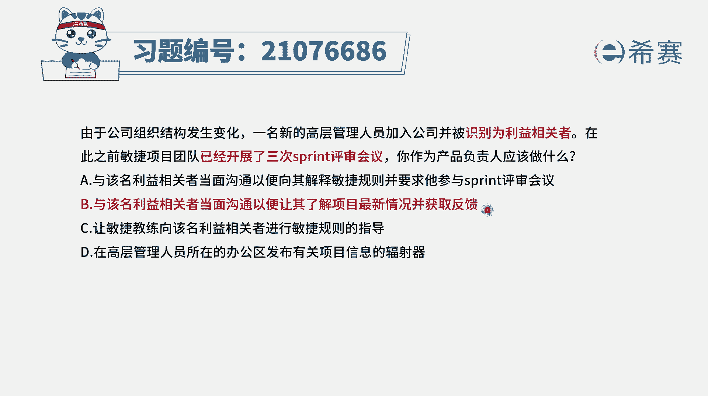

# 搞定PMP考试50%的考点，180道敏捷项目管理模拟题视频讲解，全套免费观看（题目讲解+答案解析） - P96：96 - 冬x溪 - BV1A841167ek

由于公司组织结构发生变化，一名新的高层管理人员加入到公司。

并且被识别为利益相关方，在此之前，敏捷项目团队已经开展了三次，spring的那个评审会议，也就是说迭代评审会议，那你作为产品负责人应该怎么做好，现在是已经识别到了，建一个新的相关方，你应该怎么做呢。

毕竟它还是这个项目一个重要的相关方，我们知道就是在整个项目过程中。

其实会有一个很重要的信息是什么，要信息同步，就要信息透明，信息透明的方式有很多种，不管是用这种信息发射源也好，还是开门战会也好，或者是迭代评审会也好，总之是通过各种方式来达到这个信息同步。

信息透明，那这个重要的相关方是新识别到的，我们要跟他怎么样去同步这些信息呢，我们来看一下，选项A与该名利益相关者当面沟通，这个有没有问题，肯定是可以的啊，以向其解释敏捷的原则，这也是没有问题。

并且要求他参与到spring的评审会议中来，这也没有问题，也是可以的，OK选项B与该名利益相关者当面沟通，以便让其了解项目的最新情况诶这很显然，这就是一种正常的跟领导汇报的这种方式，领导新过来。

我先告诉你整个这个领导项目的一个基本情况，所以这个是可行的对吧，然后还有一条说并获取其反馈，那也就是说他对这个项目有什么一些指导，建议哈或想法呀，要求啊，你可以给我提供，那这种方式。

就完完全全就是相比A选项而言的话，这个B选项它会更胜一筹，这些是给告诉你这个项目的一个基本情况，是什么样的，同时会要去了解你对于这些项目的一些想法，反馈信息，所以B选项比A选项要更好一点。

好我们再来看一下剩下两个选项，C让敏捷教练向这名关键的相关方，来进行这个敏捷规则的一个指导，呃，这里有知道一个重要信息啊，就说通常情况下，产品负责人是直接跟客户打交道的。

那这个呃也就是我们在这边说的甲方爸爸，而在这个题目中呢，那通常情况下，这些领导成，他的这些意图是经过谁来去反馈得到呢，一般来讲其实还是要通过这样一个产品负责人，而不是需要去让你再把这个事情。

推给这个敏捷教练啊，所以C选项是错误选项选项D，在高层管理人员所在的办公区，来发布一个有关它的这样一个信息的辐射器，这就犯不着了，你肯定是最有效的沟通方式是什么。

是面对面的沟通，你先跟他去面对面的沟通。

去同步这样一些重要的信息，然后呢去后续的反馈，就是接受他的这样一些指示来反馈。

所以答案选第二个更合适哈。

