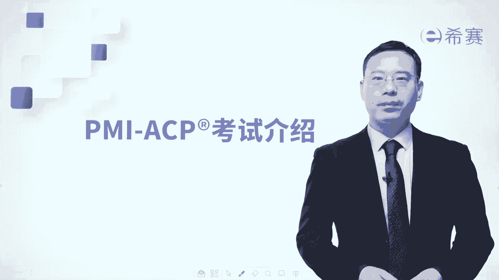
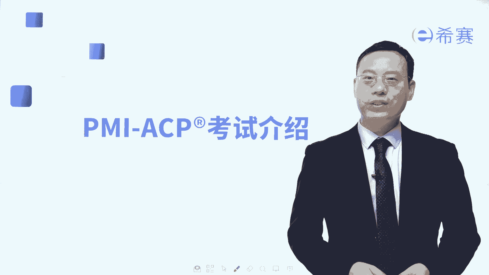
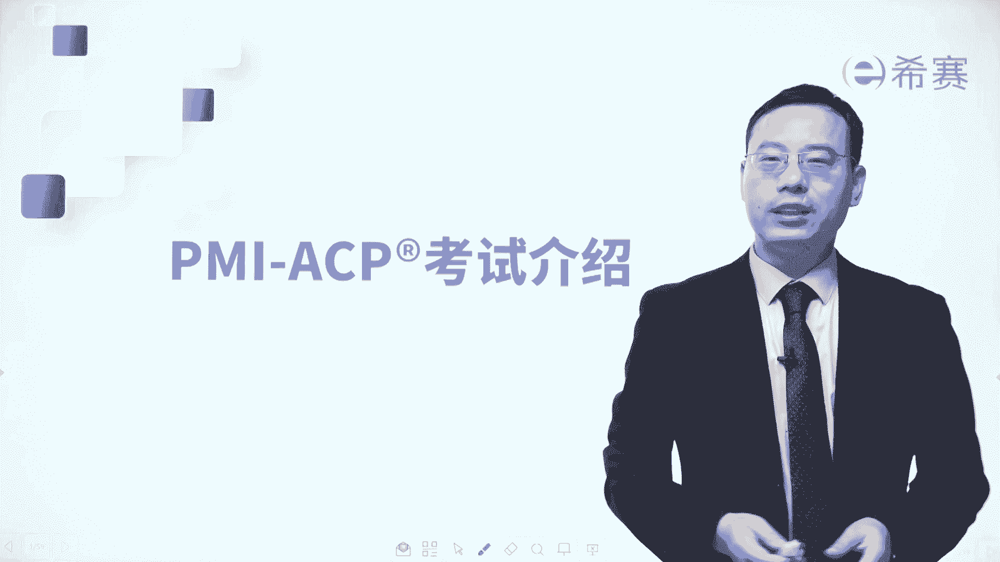
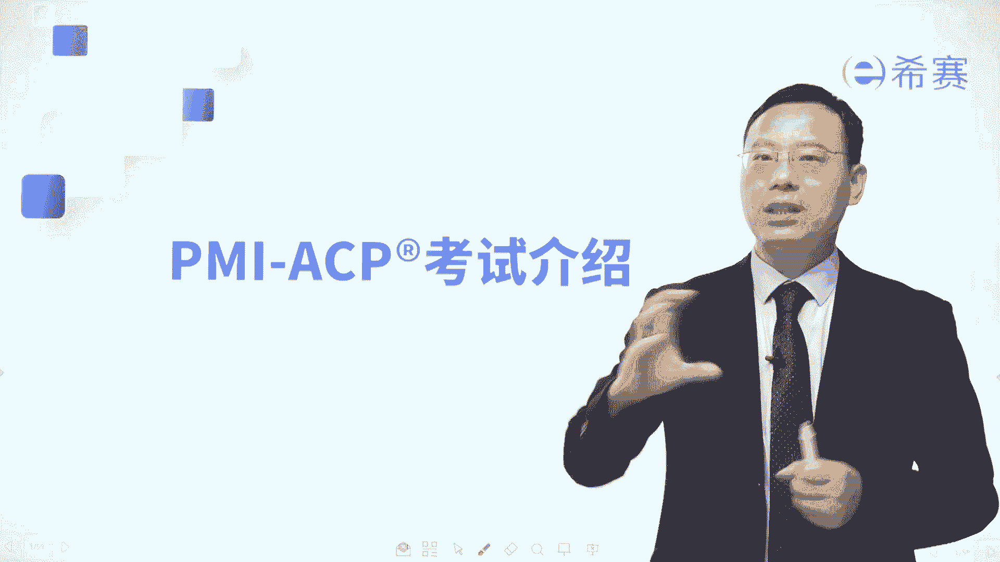
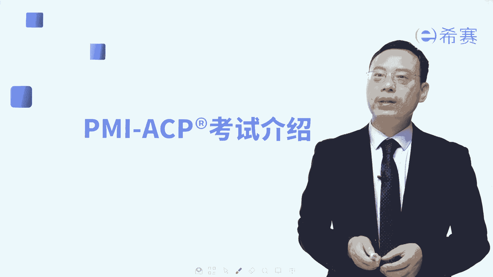
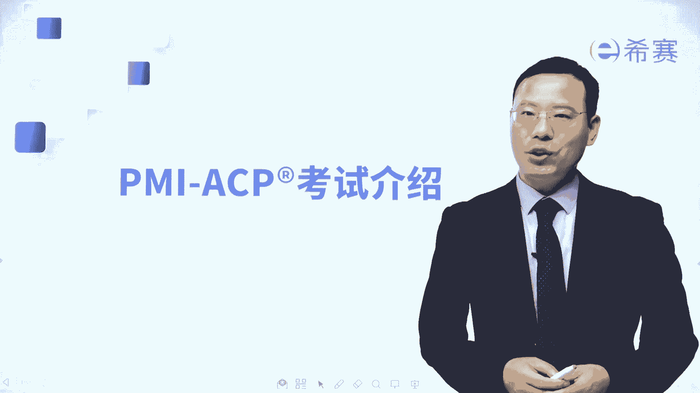
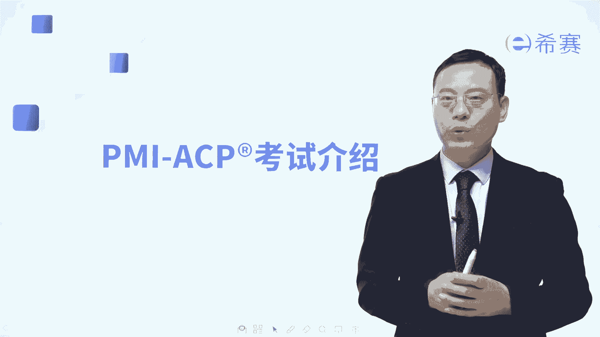
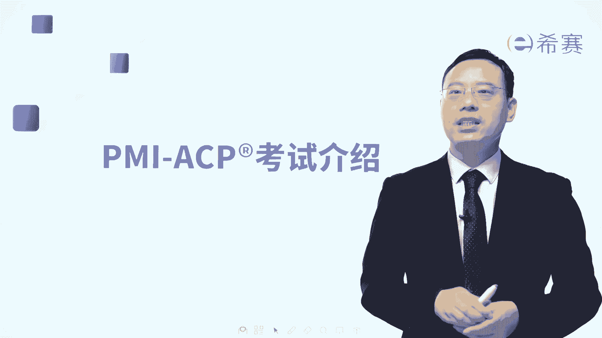
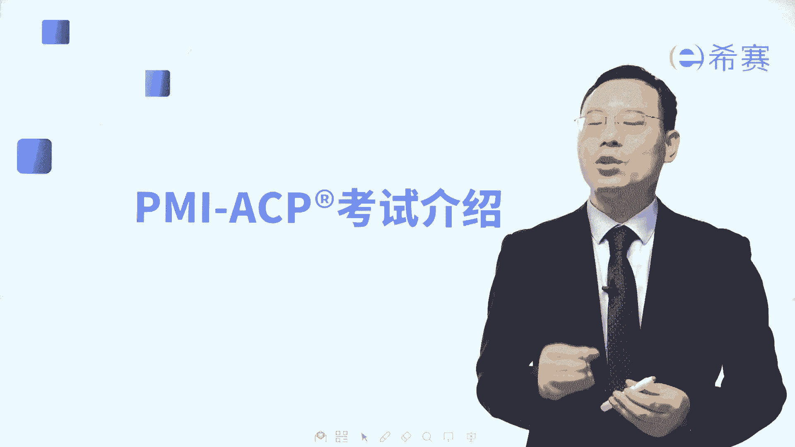
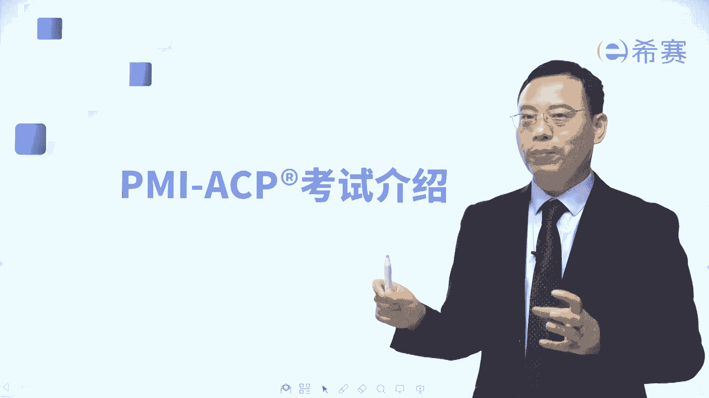

# 搞定PMP考试50%的考点，180道敏捷项目管理模拟题视频讲解，全套免费观看（题目讲解+答案解析） - P100：PMI-ACP（敏捷）考试介绍 - 冬x溪 - BV1A841167ek

大家好，欢迎来到希赛网专业的职业教育平台，我是罗福兴。

我们一起来看一下关于pm i杠CP考试，它的这一个基本介绍。

那ACP考试呢，它其实是属于PMI的这一套课程体系。

里面的一个很重要的内容，关于敏捷项目管理的内容，那敏捷项目管理。

它其实是属于项目管理中的一个分支，它是特别针对于做软件的过程中，可能会持续发生大量变化的情况下，我们用一套拥抱变化的方式来管理项目，那整个敏捷项目管理，它其实一个是要去拥抱变化，一个是要价值驱动交付。

还有一个呢是透明沟通，而他的考试内容，它会分到了这样的七个知识领域，那每一个知识领域分别都讲些什么东西，我们来稍微做一个简单了解，首先第一个板块讲的是关于敏捷的原则和理念，那敏捷呢有一个敏捷宣言。

讲到了是四个理念，然后呢还是敏捷的12条原则，我们在学习的过程中，需要去考察关于组织里面，他会如何去联合应用，这样一些敏捷的原则和敏捷理念，这个部分呢考试占比占到16%，也就是大概有19分左右。

第二个板块讲的是价值驱动交付，也就是说在敏捷中，重点会讲的是如何能够去交付有价值的内容，尤其是高价值的内容，什么叫高价值呢，其实就是它一定是有一个对比，对不对，那种对客户而言价值比较大的，就是放在上面。

价值比较小的呢放在下面，那我们需要去根据这样一个优先级排序，来尽早的交付高价值的增量，以及持续交付高价值增量，那么这就是价值驱动交付，而这个板块呢也是咱们在整个ACP考试中，考得最多的。

占比占到有二十二十四%道题目，然后第三个板块是讲的是干系人参与，其实整个关于干系人参与，首先我们要去指导一下，其实目标就是，尽量让大家更多的去支持这个项目，然后减少对项目的抵制。

从而能够让项目顺利的往前推进，这是干系人参与的价值和意义所在，那我们怎么样去做干系人参与呢，哎要建立一个信任的氛围，能够让大家更好的去参与其中来，便是协调他们的需求和期望来，去努力平衡大家的需求。

达到某种共识，而这个部分考试占比占到了17%，也就是大概有20分左右，事实上呢，因为整个在敏捷中，他特别会强调是我们团队成员之间，以及我们和甲方之间和客户之间，我们都要有很多频繁的互动。

都要有这些人和人之间的互动，第四个板块讲的是团队绩效，其实也就是要去追求一个高的绩效，那怎么样才能够达到一个高的绩效呢，首先是大家在一个良好的氛围中去工作，所以要建立一个信任的。

学习的协作的团队氛围和环境，并且我们知道有人的地方就有江湖，就有是非就有冲突，那如果有冲突的话呢，我们也要有效的去解决冲突，通过这种方式，能够让团队是处在一个相对比较融洽的环境中。

能够比较好的去创造价值，从而能够去得到一个高绩效的团队，而这个板块内容占比占到16%，也就是大概有19分左右，然后再接下来还有第五个呢叫适应性的计划，所谓适应性呢，我们来想一个词。

我们经常会说诶那个谁谁谁，他的适应能力很强，什么意思，就是他在任何不确定的环境和条件下，他都能够去调整自己来迎合当下的这个状态，能够去把一些事情有向往前推进，那么对于这个适应性的计划。

也就是我们在做敏捷项目管理中，有可能计划会持续的做一些调整，那我们需要去根据这种情况来调整，所以根据目标价值约束等等反馈，来去做一个调整的不断发展，其实也是调整的计划。

而这个内容呢考试占比占比占到12%，也就是有14道题目左右，好在看到第六个板块叫发现问题和解决，其实也就是要有效的去发现问题，解决问题，那么对于这一个板块啊，其实就是来去考察我们作为一个项目经理。

作为一个敏捷教练，我们是否能够敏锐地捕捉到问题以及风险，能够去有效地解决问题，或者提前去规划一些风险的应对方式，万一风险它真的发生了以后，是否可以有效的去把它解决掉，这是考察这样一个板块。

那这个板块呢他考试占比占到了10%，也就是有12道题目好，最后一个板块叫持续改进，其实关于持续改进呢，我们知道敏捷中其实会持续讲到一个叫迭代，那么PDCA循环，PDCA循环不断地去循环迭代。

先完成再完美，不断去优化，这样的话呢，就能够让我们达到一个比较好的状态，而在敏捷中也特别强调这个持续改进，就是你不需要一一开始就很牛逼，你要做着做着，慢慢的就会越来越牛逼，越来越牛逼这样一个状态。

所以是持续的去改进它的这样一个质量啊，效率啊，价值包括改进这些流程，改进团队，从而让我们的流程变得更好，让我们的团队变得更牛逼，让这产品的品质质量变得更好，而这就是整个ACP考试，它的这样一个七个板块。

最后一个板块中考试占比占到9%，也就是大概会有11道题目左右，ACP考试它一共有120道题目，其中有20道题目是不参与积分的。

也就是你从剩下的100道题目中。

如果能够做到65道，那么你就是顺利通过了，考试时间是三个小时。

一般是在某一个周六的早上九点钟，考到中午12点钟。

相对而言的话，CP考试它比起PMP其实要容易很多，比起NPDP也要容易很多。

我相信你只要跟着我们认真学习，拿下NPTP完全没有问题。