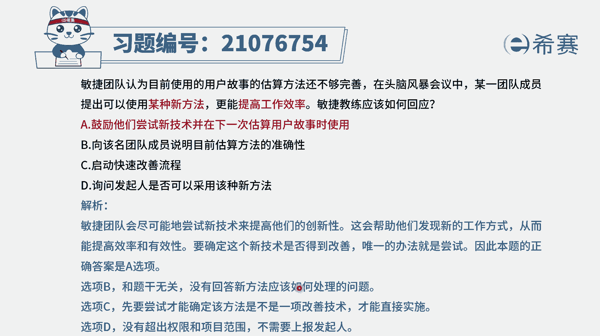

# 搞定PMP考试50%的考点，180道敏捷项目管理模拟题视频讲解，全套免费观看（题目讲解+答案解析） - P23：23 - 冬x溪 - BV1A841167ek

敏捷团队认为，目前使用的用户故事的估算方法还不够完善，在头脑风暴会议中，某一位团队成员提出了可以使用某种新的方法，能更高的提高效率，那敏捷教练应该如何去回应，那这里的话其实有一个前提条件是什么呢。

大家都觉得当下的这样一个用户估算的方式，是不够好的，那如果有人能够提出更好的方式，当然是更好的，因为整个在敏捷中，其实会提倡的是这种不断的去优化，是先完成后完美，是希望能够去精益求精。

能够去对这些技术有有那种卓越的见识，所以其该是鼓励的态度啊，那有了以上信息以后呢，我们再来看一下这个题目的四个选项，选项A鼓励他们尝试新技术，并在下一次估算用户故事的时候呢，就可以去使用这种技术。

那这一看就是很支持他们的方式，这就是可选的啊，答案就是它了，选项B向该名团队成员说明，目前估算方法才是最准确的，那这种方式呢就显得是呃，不要去搞一些新的幺蛾子了，你就是用。

你就老老实实按照这种方式来做就可以了，那他就没有办法改进了呀，敏捷中其实会提到一个叫什么，我们不断去回顾和反省，通过这种反省反思来去进步，那这个就跟这个反思是相相相违背的啊，选项C快速启动改善流程呃。

在敏捷中呢，他其实不会是用这种方式来去表达，而更多的是什么，就如果说大家觉得有好的方式呢，我们就可以通过开会的方式来进行讨论并解决，并且一般情况下，我们在什么时候才会重新去估算用户故事。

都是在下一次的这个迭代规划会议上，所以刚好是在下一次迭的规划会上，才可以真正的去用起来，这个A选项就会更合适一点，至于最后一个询问发起人是否采用新技术，首先第一个发起他太忙，他没有时间。

第二个呢关于这种具体如何工作，团队是一个自组织，团队是自己可以去决定的，所以他都不正确，答案是选A啊，我们需要了解。

在这个过程中，敏捷教练是要去帮助团队来去清除障碍，以及去支持团队交的团队，保护团队，那既然团队他是一个自组织团队，他自己能够想到更好的方式来解决。

我们应该是给他鼓励，让他能够更好的去做到这个事情。

