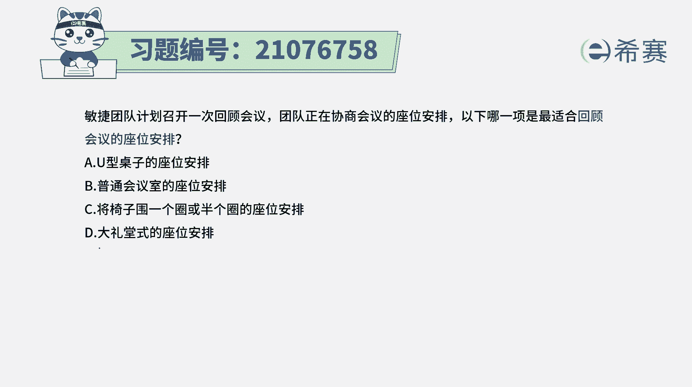
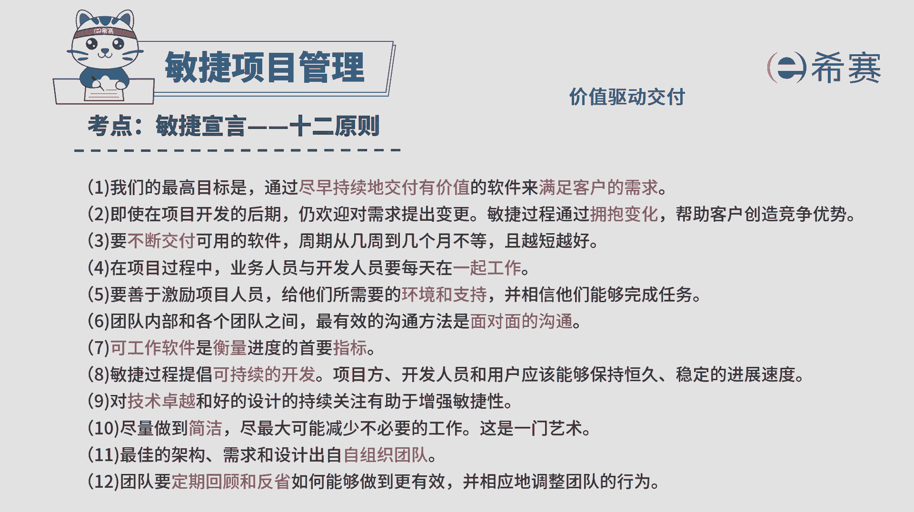
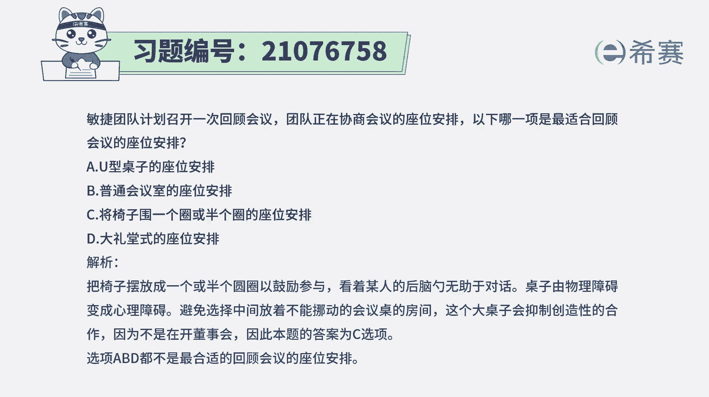

# 搞定PMP考试50%的考点，180道敏捷项目管理模拟题视频讲解，全套免费观看（题目讲解+答案解析） - P27：27 - 冬x溪 - BV1A841167ek

敏捷团队计划召开一次回顾会议，团队正在协商会议的作为安排，以下哪一项是最合适回顾会议的作为安排，请注意他这个会议是一个什么会议呢，是一个迭代回顾会议，那迭代回顾会议是我们自己内部来去回顾，反思反省。

看这一次迭代中有哪些做得好，累计做得不好，需要怎么样去调整和改进，我们要去讨论，然后自我反省，然后以及团队一起来共同反省来做的话，要怎么样。

最好的方式应该是面对面的沟通，或者说是能够大家相互看见对方，看见彼此的这种方式来做沟通，那有了这个信息以后。

我们再来看一下这四个选项，选项A是用U型的这样一个桌子来安排座位，那这种U型的桌子安排座位的话怎么做，他们相互做，做的时候呢，这个人看着这边看这边看这边这种U型桌子，它其实对于办公是合适的。

但是如果说专门要去开这一次回顾会议呢，以这种方式来摆，其实不合适，他不如后面的第三个选项，第三个选项是这样说的，说将椅子围成一圈，或者说是围成半圈来安排座位，那是什么意思。

也就是我们可以直接是围成一个圈的，这样一个方式，大家就直接坐着，坐着以后呢，前面没有东西挡住，没有桌子挡住，我们彼此可以就是更好的来直接去面对面，或者是围成一个半圈，然后大概是彼此更好地去相互面对面。

这种方式它跟那个选项一种U型还是有点差别，就这个半圈是朝内的，而U型坐着的是其实是朝向外部，就是每一个人都是对着那个墙壁来去工作，然后有需要的时候呢，可以转身来开这样一个站，会是这个方式。

所以相比而言的话呢，C选项其实会更好一点，就是我们需要去知道，其实最合适的方式就是面对面的沟通，并且没有任何的障碍，或是没有任何物理东西去隔断去阻碍，至于说B选项，普通的会议室的安排。

这种方式肯定是不太合适啊，那大家都是你看到我的后脑勺，我看到他的后脑勺这种方式来发言来沟通，其实就差了点意思，选项D大礼堂中的这样一种中文安排，那它跟它跟这个没有什么本质差别，都是不合适的，相比而言。

A和C其实它是样子有点相似，但其实本质不相同，C里面的话是朝着中心，OK都是朝着中心是是这样的，相互能够看到，其实我因为有的时候也会去给上，给大家去上一些不同的培训，像在心理学的这些课程里面的培训。

很多时候都是直接大家就来一把椅子坐着，没有桌子，而这种方式就会很方便，就是你的目光能够少受到全场的所有人，那这种沟通每一个人都能够少受到所有人的话，那每一个人都是现场的主人。

那这样的话沟通其实会更高效一些，所以这个题目的答案是选C，将椅子围成一个圈，或是围成一个半圈的这样一个方式来安排呃。

