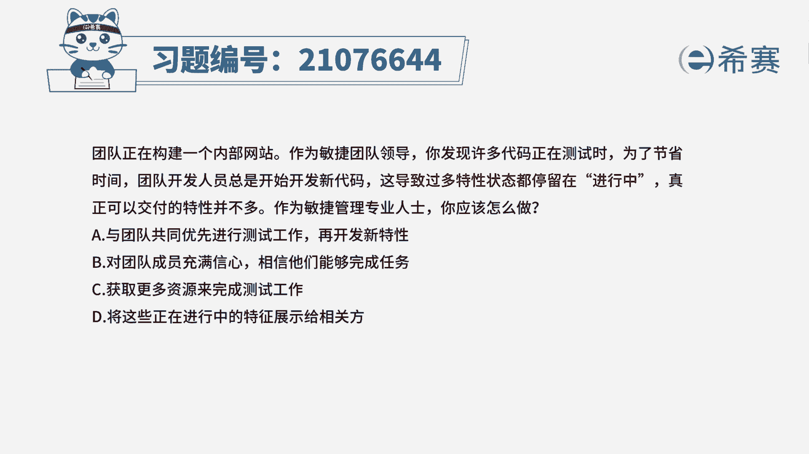
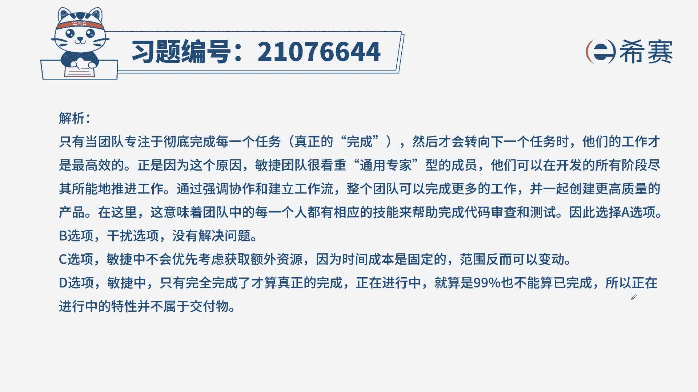

# 搞定PMP考试50%的考点，180道敏捷项目管理模拟题视频讲解，全套免费观看（题目讲解+答案解析） - P3：3 - 冬x溪 - BV1A841167ek

团队正在构建一个内部网站，作为敏捷团队领导，你发现许多代码正在测试时，为了节约时间，团队开发人员总是开始开发新代码，这导致过多特性状态都停留在了进行中，真正可以交付的特性并不多，作为敏捷管理专业人士。

你应该怎么做，A与团队共同优先进行测试工作，再开发新特性，B对团队成员充满信心，相信他们能够完成任务，C获得更多资源来完成测试工作，D将这些正在进行中的特性展示给相关方，本地考法最佳实践。

找到题干的关键信息，团队出现了一个问题，因为有很多的特性，也就是用户故事卡在了进行中，这个状态导致了项目出现了瓶颈，停滞下来了，你作为敏捷管理专业，是你的岗位职责是帮助团队践行敏捷原则，针对于这个瓶颈。

要帮助团队把这个瓶颈给化解掉，这里的瓶颈就是我们看板里面的限制，在制品好，基于这个分析一起来看四个选项诶，与团队共同优先处理测试工作，再开发新特性，在看板里面我们知道有限制代制品。

同时还有阶段的完成标准，只有完成这个特性才能进入到下一个状态，这里是因为测试卡住了，所以无法推进项目的进展，那我们就帮助他们做好限制，在制品A符合刚才的描述，B对团队充满信心，相信他们能完成。

现在项目已经出现了瓶颈，只相信是解决不了问题的，C获取更多的资源来完成测试工作，具体的工作敏捷教练是不负责的，只是帮助大家践行敏捷原则，这种时候也是团队自己来决定，所以C项不合适。

因为我们问题问的是敏捷教练应该怎么做，D将这些正在进行中的特性展示给相关方，特性在进行中，我们无法展示给相关方，应该是完成之后再再进行评审，再进行展示，所以也不合适。

从而选出最佳实验选项A选项，这是本题的解析。

大家可以暂停看一下，这是本集的相关知识点，看板实践，针对这个知识点，我们一定是从内容上下手，知道它有哪几个特点，特点的内容是什么。

