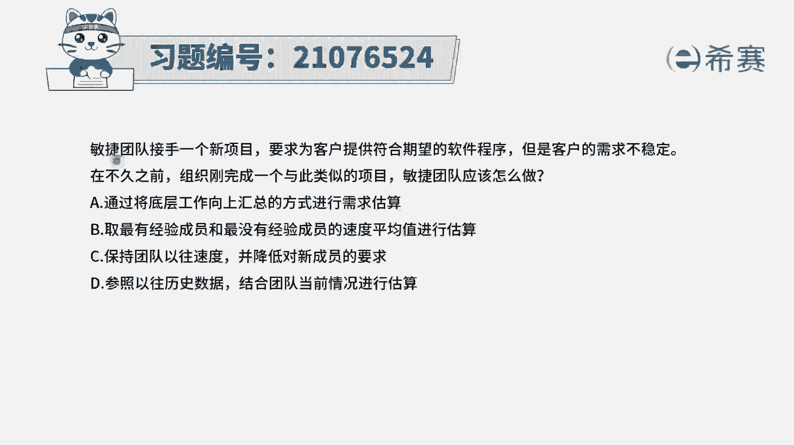
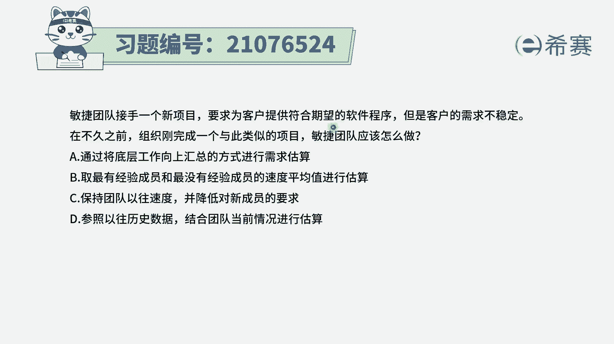
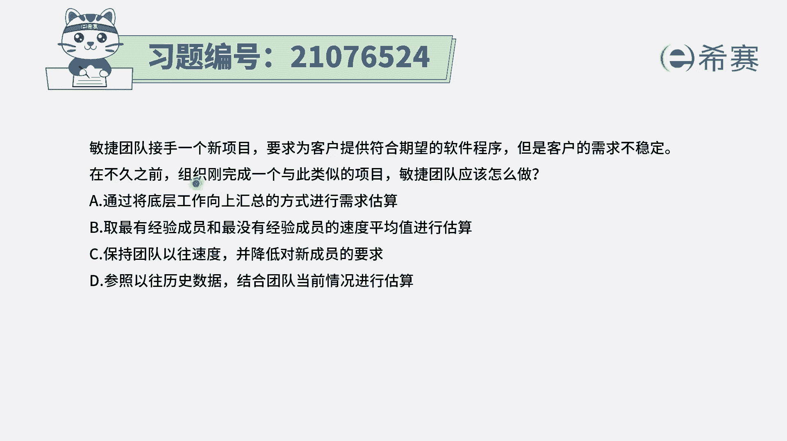
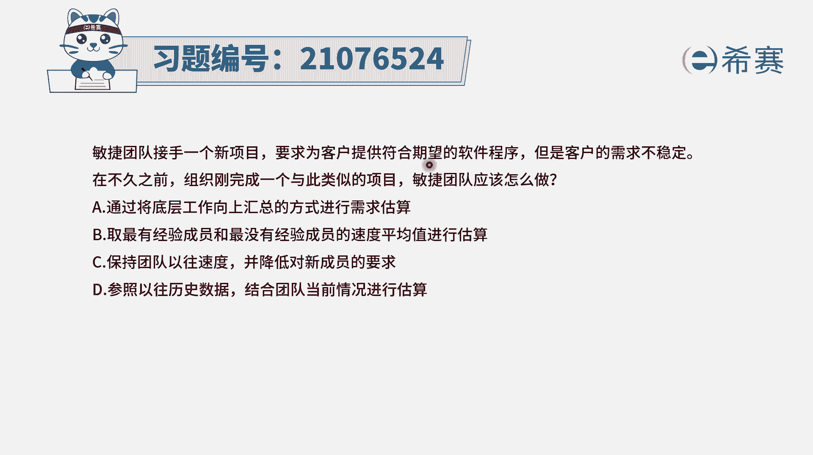
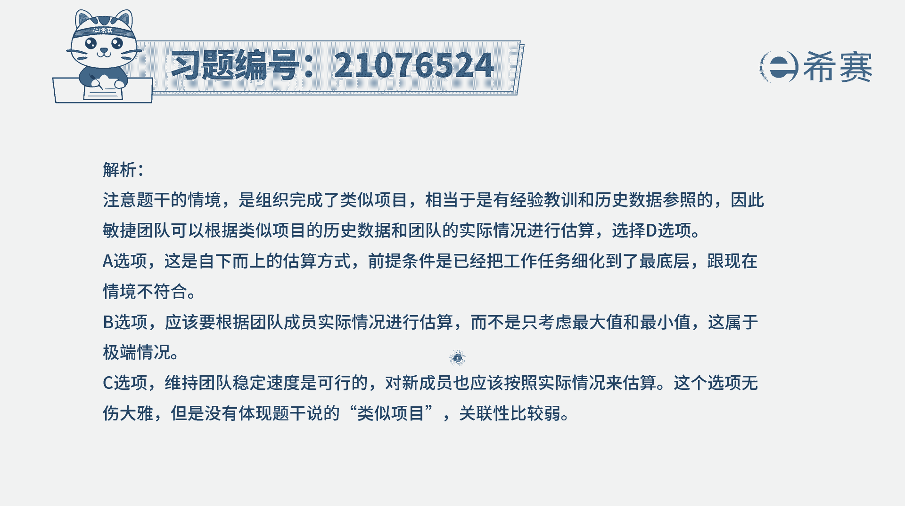

# 搞定PMP考试50%的考点，180道敏捷项目管理模拟题视频讲解，全套免费观看（题目讲解+答案解析） - P30：30 - 冬x溪 - BV1A841167ek

敏捷团队接手了一个新项目，要求为客户提供符合期望的软件程序。

但是客户的需求不稳定，在不久之前。

组织刚完成一个与此类似的这一个项目，那敏捷团队应该怎么做这种题目呢，其实比较特别，因为题干中它会明确表达说，我们刚刚才做了一个，跟这个项目非常类似的项目，那你应该怎么办。

那肯定就可以去参考一下那个类似的项目，对不对，虽然说在敏捷中，它其实不提倡这种绝对估值的方式，但是题干中明确表达这个意图，其实就会告诉你说，那指向性很明确，就是去参考刚刚做完了这一个类似的项目。

那我们就来看一下四个选项，选项A，通过将底层工作向上汇总的方式来进行估算，题目中有一个信息告诉你，说这种方式不可行，什么呢，说客户的需求是不稳定的，那就是客户的需求可能会发生一些变化。

对于这种变化的情况下，你完全去按照这种创建工作分解结构，然后再把自己最底层的工作内容，工作包来进行估算，以后再向上汇总的这种方式，它是不可取的啊，他只符合，或者说只适用于这种传统的项目管理方式，B选项。

去最有经验的这样一个成员，和最没有经验的成员，他们这样一个速度的平均值来进行估算，这种方式也显得太过于草率了吧对吧，那如果说加了一个王者进来，那我们的这个整个平均值，就要必须往下面拉很多。

如果加了一个新手进来，我们的整个平均值就会越往下面降很多，这种方式肯定是不可取的，选项D保持团队以往的速度，并降低对新成员的要求，呃其实这个里面的话他关注的重点是什么啊，关注的重点是，我们做的应该是。

刚刚与之前做的项目相类似的项目，所以这个选项这个选项本身没有错误，但它跟题干没有什么关系，这句话没有错，但是跟题干没有什么直接关系，好最后一个参照以往的历史数据，结合团队当前情况来进行估算，那这一句呢。

就刚好是符合了题干中的这样一个内容，跟他是有遥相呼应，题干中说我们刚刚做过一个像类似的项目，那这里就是说我们去参考一些过往类似的项目，然后并且是根据当前的情况来进行估算，所以答案是选D选项。

这里有一点你需要去了解，就是C选项本身这句话没有错，但是他跟题干关联度不大，我们一般要选，一定是选那个跟题干的关联度比较大的。

正确选项。

