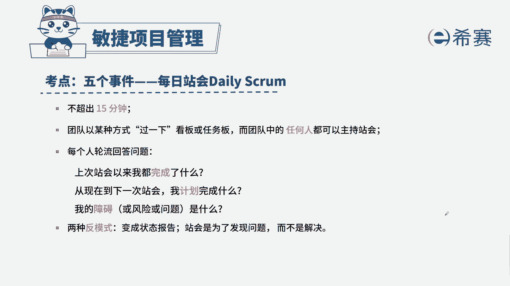

# 搞定PMP考试50%的考点，180道敏捷项目管理模拟题视频讲解，全套免费观看（题目讲解+答案解析） - P39：39 - 冬x溪 - BV1A841167ek

某团队正在进行一个开发项目，致力满足相关方对产品的需求，一位新加入敏捷团队的团队成员，不明白为什么要开美食展会，团队应该怎么回答，A敏捷教练可以为团队提供指导帮助，B产品负责人可以安排团队工作。

C团队可以讨论问题的解决方案，D团队可以提出问题，实现问题可视化，解题思路，首先通过题干找到关键信息，题干告诉我们新加入了一位成员，为什么要开它，我们是为了避免信息孤岛，帮助我们团队之间进行协调。

工作的这么一个会议，那他如何去开呢，先做了什么，接着要做什么，以及我们遇到了什么呢问题，所以我们选择正确答案D团队可以提出问题，实现问题可视化，我们来看一下其他三个选项，A敏捷教练可以指导团队提供帮助。

A选项的表述是没有问题的，B产品负责人可以安排团队工作，产品负责人不负责安排工作，因为我们团队是自组织团队，C团队可以讨论问题，解决方案，只是让信息同步，而不是为了讨论问题，如果说解决方案。

我们需要另起会议进行解决，这是本题的解析，大家可以暂停看一下。

