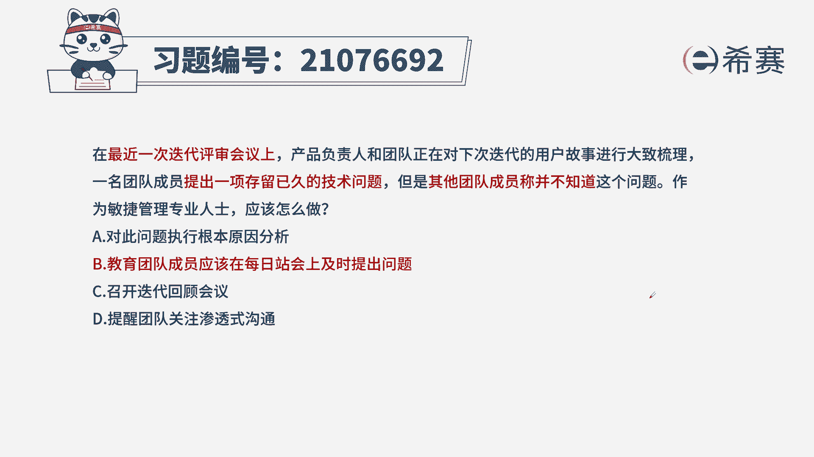
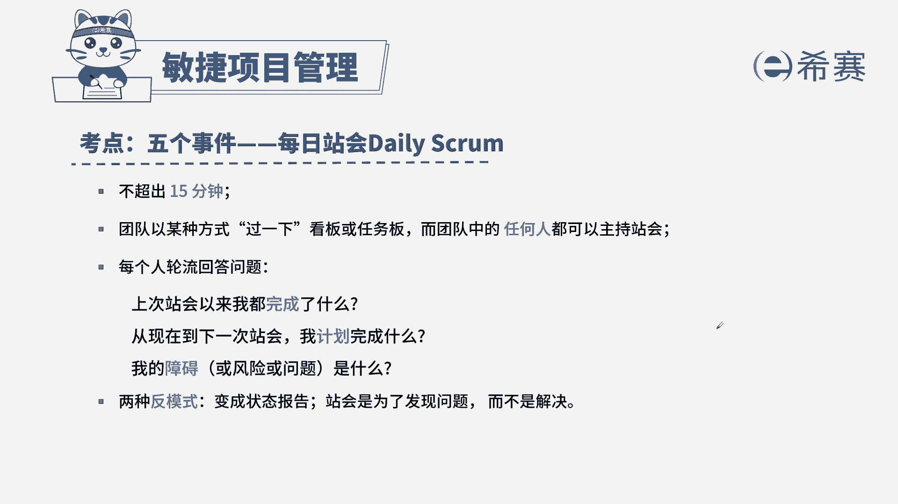

# 搞定PMP考试50%的考点，180道敏捷项目管理模拟题视频讲解，全套免费观看（题目讲解+答案解析） - P4：4 - 冬x溪 - BV1A841167ek

在最近一次迭代评审会议上，产品负责人和团队正在对下次迭代的用户故事，进行大致梳理，一名团队成员提出一个留存已久的技术问题，但是其他团队成员称并不知道这个问题，作为敏捷管理专业人士应该怎么做。

A对此问题执行根本原因分析，B，C召开迭代回顾会议，D提醒团队关注渗透式沟通，通过题干我们找到关键信息，在评审会议上，有成员提出了一个问题，同时其他成员不清楚，那这也是反映了信息出现了不对称的情况。

针对这种情况，我们作为敏捷教练，应该告诉我们的团队成员有问题要及时提出来，防止信息股的，从而我们选出B，我们来看其他三个选项，A对此问题执行根本原因分析，关于我们具体的工作内容，我们不需要敏捷教练参与。

因为我们的团队是自组织团，C召开迭代回顾会议，没有正面回答我们题目中提出的问题，D提醒团队关注渗透式沟通，渗透式沟通，就是在我们日常工作中进行无意识的信息传递。

和我们题干无关，这是本题的解析，大家可以暂停看一下本题的考点。

人物以及我们要说哪些话，这几个点，同时我们还要了解其他几个会议的特点。

这么一来，针对此类型的题目。