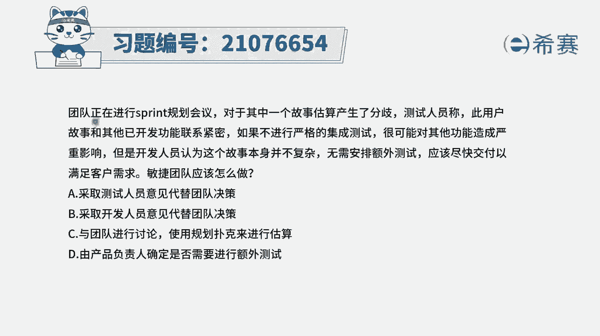
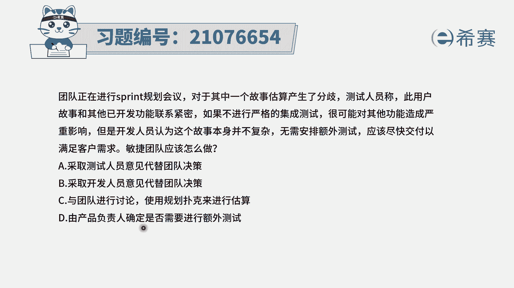
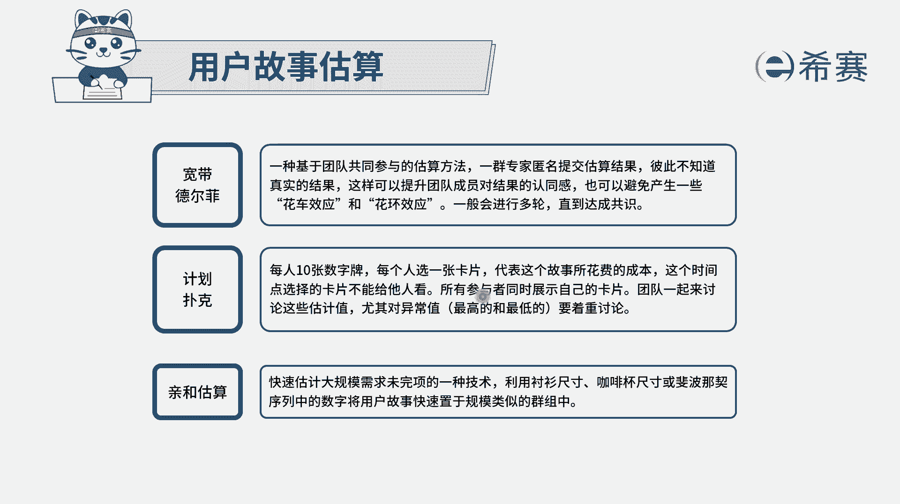
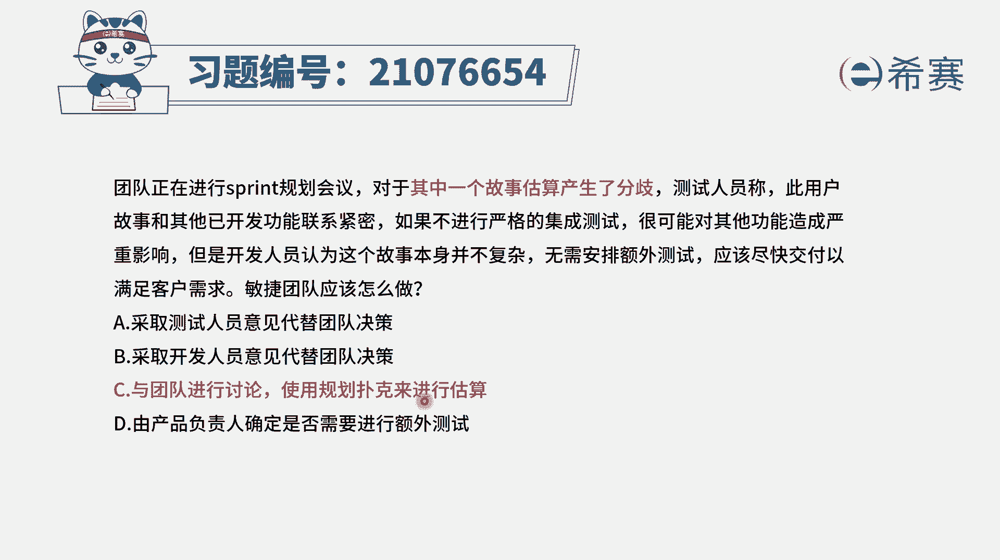
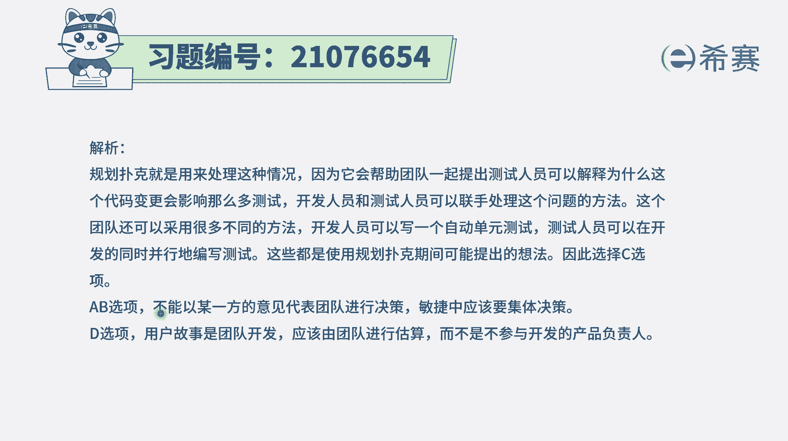

# 搞定PMP考试50%的考点，180道敏捷项目管理模拟题视频讲解，全套免费观看（题目讲解+答案解析） - P41：41 - 冬x溪 - BV1A841167ek

团队正在进行spring的规划会议，也就是说是迭代规划会议，对于其中一个用户故事的估算产生了分歧，测试人员称，使用户故事和其他的已经开发的功能，联系非常紧密，如果不进行严格的集成测试。

那很有可能会导致对其他功能造成严重影响，但是开发人员认为，这个故事本身并不复杂，无需安排额外测试，应该是尽快的交付，以满足客户需求，那么在这种有分歧的情况下，敏捷团队应该怎么办呢。

首先我们需要去知道一个很重要的点，团队是一个什么样的团队，敏捷团队是一个要自组织团队，那自组织团队是事情是自我组织，自我管理任务是自我认领，主动去完成，但是有高度的这种自觉性的这样一个群体好。

有了这个认知以后，另外呢关于冲突，一般情况下，如果说A方和B方产生冲突，我们会怎么选，如果他没有明确的话，我们是既不选A也不选B，我们应该是讨论着来进行啊，有了这个认知以后呢，我们再来看一下选项。

A说是采取测试人员的意见，这就是选了A方，采取开发人员的意见，这就选了B方，这两个人一般都不选选项，C与团队进行讨论，使用规划扑克来进行估算，那也是我们团队来共同做决定，我们做决定呢还给了你一个工具。

这个工具叫计划扑克，用计划扑克来做，这是可行的，所以答案是C选项，它是可循可选项，也是唯一可选项，而最后一个选项由产品负责人来确定，是否需要进行额外的测试，关键是产品负责人他只会关照需求的层面。

他不会关注开发实现的这个层面，所以由他来做决定，这肯定是不正确的，基于ABD都不正确。

只有C可以选，那我们就来了解一下到底什么是计划补课，计划扑克呢它其实只是一种估算的方式，就我们需要对这些用户故事进行估算的时候呢，每一个人手上都有一副扑克，这三张扑克上面有点数，每一个人对于这个用户。

是自己都心里面想到一个点数，把它出出来，出来以后呢，我们再来看大家的这个数值，然后看是否是比较相接近，如果有一些数值特别高或特别低，那我们需要邀请这些人单独来做分享交流。

因为他有可能看到了我们没有看到的部分，然后通过这样一种方式能够满足题干中所说的。

大家一起来共同参与，所以我们可以用多玩几轮计划，补课的方式来达成。

让他们共同参与讨论解析。

