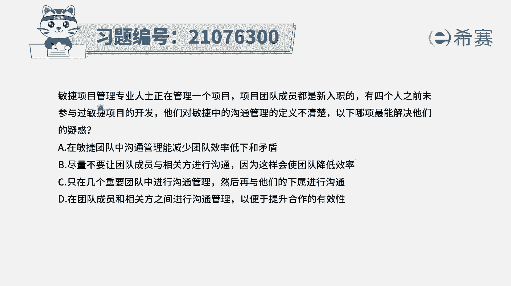
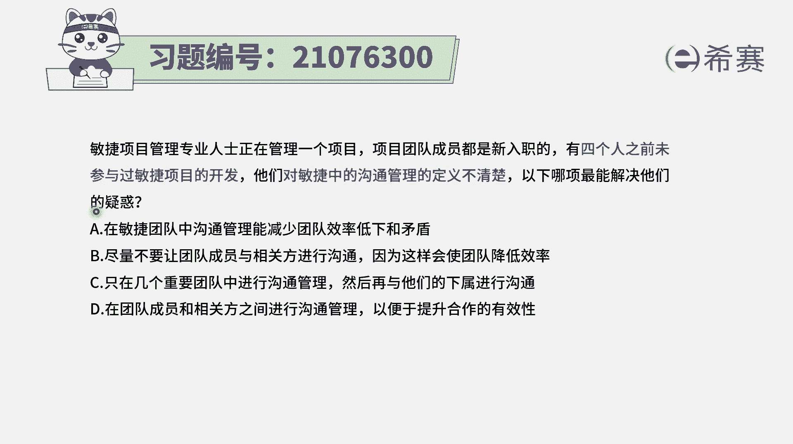
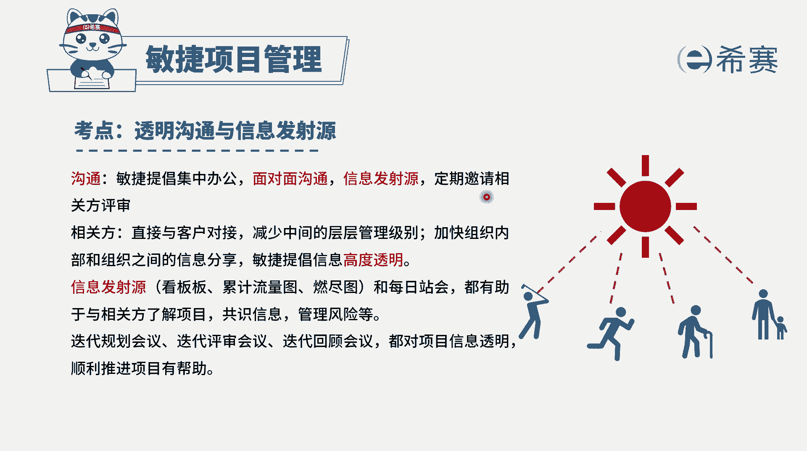
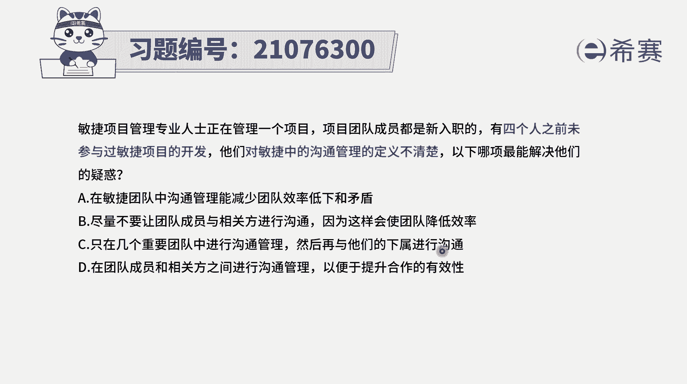
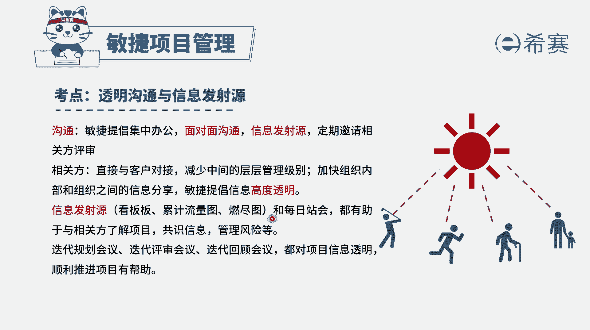
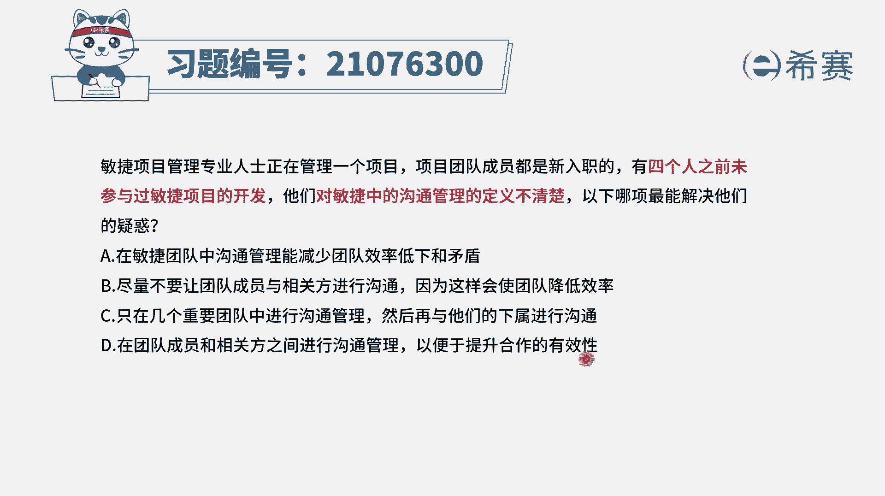
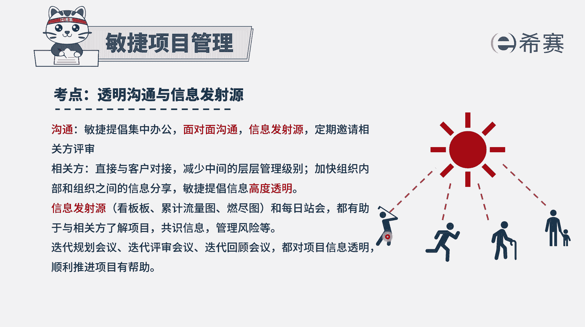
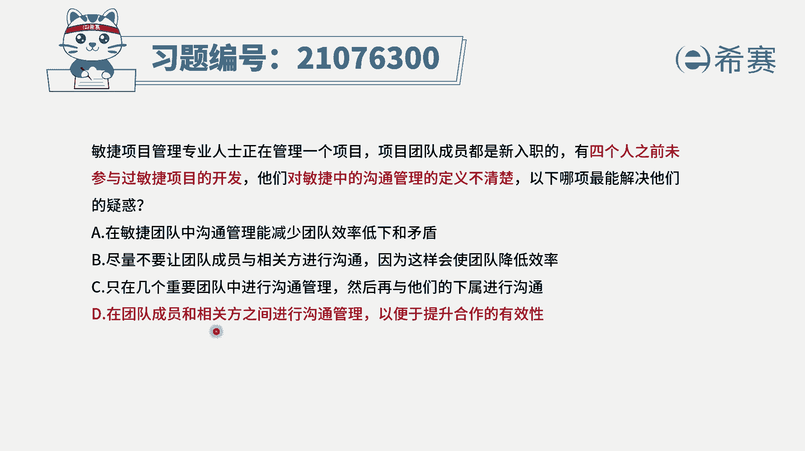
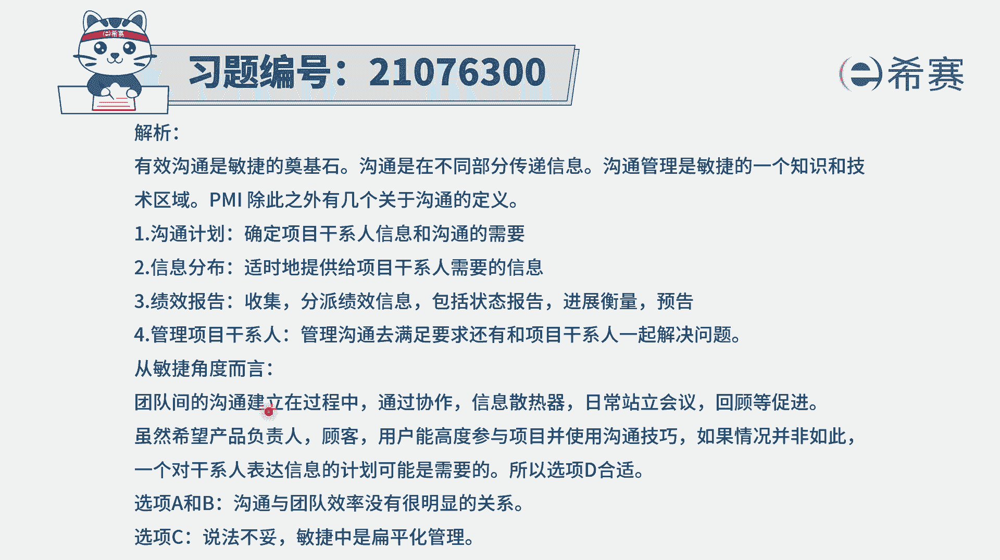

# 搞定PMP考试50%的考点，180道敏捷项目管理模拟题视频讲解，全套免费观看（题目讲解+答案解析） - P44：44 - 冬x溪 - BV1A841167ek

敏捷项目管理专业人士正在管理一个项目，项目团队成员都是新入职的，有四个人之前未参与过敏捷项目的开发，他们对敏捷中的沟通管理这个定义呢不太清楚，那以下哪一项能够去解决他们的这个疑惑，那我们需要了解一下。

有人没有参与过敏捷项目的开发，对于敏捷中的沟通管理不太清楚，而事实上在敏捷中会特别强调沟通。

他对于沟通的要求是什么，首先第一个说是最高效的沟通方式，是面对面的沟通，然后并且呢会希望沟通能够去做到高度的透明，怎么样透明呢，用信息发射语言来做到信息的透明，毕竟他还希望能够去定期。

邀请一些其他相关方的参与评审，去获取他们的这些反馈信息，并且在民间的中，整个管理呢它是偏重扁平式的管理。

我们有了这些基本信息以后，我们再来看这四个选项，选项A在敏捷团队中，沟通管理能够减少团队效率低下和矛盾啊，这个怎么说呢，其实沟通管理它对于团队的效率低下，团队效率低下低下跟什么有关系。

应该最主要的还是这些工作人员，他的工作能力，技能这一块它会跟效率直接相关，然后另外就是整个团队的氛围，那团队的氛围就不仅仅只是包括沟通，还会包括这样一些文化呀，环境啊这些东西。

所以直接说沟通这一条呢其实还不足以，第二个选项，尽量不要让团队成员与相关方沟通，这就是错误的啊，一般来讲我们说其实是提倡有更多的沟通，这样的话信息透明这一块可以做得更好一些。

选项C只有在几个重要的团队中才去进行沟通，再与下属去沟通，在敏捷中呢。

一般来讲它会强调的是信息透明，怎么样透明，它会通过这样一些信息发射语言的方式，比方说看本燃尽图等这样一些方式，能够让所有人都看到这样一些信息。

而不是会有那么强烈的层级的概念，选项D，在团队成员和相关方之间来进行沟通管理，以便提升合作的有效性，也就是说通过这样一些沟通管理，或者是通过加深沟通，能够让信息更多的透明，减少信息的损耗。

从而能够去让这个项目的话，能够更有效地去往前推进，所以呢这个题目这个D选项。

它既符合了咱们在整个敏捷中，沟通的这样一个思路。

就是能够清晰透明，同时呢也能够满足我们在民间中说，团队成员和相关方之间，能够有一种比较好的这种互动，以及团队成员和相关方之间，一层一层的信息传递啊，不会有这样一些信息能够直接沟通是最好。

不过所以答案选D选项。

