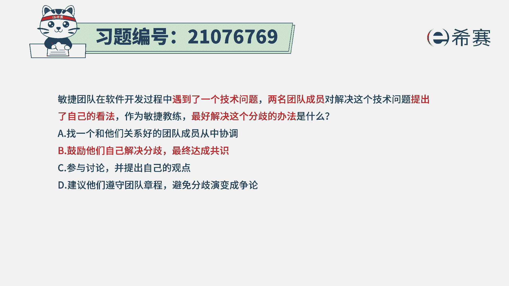
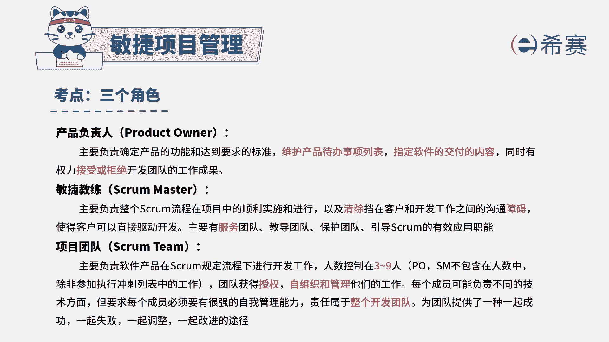
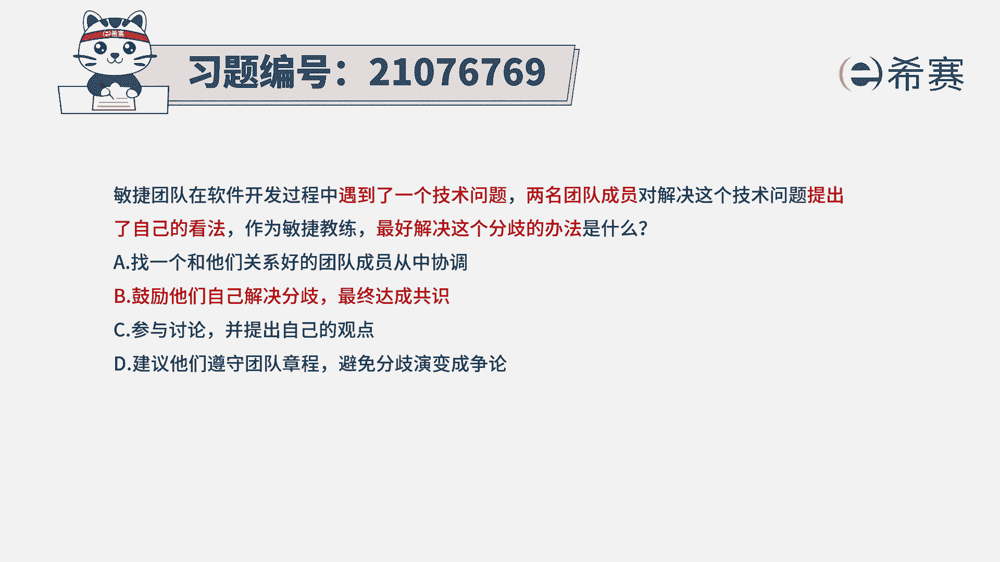

# 搞定PMP考试50%的考点，180道敏捷项目管理模拟题视频讲解，全套免费观看（题目讲解+答案解析） - P47：47 - 冬x溪 - BV1A841167ek

敏捷团队在软件开发过程中，遇到了一个技术问题，两名团队成员对解决这个技术问题，提出了自己的看法，作为敏捷教练，最好解决这个分歧的办法是什么，那团队成员，既然对于解决某个技术问题有分歧的话呢。

最好的方式应该是团队一起来，共同解决这个问题，我们来看一下四个选项选项，找一个和他们关系好的团队成员从中协调，这就是在和稀泥这种方式的话，很显然是没有直面问题去解决问题，它虽然也能够调和这种矛盾。

但是不能够解决这样一个技术问题，选项B鼓励他们自己解决分歧，最终达成共识，那这很显然刚好就是敏捷中所特别推崇的，就是大家是一个自组织团队，然后团队成员有一定的自主性，既然遇到了问题。

那最好是自行解决会更好一些，尤其是当这样一个问题，他还没有达到这种严重分歧，影响进度，影响绩效的时候呢，都可以给予大家空间来自行解决问题，选项C参与讨论，并提出自己的观点啊，如果说他们的冲突。

他们的分歧是一个很大的冲突，很大的分歧的时候呢，那敏捷教练是需要介入进来，但题干看不出来，提纲只是表达说有有意见，所以呢暂时还达不到这个点选项D，建议他们遵循团队章程，避免分歧也变成争论。

这种方式就是从上往下压的方式，它不适合敏捷这一套啊。

那整个解析呢在这里，大家有需要可以自行来查看，敏捷教练他是会去保护团队，支持团队，服务团队，引导团队，那同时呢团队是有一定的自主性，它是被授权的，是自我管理，是自我组织的这一个团队。

所以在团队成员中，有一些事情发生冲突的时候呢，最理想的方式是自行能够解决这样一个冲，突和分歧来达成共识，但他们实在是达成不了的时候呢，敏捷教练介入进来。

