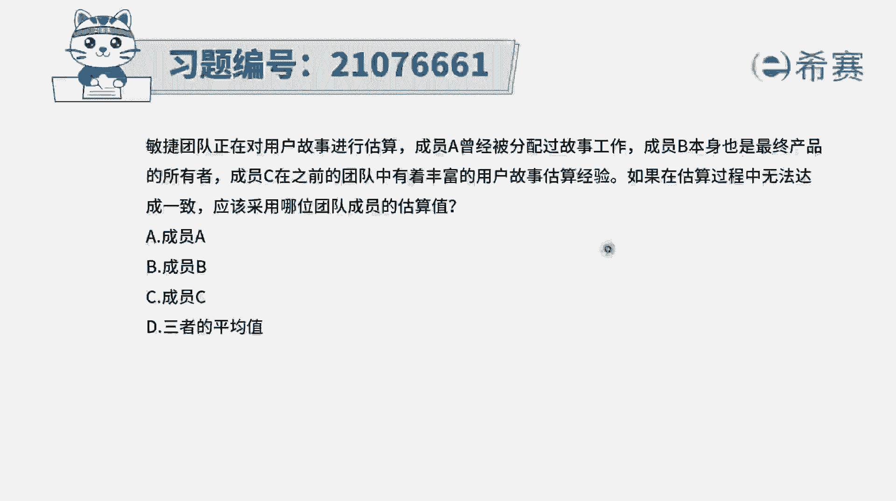
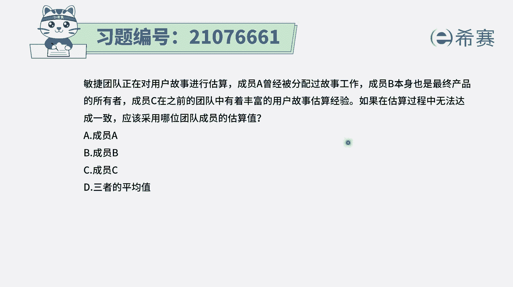
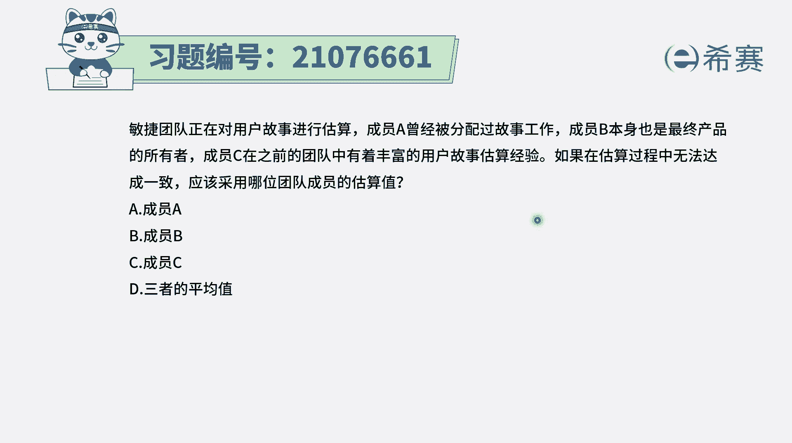
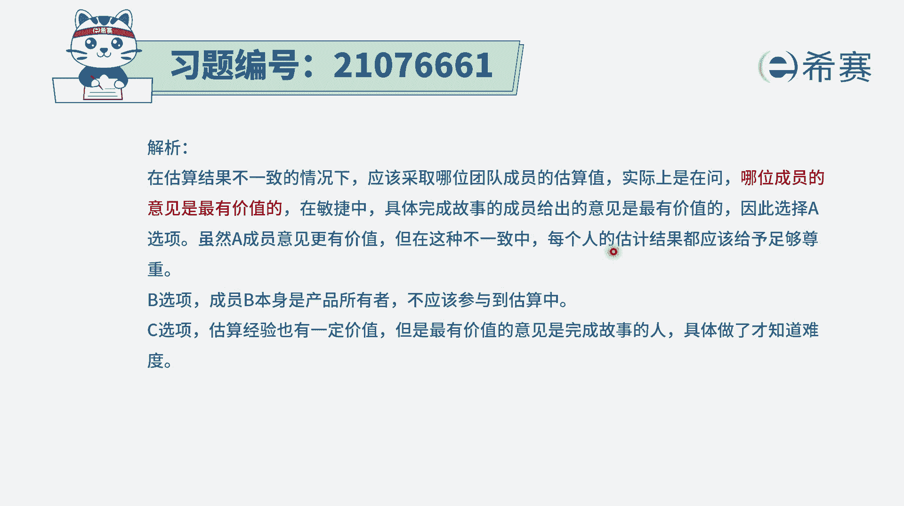

# 搞定PMP考试50%的考点，180道敏捷项目管理模拟题视频讲解，全套免费观看（题目讲解+答案解析） - P51：51 - 冬x溪 - BV1A841167ek

敏捷团队正在对用户故事进行估算，成员A曾经被分配过故事工作。

次元壁本身也是最终产品的所有者，有着丰富的用户故事估算经验，如果在估算过程中无法达成一致的话，那么应该采用哪一位团队成员的估算值，那这个题目呢其实很有意思啊，它是一种冲突。

就是三个人对于这样一个用户故事的估算，什么叫用户故事的故事呢，简单来讲其实就是工作量的这一估计，就是我现在要做一个事情，这个事情大概是三天，五天八天大概有多长的工作量呢，我们去估算这叫用户故事的估算。

然后再来看到这三个人，他分别是什么角色，成员A他是曾经被分配过故事工作的人，也就是做过这个故事的人，并且呢现在可能是在继续做这样一个故事，所以曾经做过类似的故事，现在又将要去做这样一个故事。

他应该是比较有话语权的，他是最有话语权的，而成员B他是最终产品的所有者，那其实是客户或者说是产品负责人这个角色，那不管是产品负责人还是客户，他不会参与到具体的这样一个敏捷开发。

所以呢他不能够去提供这样一个，关于用户故事的一个准确的估算，而成员C他在之前的团队中，有着丰富的用户故事估算经验，但是在民众会提倡是谁去做谁的估算，会更有价值，所以有这样一个理论以后呢。

答案是选A，选项是乘员A，这个解释呢这里有个非常详细的解释，也就是说当三个人的这样估算有冲突的时候，我们应该是选了个最有价值的，而最有价值就是谁去负责，具体去做，具体去落实。

那么它的估算就相对来讲最有价值，因为在敏捷中会提倡的是什么，他会提倡的是团队成员都是积极主动的，是有自我管理能力的，并且团队本身也是一个自组织团队，这个群体本身就是有它的这样一个特性，不会有人去摸鱼啊。

偷工减料啊的这样一些情况。

所以就选了一个最有价值的一个成员，那就是A成员，他自己曾经被分配过故事工作。

所以他来做的话呢。