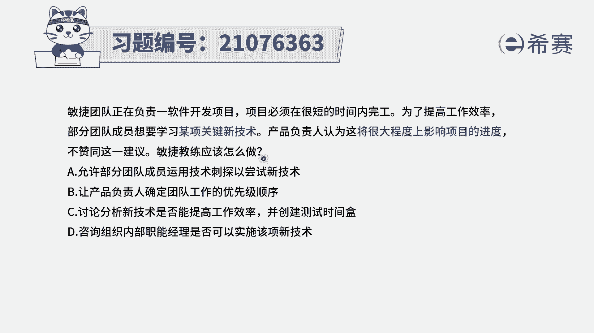
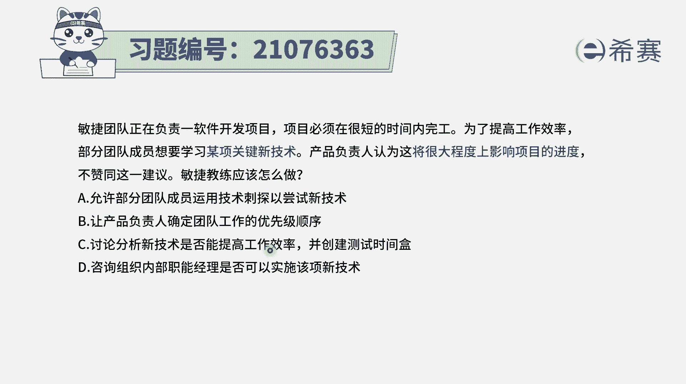
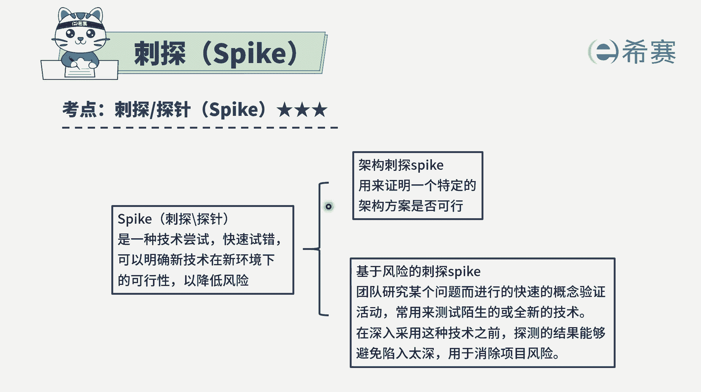
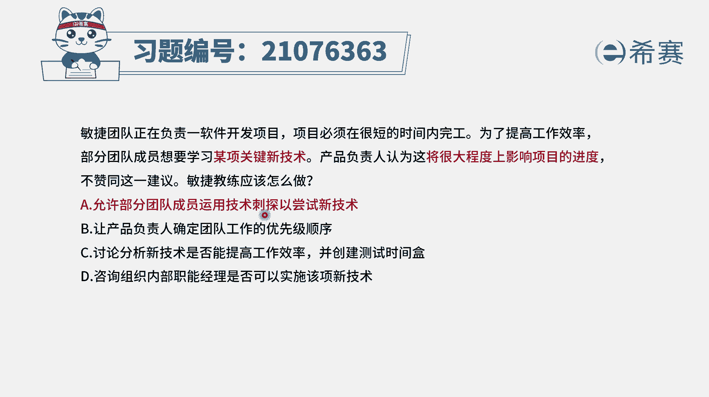
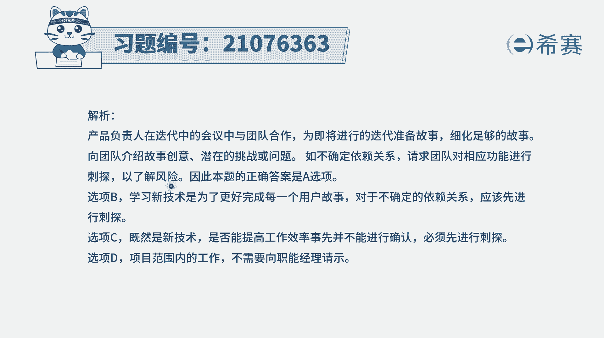
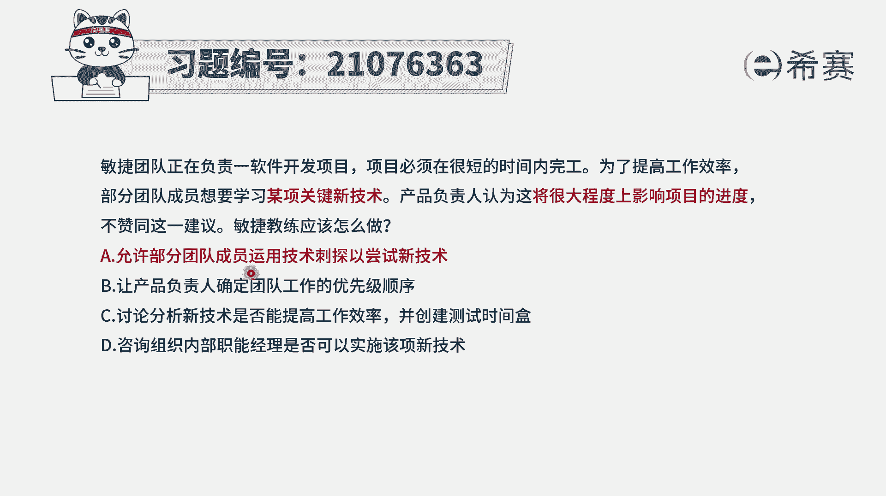

# 搞定PMP考试50%的考点，180道敏捷项目管理模拟题视频讲解，全套免费观看（题目讲解+答案解析） - P54：54 - 冬x溪 - BV1A841167ek

敏捷团队正在负责一项软件开发项目，项目必须在很短的时间内完工，为了提高工作效率，产品负责人认为，这将很大程度上影响项目的进程，不赞成这一建议，那敏捷教练应该怎么办啊，在敏捷中有这样几个特质啊。

首先第一个呢团队决定做什么东西，以及决定用什么样的技术做，它是有一个叫自组织团队，它有一定的自主性，所以他可以来去决定这样一些东西，但是对于新技术，新的这样一些个呃可能存在风险。

这些情况呢我们也不能贸然的去做，我们可以怎么做呢，可以去有一个专门的一个关键词叫刺探。

对于这种新技术，我们可以去做一种技术尝试，就是快速尝试，快速是对或者是快速试错的方式，从而能够去确定这种新技术，在新的环境下它是否可行，当我们了解这样一个信息以后，避免说大规模的去使用这种新的东西。

导致产生很多的风险，所以一般来讲对于这种新技术。

我们可以采用试探的方式来去做，那再回到这样一道题目，既然团队成员想要用某项新的技术，但是呢它又有一定的不确定性，那到底怎么办，我们来看一下四个选项，选项A，允许部分团的成员运用技术次烫的这样一个方。

式来尝试新技术，那很显然这是一种可行的方案，是可选项选项B，让产品负责人确定团队工作的优先级顺序，请注意，我们是一个自组织团队，那在这一轮迭代中要做什么事情，应该是我们自己来去分配。

自己来去管理自我组织，所以要做的事情，他也不是由产品复制人来去确定先后的顺序，选项C讨论分析新技术是否可以提高工作效率，并且是创建这个测试的时间和呃，在敏捷中有一个特质，就是能上手就上手。

你光是讨论的话没有用，你得要试一试，就是试裸子是马要拉出来溜溜才行，所以它会更强的是。

我们可以通过这种刺探的这种方式来去尝试，也就是刺探或叫探针这种方式来尝试。

所以相比而言呢，A10更合适，而最后一个选项，咨询组织类职能部门的经理，是否可以去实施该新的技术，那因为本身我们就是一个自组织团队，我们到底要去做什么东西，理论上来讲，尽量是由我们自己说了算。

只有在我们不能够确定的时候呢，才去寻求一些外部的支持，那现在目前题干中其实并没有讲，到时候我们就是不能够去胜任，我们要不要去做，我们可以先通过这种刺探的方式来去完成，通过刺探来去尝试这一新技术来去知道。

那解析呢在这边需要的同学可以自行查看一下。

这里有一个很重要的信息是，一般来讲产品负责人他在整个迭代中，它会能够去我为大家准备这样一些用户故事，去细化这些用户故事，并且向团队去介绍这样一些用户故事，他的创意啊，简单的挑战呢问题。

但如果说遇到一些特定的问题，遇到一些特定的一些不能搞定的事情呢，团队可以相对应的去进行刺探，来了解风险，来了解它的可行性。

