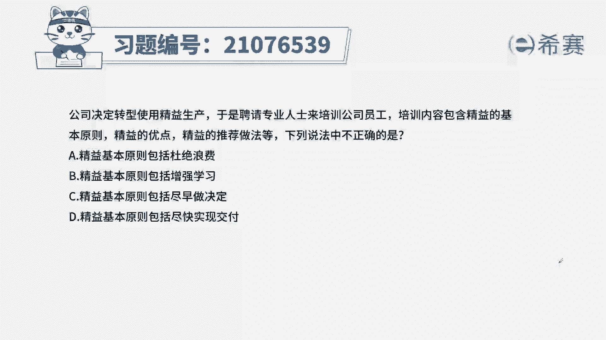
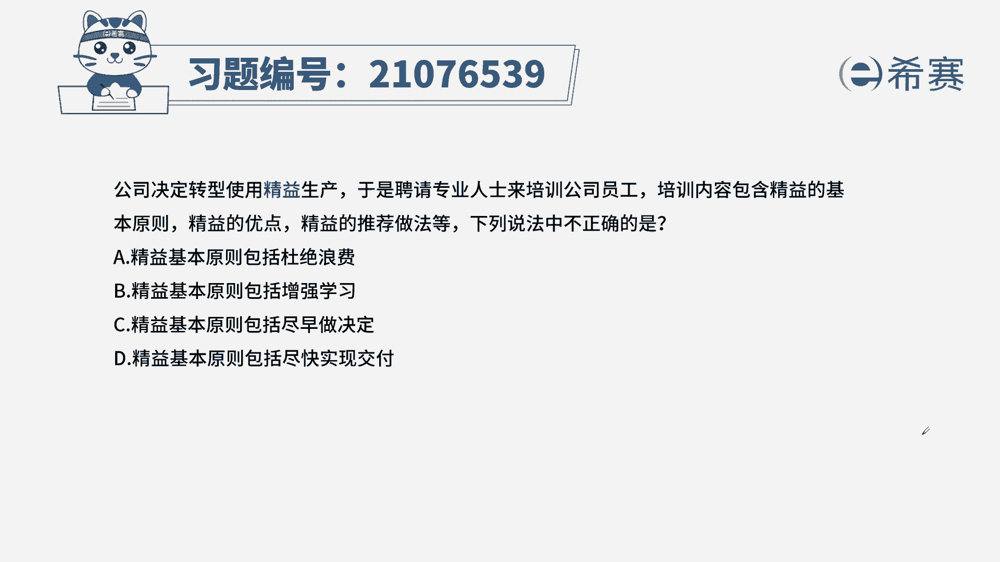
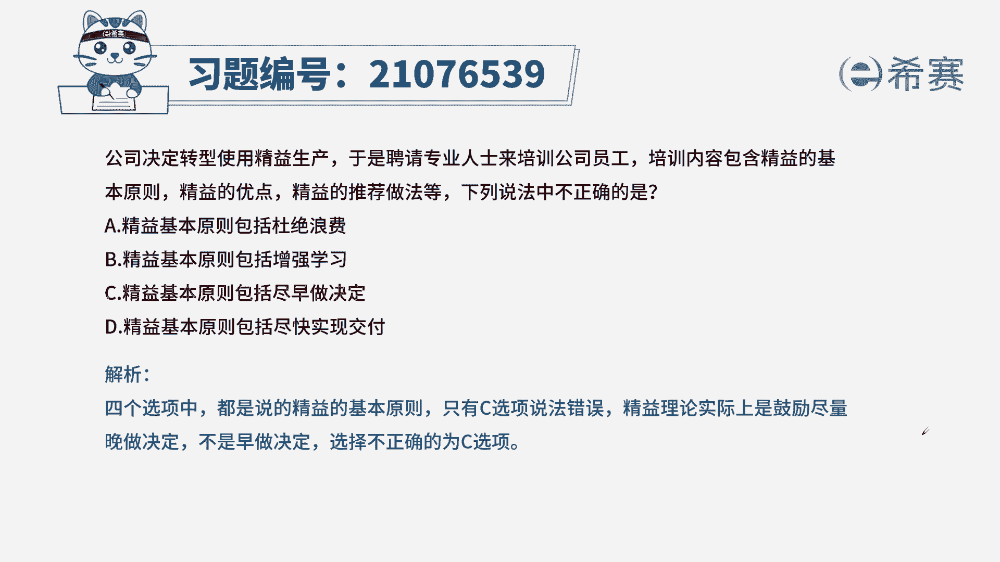
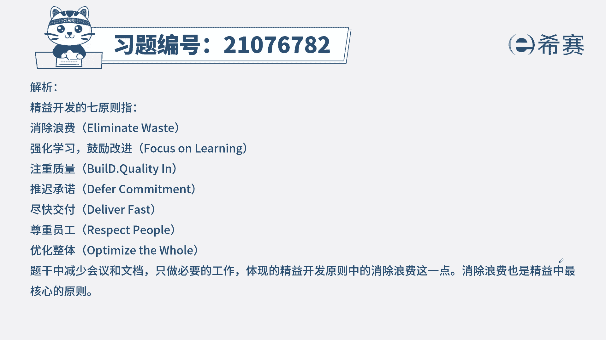

# 搞定PMP考试50%的考点，180道敏捷项目管理模拟题视频讲解，全套免费观看（题目讲解+答案解析） - P55：55 - 冬x溪 - BV1A841167ek

公司决定转型使用精益生产，于是聘请专业人士来培训公司员工，培训内容包含精益的基本原则，精益的优点，精益的推荐做法等，下列说法中不正确的是，A精益基本原则包括杜绝浪费，B经济基本原则包括增强学习。

C经济基本原则包括尽早做决定，D经营基本原则包括尽快实现交付，本题的考法是考内容，首先通过题干找到关键信息，题干中说公司的项目要使用精益生产，问我们哪一项不属于经营的基本原则，看一下四个选项。

A杜绝浪费，精益生产要求我们只做创造价值的环节，如果某个环节没有产生价值，就需要把它剔除掉，本身就是为了防止杜绝浪费，B增强学习，经营生产要求团队相互学习，形成一个成长性的组织，C尽早做决定。

经营市场中要求避免快速的武断地做决定，而是晚做决策，原因在于需要进行充分的讨论，信息越多，越基于我们的共识，更好地服务于我们后面的工作，所以推崇的是晚做决策，所以C不对，D尽快实现交付。

这也是我们敏捷的一个要求之一，尽快去交付，可以得到客户和用户的反馈，这样会有很多的问题尽早暴露出来，以便团队进行后期的迭代或改进，从而我们选出正确选项为C选项。

这是本题的解析。

大家可以暂停看一下本题的相关知识点，精益开发的七原则，针对这个知识点，我们一定是从内容上下手，我们要知道这七个原则的具体含义是哪些。

