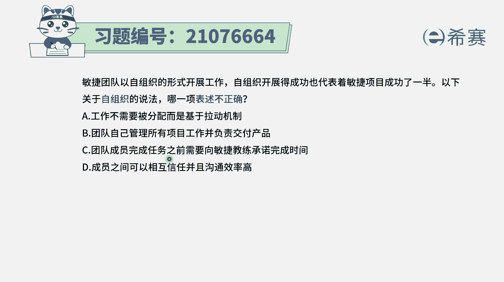
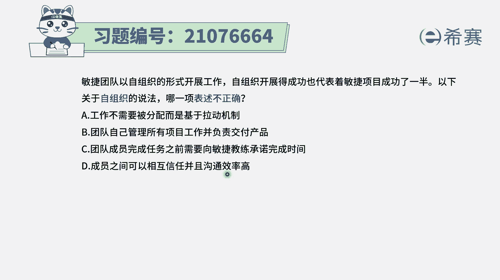
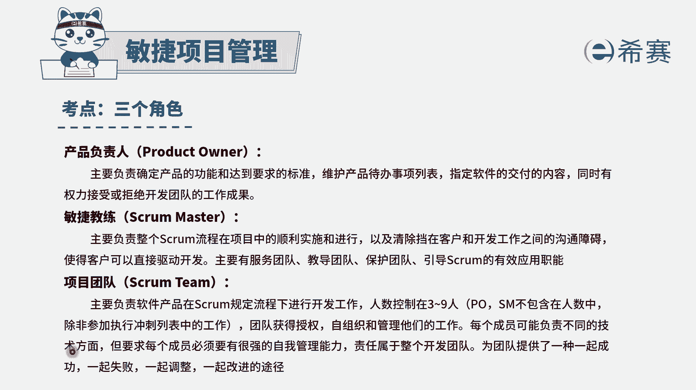
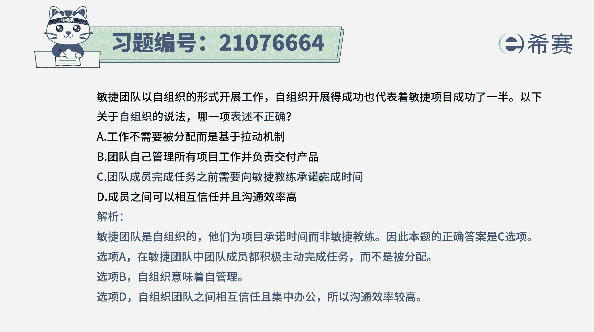

# 搞定PMP考试50%的考点，180道敏捷项目管理模拟题视频讲解，全套免费观看（题目讲解+答案解析） - P56：56 - 冬x溪 - BV1A841167ek

敏捷团队以自组织的形式开展工作，自组织开展的成功，也代表着敏捷项目成功的一半，以下关于自组织的说法，哪一项表述不正确，请注意他说的是不正确啊，呃选项A说是工作不需要被分配，而是基于拉动机制。

什么叫拉动机制呢，就是工作在这边，然后大家来主动认领任务，主动去完成，这就是所谓的拉动机制，就每个人主动的去取任务，这刚好是符合这样一个自组织对吧，选项B团队自己管理所有工作并交付产品。

那这刚好也是符合自组织团队，选项C团队成员完成任务之前，需要向敏捷教练承诺完成时间，是这样的吗，这个是错误答案啊，他在完成之前，他是自己来向项目承诺这个时间，他们是自组织，自管理。

是拉动式的这种方式来去做事情，他们会自己给自己定时间，并且都是自我管理能力比较强的人群。

也就是整个这个团的成员，他们是自组织自管理，每个团员要求必须是有很强的自我管理能力，但是各自去完成他自己的这一部分的事情。

同时呢共同成功，一起失败，所以这个C选项是错误选项，选项D成员之间可以相互信任，并且沟通效率高，那当然了，在敏捷中它会提倡什么是自组织，团队是面对面的沟通，是集中办公，这种方式要求大家是相互信任。

并且是一个个个都是复合型人才。

就是这里都是这种复合型的人才，有不同的这样一些技能，那么这种情况下，大概就是能够一起来共同完成这些事情，那很多时候民众会提倡是这种透明沟通，而这个透明沟通，其实也是来建立信任的一种方式。

所以这个题目中说哪一种是不正确的表述，关于自组织，答案就是选C啊，他不需要去向明年教练来承诺时间，他是要去自己来向项目承诺时间解析。

