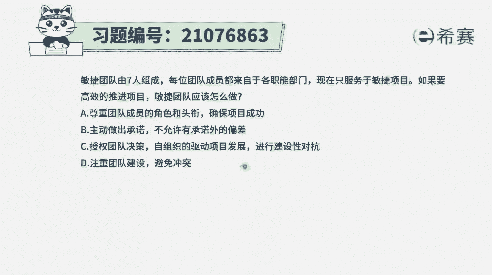
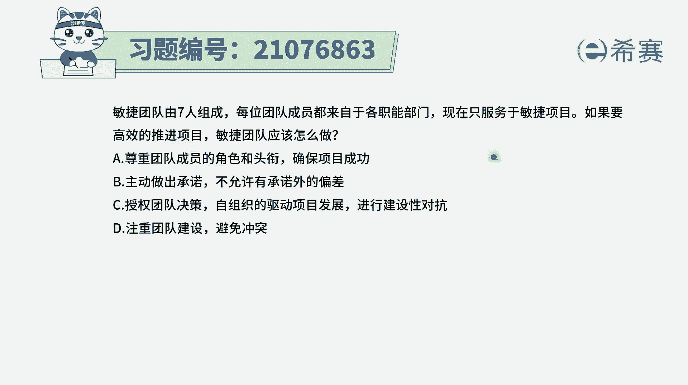
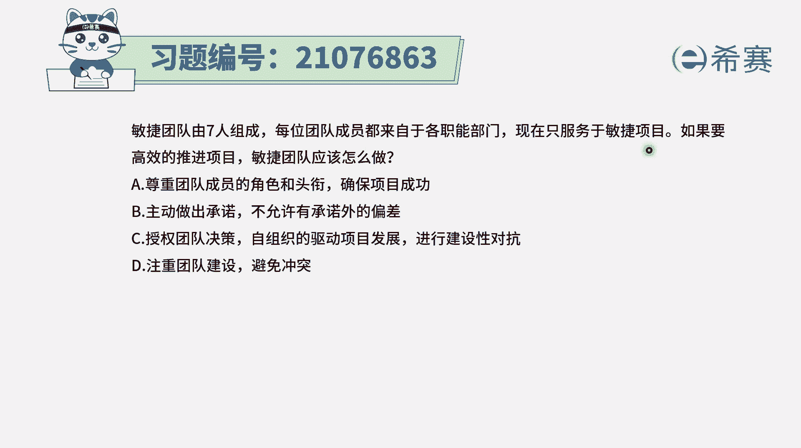
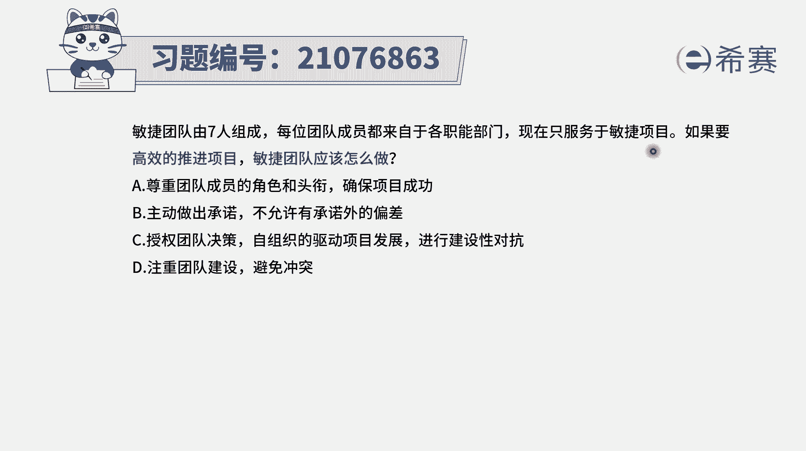
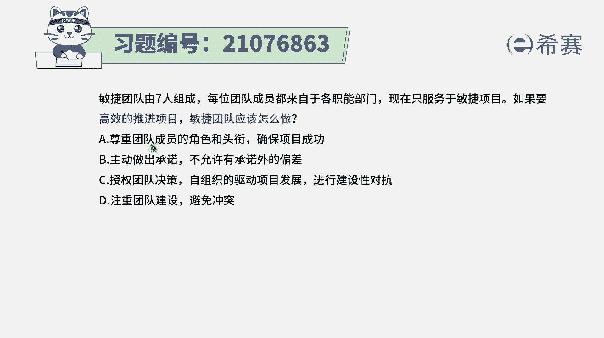
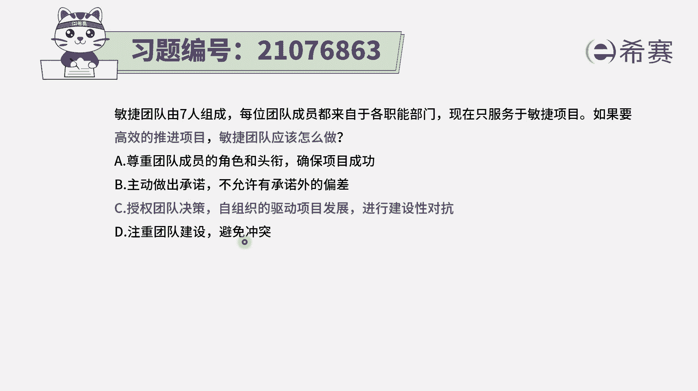
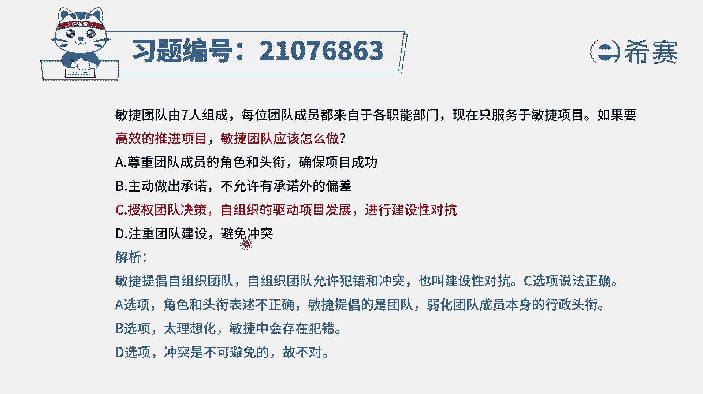
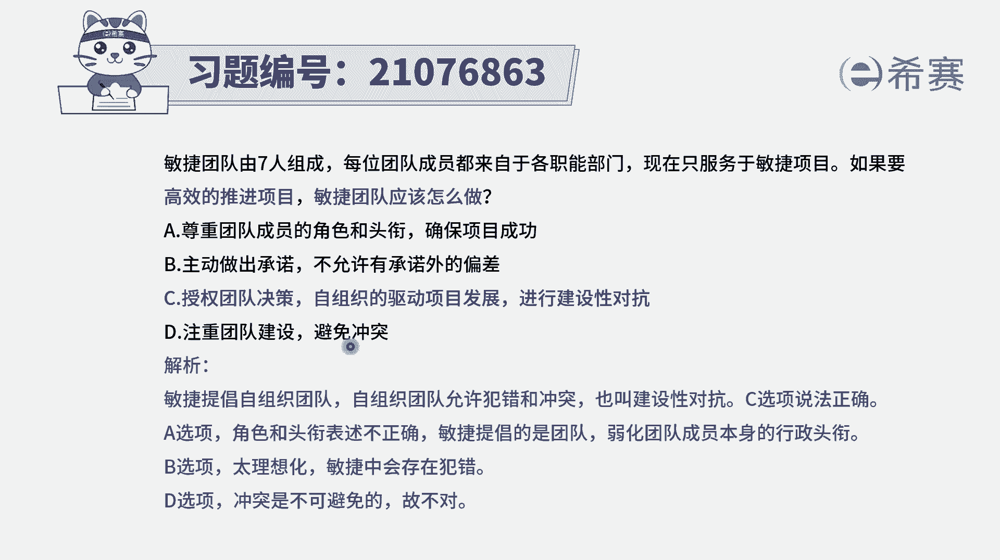

# 搞定PMP考试50%的考点，180道敏捷项目管理模拟题视频讲解，全套免费观看（题目讲解+答案解析） - P58：58 - 冬x溪 - BV1A841167ek

每位团队成员都是来自于各自的职能部门。

现在呢是只服务于敏捷项目，如果要高效地推进项目。

敏捷团队应该怎么做，那这里其实是告诉我们，敏捷团队来源是来自于什么。

来自于各个职能部门，然后现在是专职去做这样一个敏捷的项目。

在这种情况下，我们怎么样去高效推进项目呢，来看一下四个选项啊，选项A尊重团队成员的角色和头衔。

确保成功，在敏捷里面的团队成员。

其实就已经没有什么角色和头衔了，大家都是团队成员，虽然每一个人都是一专多人，都是一个T型的人才，是一个复合型人才，但是我们在这里的话，其实不会去重视那些虚名，都是去干实事去完成事情，所以A选项不正确。

B选项主动做出承诺，不允许有承诺外的偏差，承诺呢它是一种对未来的这样一个承诺，是一种设想，或者说是计划，但是能不能够完全按照程度来进行，其实不一定，所以偏差多少都会有一些，只是我们会需要去调整。

然后让它能够大差不差，按照这个目标去进行，完全不允许偏差，这种方式也太吓人了啊，就是这样的话会给大家造成巨大的心理压力，选项C授权团队决策，自组织的驱动项目发展进行建设性的对抗。

这刚好就是敏捷中所推崇的，他会希望大家能够去自我组织，自我管理，能够授权给大家，如果说有一些更好的方式来解决当前的问题，我们也可以提出更好的方式，那么这个更好的方式，对于当前的这种解决的方式来讲。

它就是一种啊对抗性的这种方式，也就是说允许有冲突，允许有不一样的方式来解决问题，可以有这种建设性的对抗，所以答案就是选C选项的啊，然后选项D注重团队建设，避免冲突，完全避免冲突几乎是不现实的。

事实上冲突它不是一个妖魔鬼怪，不是洪水猛兽，合适的情况下冲突，他能够去引发团队思考，反思，能够去促进团队进步，所以只能说是我们要做好冲突管理，而不能是完全避免冲突，所以这个题目的答案就是选C。

怎么样能够更高效地推进项目，民团队应该是受获得这一授权，能够自组织，然后能够去进行建设性的对抗。

那解析呢在这边需要的同学可以自行查看，这里有一个点很重要。

就是其实是允许团队犯错误，而不是用一种非常高压的方式来做事情。

让大家处在一次很战战兢兢的这种方式。

