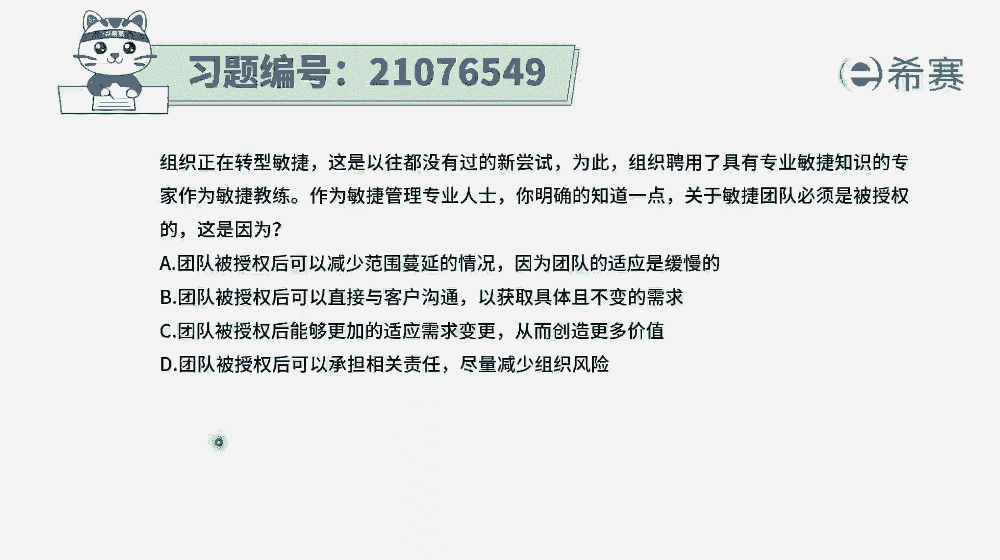
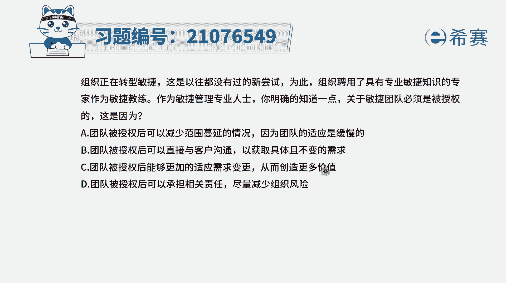
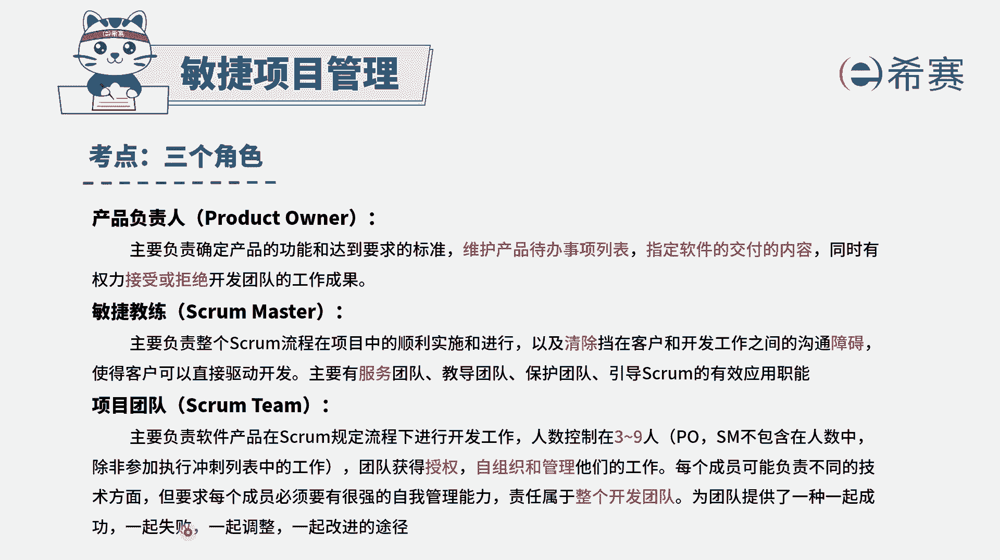
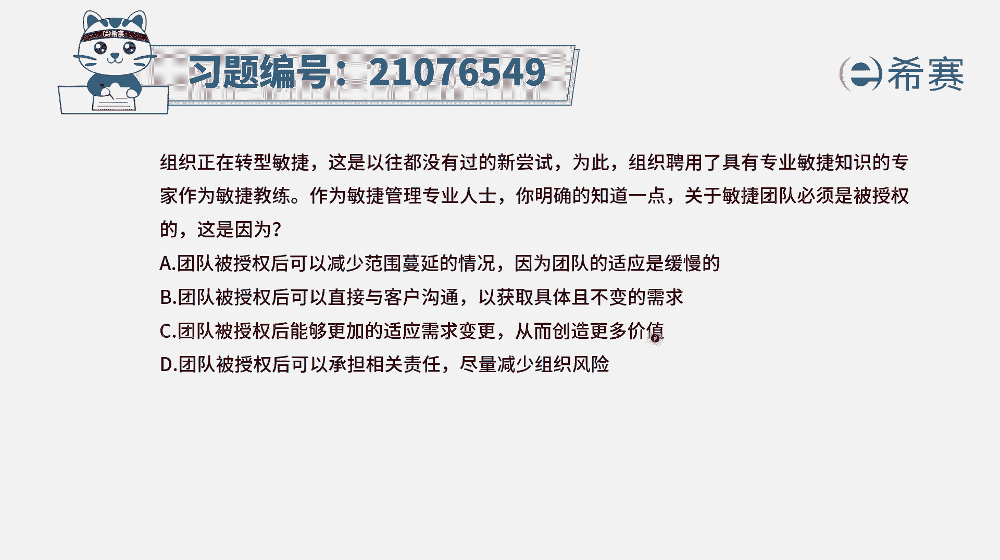
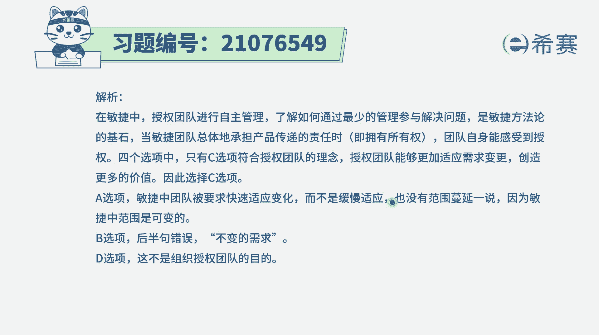

# 搞定PMP考试50%的考点，180道敏捷项目管理模拟题视频讲解，全套免费观看（题目讲解+答案解析） - P60：60 - 冬x溪 - BV1A841167ek

组织正在转型敏捷，这是以往都没有过的新尝试，为此组织聘用了具有专业敏捷知识的专家，作为敏捷教练，作为敏捷管理专业人士，你明确的知道一点，关于敏捷团队必须是被授权的，那这是因为什么呢。

也就是说为什么敏捷团队必须是被授权的呢，它有什么好处吗，我们来看一下这四个选项，哪一个才是他真正的好处，选项A团队被授权以后呢，可以减少范围蔓延的情况，因为团队的适应是缓慢的，刚好错了。

首先在敏捷度上没有范围蔓延，这么一说，他是拥抱变化的，就你有什么样的变化都可以提过来，第二个呢团队他的这个适应是非常快速的，是能够快速适应各种变化，所以A选项两句都错了啊。

B选项团队被授权后可以直接与客户沟通，这句没有错，而选项后半句以获取具体且不变的需求，是这样的吗，这就错了啊，在敏捷中，他提倡的就是快速的拥抱变化，因为客户的需求有大量的变化。

我们通过拥抱变化来帮助客户创造价值，所以这半句是错误选项，C团队被授权后能够更加的适应需求变更，而这刚好是跟着就反过来对吧，这就是正确的啊，从而能够去创造更多的价值，因为我们能够去更好地适应变更。

团队能够自己去做主，来去完成一些事情，能够更快捷的去应对变化，而事实上变更才能够帮助客户创造更多的价值，所以这句话是正确的，那最后一个选项，团队被授权后可以承担相关的责任，可以尽量减少组织的风险。

是这样的吗，我们之所以去把他的巨授权，是因为他能够更好的去应对这个项目，去管理好这个项目，而不是说让他去承担公司的一些责任，减少公司的风险，不是这样的啊，而是为了更好的去推进这个项目，去完成这个项目。

所以D选项，这个不是那个敏捷团队的这样一个授权的初心，所以答案是选C，我们需要去知道。

其实在敏捷中呢确实是团队是获得授权，能够自我组织，自我管理，而这样的一种方式是，能够让团队能够去一起面对客户，一起成功，一起失败，而事实上，很多事情都是大家可以相互商量着来进行。

可以自己去主动认领，所以答案是选C选项，授权以后能够更加的适应需求变更，从而能够去为客户创造更多的价值。

