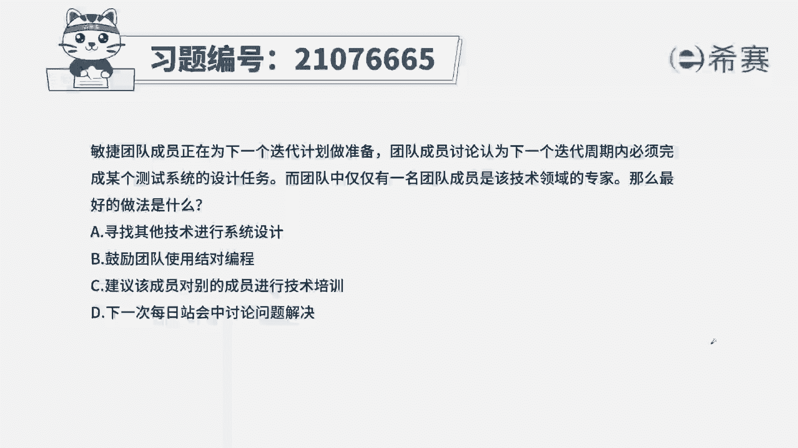

# 搞定PMP考试50%的考点，180道敏捷项目管理模拟题视频讲解，全套免费观看（题目讲解+答案解析） - P61：61 - 冬x溪 - BV1A841167ek

敏捷团队成员正在为下一次迭代计划做准备，团队成员讨论认为，下一次迭代周期内，必须完成某个测试系统的设计任务，而团队中仅仅有一名团队成员，是该技术的一个专家，那么最好的做法是什么。

A寻找其他技术进行系统设计，B鼓励团队使用结对编程，C建议该成员对别的成员进行技术培训，解决本题的考法是最佳实践题干的关键信息，只有一名团队成员是该领域的专家，而下次迭代时必须要完成这个设计任务。

来看一下四个选项，A寻找其他技术进行替代，题目已经说了，必须要进行此项设计，任务无法进行逃避，也无法进行替代，B鼓励团队成员使用结对编程，结对编程的好处是两个人同时工作，既可以提高效率。

又可以共享知识和技能，还可以降低错误出现在这过程中，另一个成员可以学习编程人员的方法，技术技能，题干中的一名技术专家，通过结对编程，可以培训和培养第二名成员，同时又提高了效率，是一个非常好的方式。

C建议该成员对别的成员进行培训，培训技工敏捷，而且还会花费很大的时间成本，所以相对于B来说，C略显不足。

从而选出B为最佳答案。

这是本题的解析。