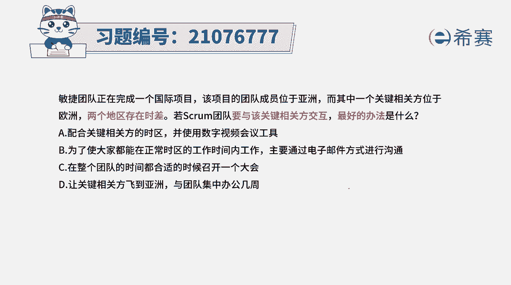
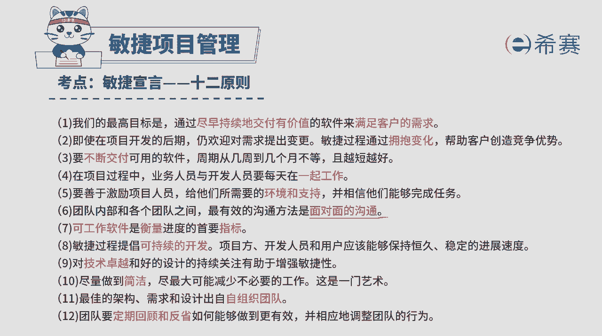
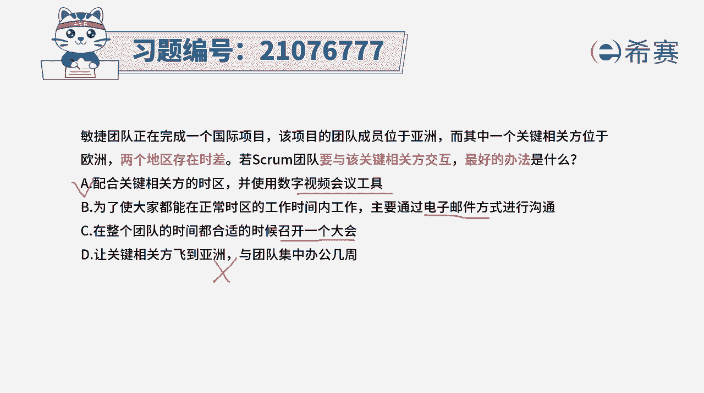
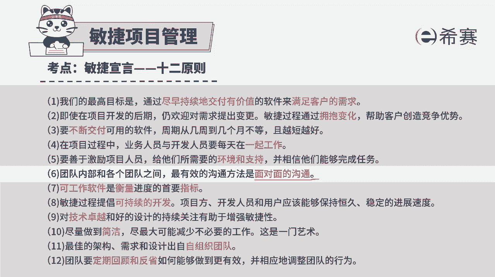
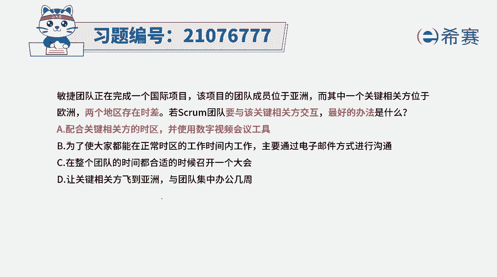
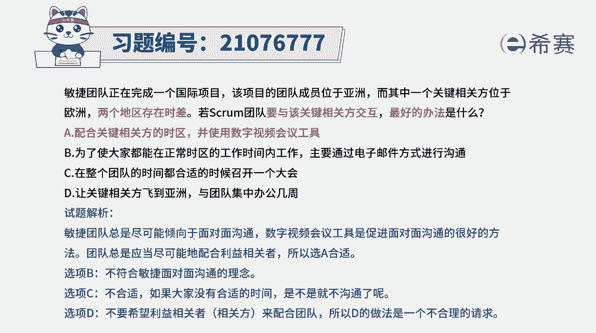

# 搞定PMP考试50%的考点，180道敏捷项目管理模拟题视频讲解，全套免费观看（题目讲解+答案解析） - P62：62 - 冬x溪 - BV1A841167ek

敏捷团队正在完成一个国际项目，该项目的团队成员位于亚洲，而其中一个关键相关方位于欧洲，两地区存在时差，6spring团队要与该关键相关方交互，那么最好的方式应该是什么呢。

那这里我们需要去知道一个很重要的信息，在敏捷中，它其实会非常强调的是面对面沟通。

敏捷里面告诉我们说，团队内部以及团队之间，最为有效的沟通方式是什么，是面对面的沟通，但是这里还有一个很重要的信息，如果说大家因为种种原因而进行异地办公，那一定是有困难的，就没有办法集中办公。

如果没有办法集中办公，不能够直接的面对面，可以怎么办呢，又可以退而求其次的方式，可以通过视频会议的方式好，有了这个信息后，我们来看一下这四个选项。

选项零配合相关方的时区，并使用数字视频会议的工具，那这个刚好就是能够解决，它依然也是一种面对面，只是在视频中的面对面，他不如当下这种线下的面对面，但是总比没有面对面要强很多啊，这是第2U的一个选择呃。

选项B，为了使大家都能够在正常的时区的工作，时间内工作，那通过电子邮件的方式啊，我们其实会知道，一般来讲电子邮件呢它会是这种文字，文字的话显得没有温度，并且呢不能够很好的去传递信息，会遗漏掉很多信息。

并且它的这种即时性也差很多，选项C，在整个团队的时间都合适的时候，来召开一个大会，那这个召开大会这个说法他就不如这个清晰，并且这个账号单位是大家一起开还是怎么开，并且事实上。

我们不只是召开一个大会就可以解决的，可能会有频繁的去交流和互动，所以A选项会说的更加明确和具体，而在看到最后一个选项，让关键相关方飞到亚洲来与团队进行集中办公，刚刚有讲过。

其实很多时候之所以去做这种虚拟团队，远距离办公，一定是有他的困难所在，那你从那边飞过来，它的这个差旅成本住宿啊，然后办公场地啊都是要都是要代价的啊，所以一般来讲对于已经有失去的。

我们都不会选择这种选项来去做解答，除非内容提纲和题干中有一种很明确的暗示。

否则的话一般不会选，所以关于这个面对面的沟通，你要再记得清楚，第一优选是线下面对面，然后其次呢就是这种线上的面对面。

所以这个题目的答案呢就是选A选项，当两个地方存在时差的时候呢，我们就可以选择用数字视频的工具，来完成这种交互解析。

