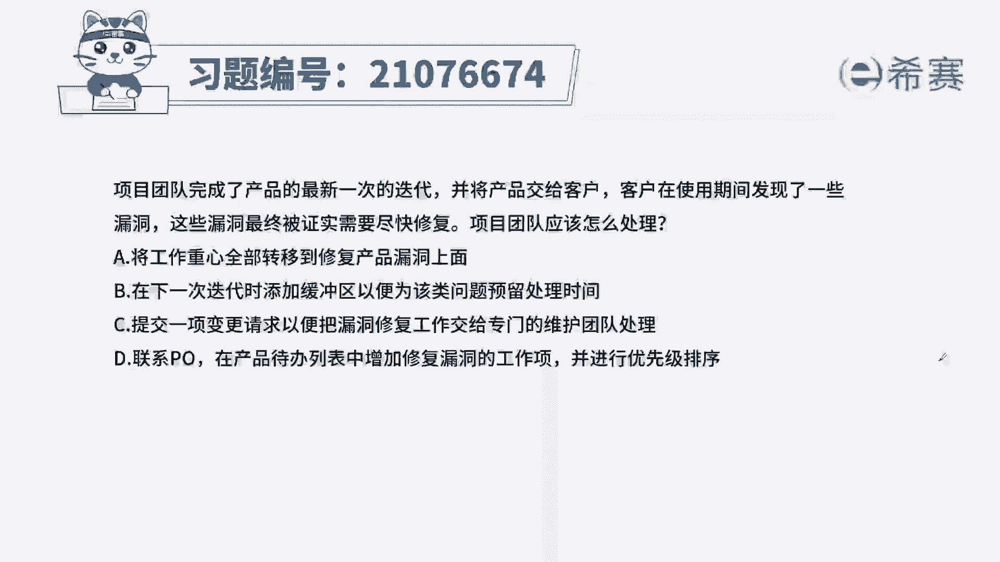
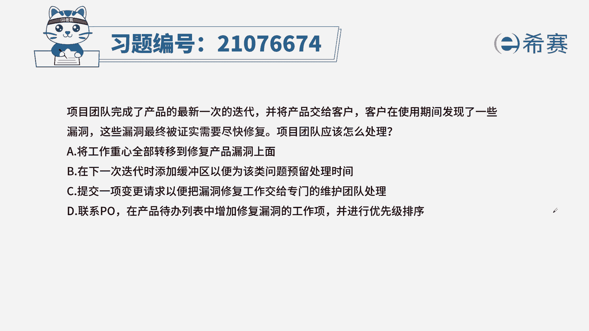
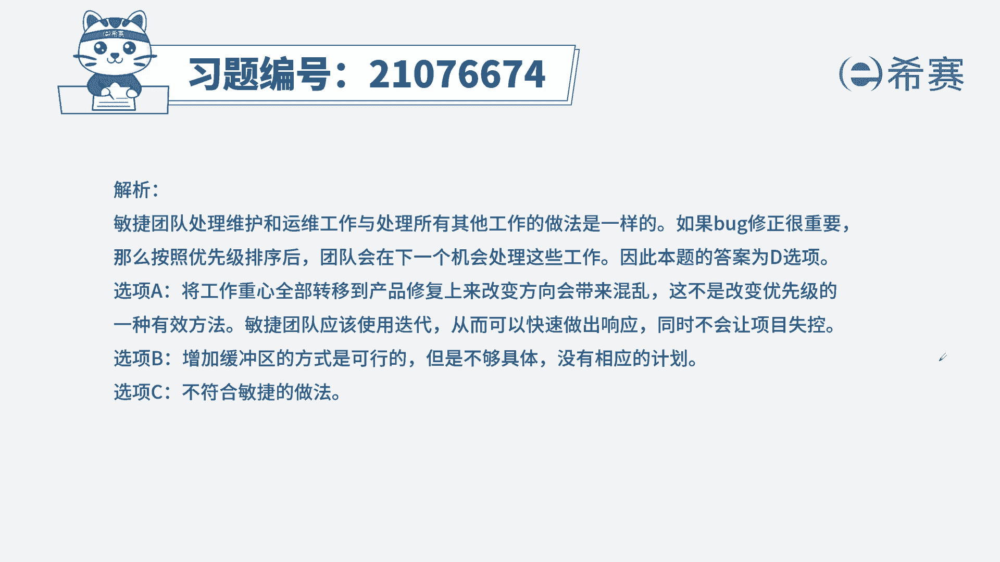
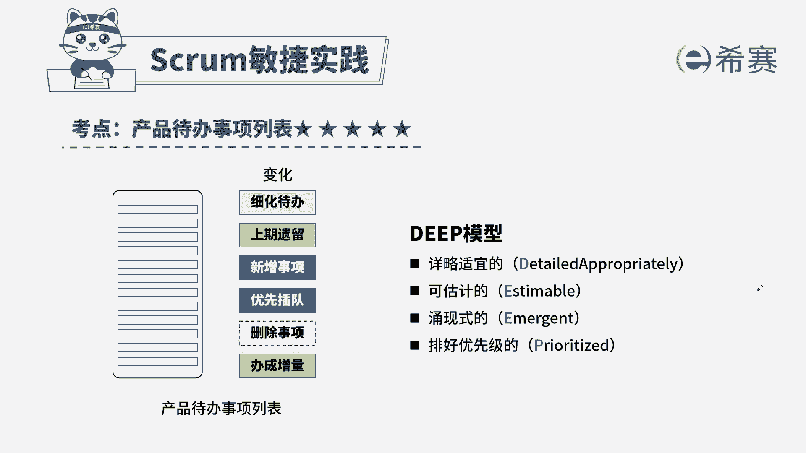

# 搞定PMP考试50%的考点，180道敏捷项目管理模拟题视频讲解，全套免费观看（题目讲解+答案解析） - P71：71 - 冬x溪 - BV1A841167ek

项目团队完成了产品的最新一次迭代，并将产品交给了客户。

客户在使用期间发现了一些漏洞，这些漏洞最终被证实需要尽快修复，项目团队应该怎么处理，A将工作重心全部转移到修复产品漏洞上面去，B在下一次迭代中添加缓冲区，以便为该问题预留处理时间，提交一项变更请求。

以便把漏洞修补工作交给专门的维护团队处理，D联系PO，在产品待办列表中增加修补漏洞的工作项，并进行优先级排序，本题的考法是我们的概念和内容，首先通过题干找到关键信息。

提前告诉我们有一个漏洞的需求需要尽快处理，那新的需求来了，我们第一步一定是要先加到待办列表中，再进行后续的操作好我们来看一下四个选项，A工作重心全部转移到漏洞上去，这样不妥，B在下次迭代中。

因为我们这里提到着急尽快修复，所以不可能放到下次的迭代中，C提交一份变更请求，变更请求是在预测性项目中所使用的流程，而在敏捷项目中没有这一项，D联系PO，放到我们的产品代办时尚列表中，进行优先级排序。

符合我们刚才的分析，所以我们选出正确选项为D选项，这是本题的解析。

本地的相关知识点，产品代办时尚列表，针对这个知识点，我们一定要明确它的内容谁负责，什么时候创建，同时要熟悉迭代代办列表，这两个知识点一起记忆。

