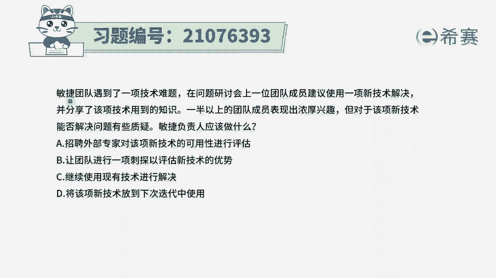
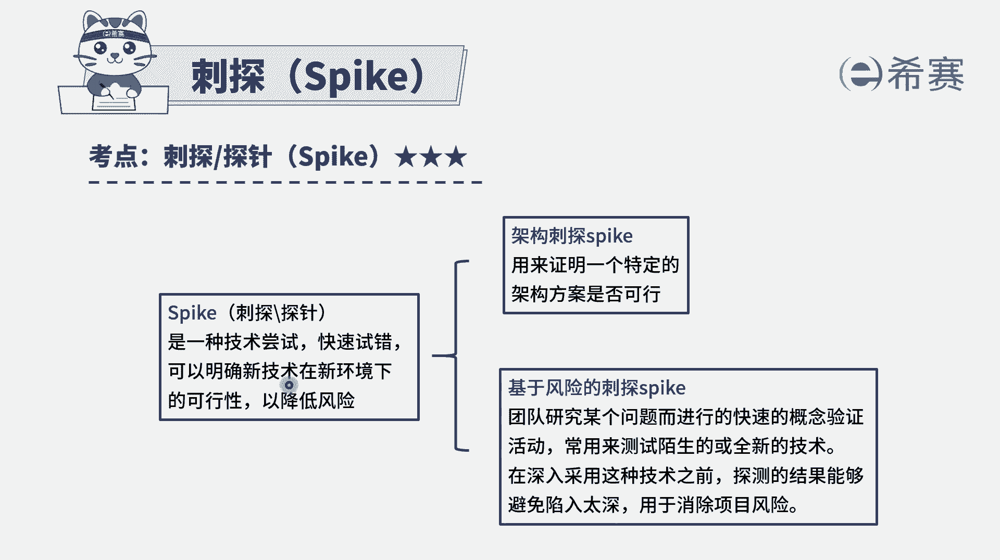
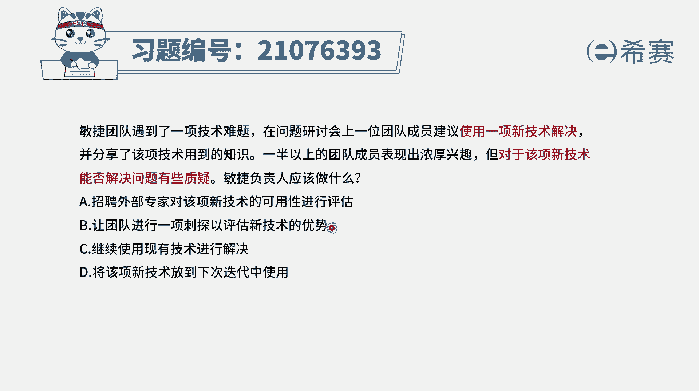
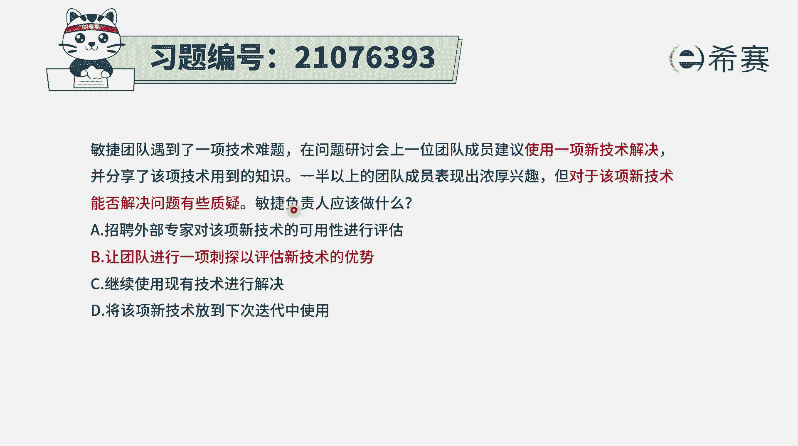

# 搞定PMP考试50%的考点，180道敏捷项目管理模拟题视频讲解，全套免费观看（题目讲解+答案解析） - P74：74 - 冬x溪 - BV1A841167ek

敏捷团队遇到了一项技术难题，在问题研讨会上，一位团队成员建议使用一项新的技术来解决，并分享了该技术用到的知识，一半以上的团队成员表示出浓厚的兴趣，但对于该项新技术能否解决问题有一些质疑。

敏捷负责人应该怎么做，我们来看一下啊，就是现在遇到了一个技术难题，然后有人提议了一个新的技术，但是这个新的技术它能不能解决问题，我们也不太确定，那么可以怎么办呢，那咱们就试一试呀，一般来讲。

在敏捷里面它会强调是说我们不要去犹犹豫豫，去分析来分析去，我们先上手去尝试一下，这个尝试的工具呢。

专门有一个词叫刺探，叫spark刺探或叫探针，它是一种技术常识，它是用这种快速试错的这个理念，在明确这种新技术在新环境下是否可行。

从而能够去降低项目的风险，所以对于这种新技术，我们一般就是用这种刺探的方式来去解决，是比较好一点，那就来看一下四个选项，选项A，招聘外部专家来对该项新技术进行可行性评估，你要外部专家来评估。

那你就不如自己亲自来去评估，因为本身我们的敏捷团队是一个自组织团队，是一个T型人才来组成的，这样一个跨职能部门的团队，所以大家本身都是应该说是强强联合，是比较强的。

因为并且呢我们要做的事情也是自己来去解决，我们是一个自组织团队，所以很多东西都应该是自己来出来主义，自己决定不需要去在靠这种外部的势力，只有在自己确实是解决不了的情况下，然后再去申请外部的资源。

所以一般来讲不是作为一个优选项啊，然后B选项让团队进行一项刺探，以评估新技术的优势，也就是说那我们就试一试吧，看这样一个新技术到底可行不可行，能不能解决一些问题，我们来去做一个用户故事，来去做一个尝试。

做一个刺探，它是可选项，事实上呢它也是正确答案，选项C继续使用现有的技术来进行解决呃，一般来讲在敏捷中呢其实会欢迎新技术，欢迎新的方法，因为一般能够被采纳的这种新技术，它肯定是有它的独到优势。

它能够去提升效率啊，或者能够提升稳定性呢，能够更好的去解决一些质量问题啊，所以呢其实是欢迎新技术的，并且敏捷它会是一种很灵活的方式来处理问题，敏捷敏捷它不仅仅只是说快，他根本的是灵活，所以是欢迎新技术。

那选项其实是继续使用现有的技术，也是对新技术视而不见，这种方式是不可选的，而D选项将该项新基数放到下一轮迭代中，那在这一轮迭代中能不能用，都不知道，你为什么就能这么武断的去说，放到下一轮迭代中呢。

所以这种方式肯定也是不可行的啊，事实上我们要决定要放到下一轮迭代，也应该是做刺探以后才能够决定，所以这里面的话只有B选项是最合适的，就是让团队进行一次刺探。

以评估新技术优势，那解析呢在这边需要同学可以自行查看一下，就是当对于一种技术不确定的时候，我们就可以通过这种刺探的方式。

来去了解这个技术的可行性。

