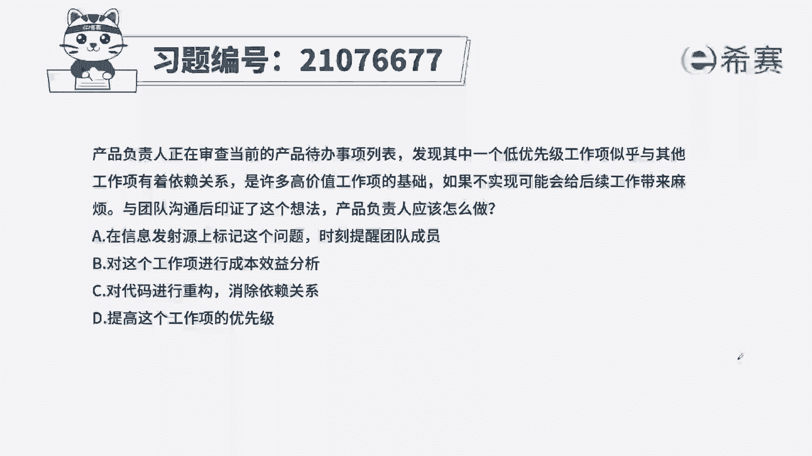
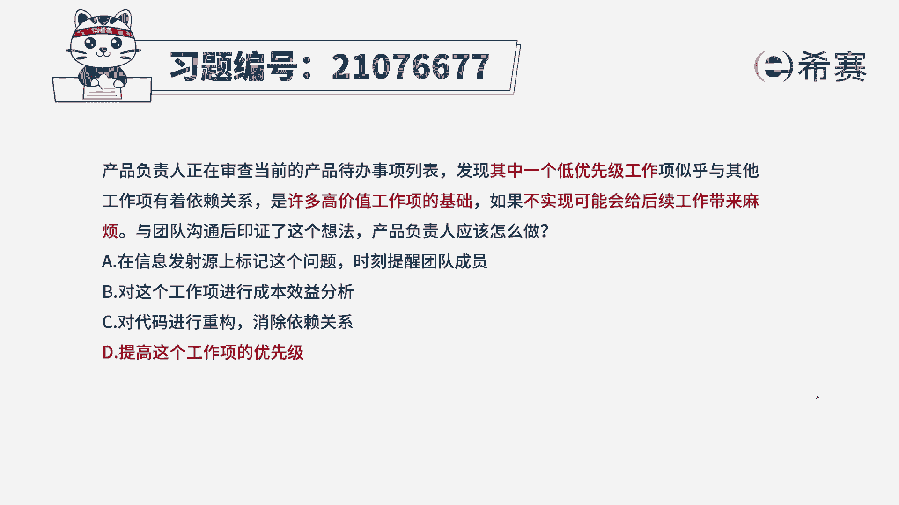
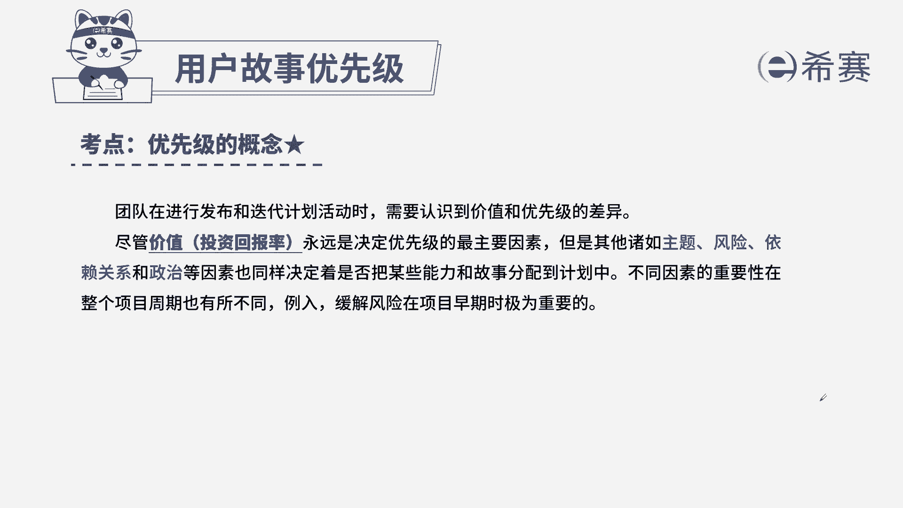

# 搞定PMP考试50%的考点，180道敏捷项目管理模拟题视频讲解，全套免费观看（题目讲解+答案解析） - P76：76 - 冬x溪 - BV1A841167ek

产品负责人在审查当前产品待办事项列表中，发现了一个低优先级的工作，似乎与其他的工作存在着依赖关系，是许多高价值工作上的基础，如果不实现，可能会给后续工作带来麻烦，与团队沟通后印证了这个想法。

产品负责人应该怎么做，A在信息发射源上标记这个问题，时刻提醒团队成员，B对这个工作项进行成本效益分析，C对代码进行重构，消除依赖关系，D提高这个工作上的优先级，本题的考法是最佳实践。

通过题干找到关键信息，原来低优先级的工作，现在变成了高风险的工作，因为它会影响到我们后续的高价值，那这么一来，我们一定要调整它的优先级，因为高风险高价值的工作要先做，从而我们选出正确选项。

D提高这个工作的优先级，我们来看一下其他三个选项，A在信息发射源上标记该问题，标记也无法实质的解决这个问题，B对这个工作项进行成本效益分析，题干已经告诉我们了，它会影响到后面高价值的工作。

所以它的价值也是很高的，C对代码进行重构，重构是为了解决我们的技术债务，和题干没有关系。

本题的解析，大家可以暂停看一下本题的相关考点，对优先级的概念我们一定要深刻去理解，因为在我们产品待办事项列表中，我们如何去排啊，它是有价值和风险来决定的，我们要根据这些因素来确定。

