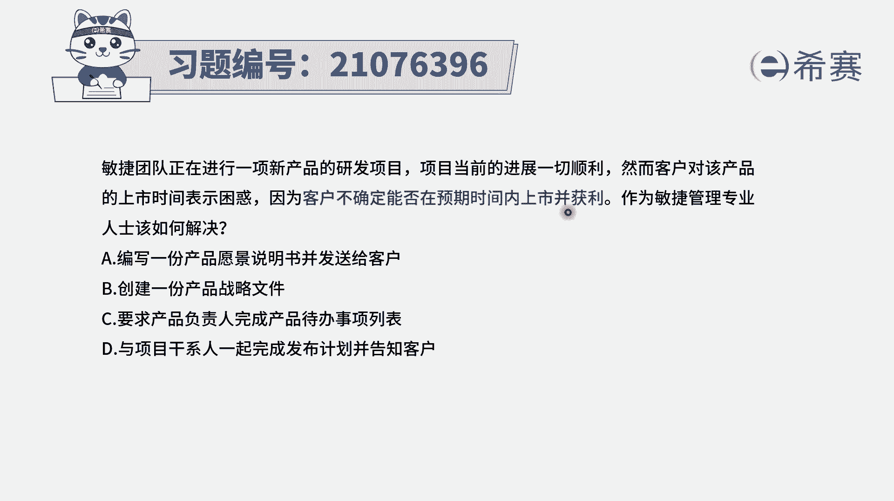
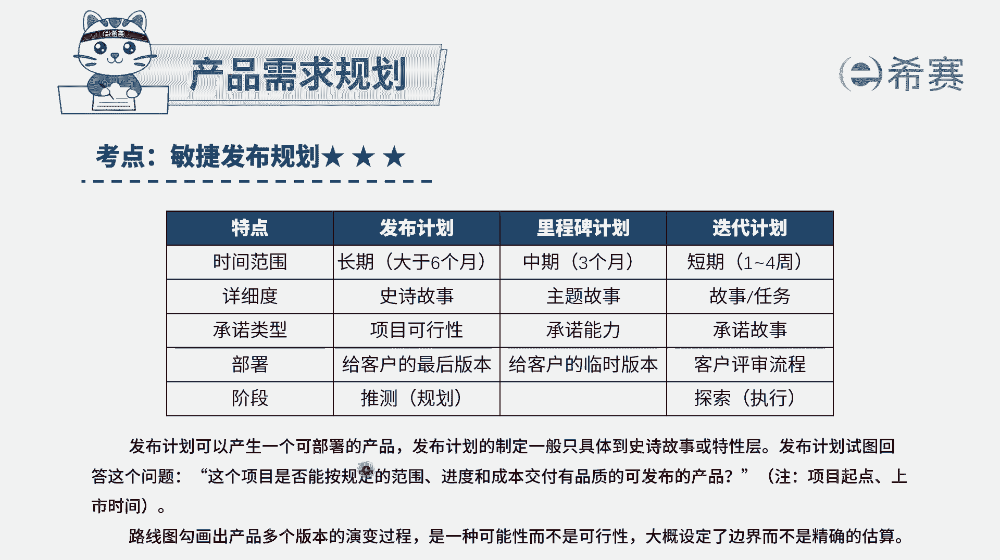
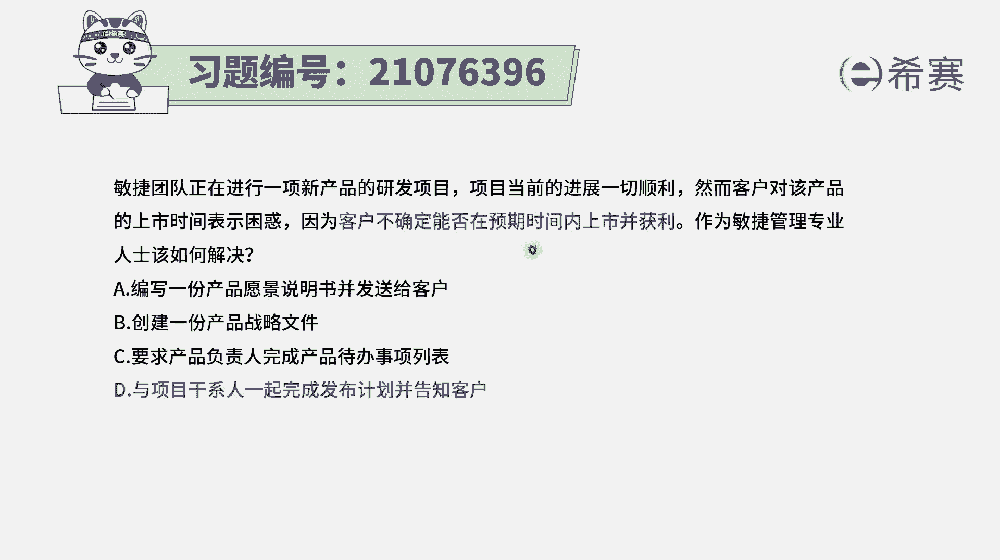

# 搞定PMP考试50%的考点，180道敏捷项目管理模拟题视频讲解，全套免费观看（题目讲解+答案解析） - P79：79 - 冬x溪 - BV1A841167ek

敏捷团队正在进行一项新产品的研发项目，项目当前的进展一切顺利，然而客户对该产品的上市时间表示困惑，因为客户不确定，能否在预期的时间内上市并获利，作为民间管理专业人士，你应该怎么样去解决这个问题。

那题目中，他其实表示是客户对于这个上市时间表有困惑，他也不能够确定什么时候能够去上市，那如果说我们能够给到他这样一个计划，告诉他在什么时候应该是能够去上市，能够提供哪些大方向的这些产品内容。

或是大方向的这些功能点内容，那这样的话客户可能会感觉好一点，至于说能否获利这个东西的话呢，其实呃你作为项目经理，你都没有办法去给他，但是有一个点，我们在敏捷里面是一个叫价值驱动交付。

也就是我们会先去交付那些客户最重视的价值，最有价值的部分，所以这样的话理论上来讲，我们能够给大家建一个相似的时间，然后他自己也会非常清晰，这个产品中哪些是最有价值的，这样的话。

他就基本上是能够满足题干中的这个需求。

而这样一个计划呢，我们在敏捷里面会有这样三个大的计划，一个是发布计划，那建议发布计划是基于愿景，然后会有这样一个每一个大的周期，会有一个发布，那这个发布呢可能会是六个月或是以上。

在这个里面的话并不会很细节的去给到呃，我们要去做哪些东西，只会是大致列出我们可能需要去包含哪些东西，然后这些东西呢可以再拆分到这样一个迭代，每一轮迭代里面呢，又是会在通过迭代规划会议的时候。

来去详细的给出每一轮迭代要做的事情，那对于客户他的这个疑惑，其实我们就是可以通过阵营发布计划，来去告诉他，我们在什么时候可以去部署哪些产品，或者说是呃，这个产品会包含一些什么样的重要的功能。

所以这个题目的答案呢。

就是做一个发布计划会更合适一点，所以客户对于产品的上市时间表示困惑，不确定能否在与其相识的时候，我们就是给他去做一个发布计划，便是去同步给他，至于其他几个选项，我们来认识一下啊。

选项A编写一份产品愿景的说明书，那产品愿景说明书只是说把客户的需求，然后转换成一个产品愿景的建议描述形式，这里面的话并没有给到什么时候，我能够去做成什么东西来上线选项，B创建一份产品战略文件。

那产品战略文件中它只会列出，一般来讲是项目的背景需求，然后可能我们需要去做什么东西，它的边界在哪里，我们大概可能会遇到什么样的风险和挑战，以及大致的时间，但是这个节点呢都是比较粗略的。

都是一个叫粗粒度的，所以他不不能够满足这个题干中所说的，是明确我在什么时候能够去想走向市场，能够发布选项，C要求产品负责人完成产品待办事项列表，那产品待办事项列表，只是把客户的需求。

能够更详细的用用户布置的方式来展现出来，以后收集到一起，并且按照价值进行排序，它里面并没有时间轴的这个维度，所以它不能够满足在什么时候能够上市发布，所以这样看起来只有最后一个选项。

也就是说发布计划中会明确表达说。

我们可能在什么时间点能够发布这个版本中，包含什么功能，然后什么功能什么功能这种方式。

