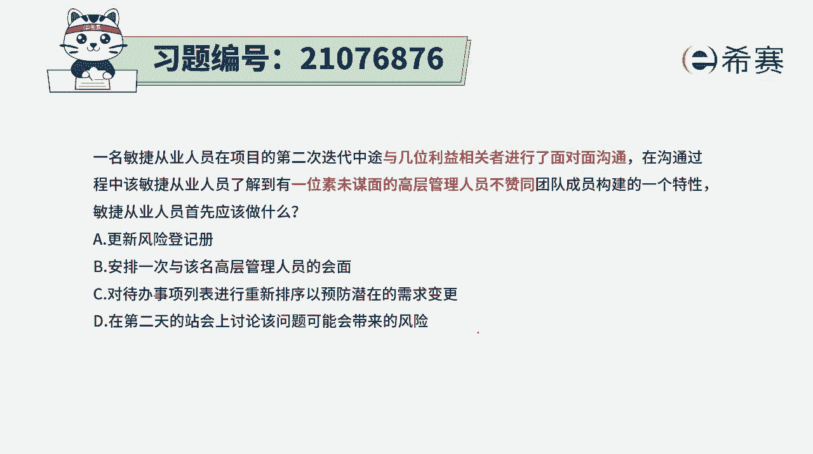
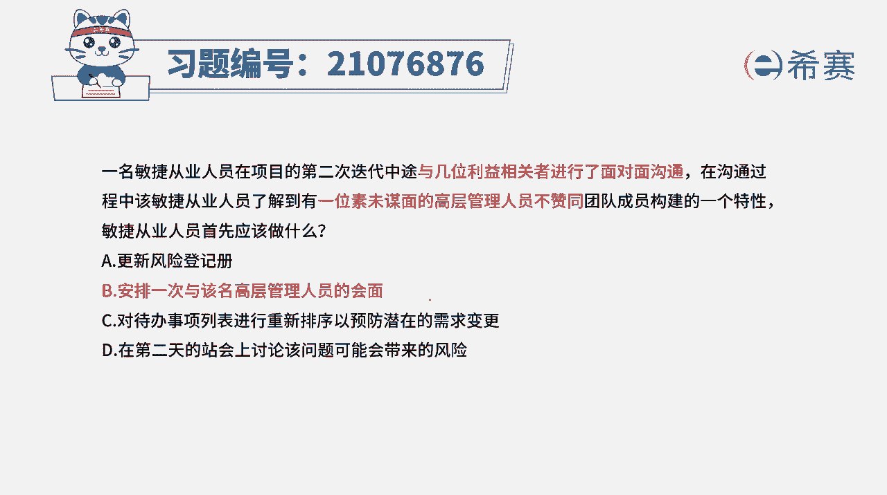
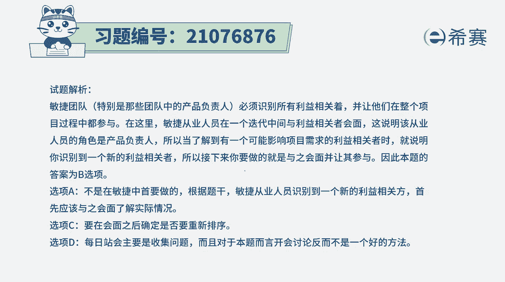

# 搞定PMP考试50%的考点，180道敏捷项目管理模拟题视频讲解，全套免费观看（题目讲解+答案解析） - P83：83 - 冬x溪 - BV1A841167ek

一名敏捷从业人员在项目的第二次迭代中途，与几位利益相关者进行了面对面沟通，在沟通过程中，该敏捷从业人员了解到，有一位素未谋面的高层管理人员，不赞同团队成员构建了一个特性，那敏捷从业人员首先应该做什么。

我们知道，首先第一个呢就是这里面出现了这样一个人员，他是一个重要的干系人，是一个重要的相关方，同时呢他还我们还没有见过面，并且他已经是表达出，对我们当下所说的这样一些工作内容中。

有一些些不同的看法和意见，那这个时候我们要怎么样去做事情呢。

其实在敏捷中，我们会强调的一个点的是面对面的沟通，就如果说有疑问，有问题，矛盾，面对面的沟通方式，它是显得最为有效的，最有效的沟通方式是面对面的沟通，好有这样一个基本信息以后。

我们再来看一下选项A更新风险的预测，就是把这个问题给记录下来，会把这个风险识别出来，记录下来，那这种记录呢它只是也在做事情，但显得不够积极主动，因为这位高层管理者，他已经是表达了不赞同这种特性。

那我们其实应该是要去了解他的这个想法诉求，以及为什么不赞同，所以第二个选项安排一次，与该高层管理人员的会面，就说我们来去见面，面对面的沟通，那这肯定是合适的啊，而事实上呢这也是这道题目的答案。

第三个对待办事项列表进行重新排序，以预防潜在的变更需求能够预防吗，本身敏捷就是要拥抱变化，你还通过这种方式来预防开玩笑呢，这不可以啊，并且这种方式它有没有解决掉，这个关高层管理者。

不赞同某个特性的这样一个事情，他没有解决，所以这也是不选呃，第四个，在第二天的展会上讨论该问题可能带来的风险，在这里有一句话想要分享给所有的同学，任何怀疑顾虑，第一时间与第一人沟通。

但是在生活中其实不一定会做到这个程度，但是如果能够做到这个程度，那就是非常了不起的一件事情，而这个高层管理人员他不赞同某个特性，我们应该是要去，第一时间跟这个高层管理人员来沟通。

然后沟通的方式是打电话的方式比较好，还是会面呢，肯定是会面更好一点，所以这四个选项中，只有第二个选项是在解答这样一个事情去处理，它是强调这种面对面的沟通方式，所以答案呢就是选第二个选项解析。

