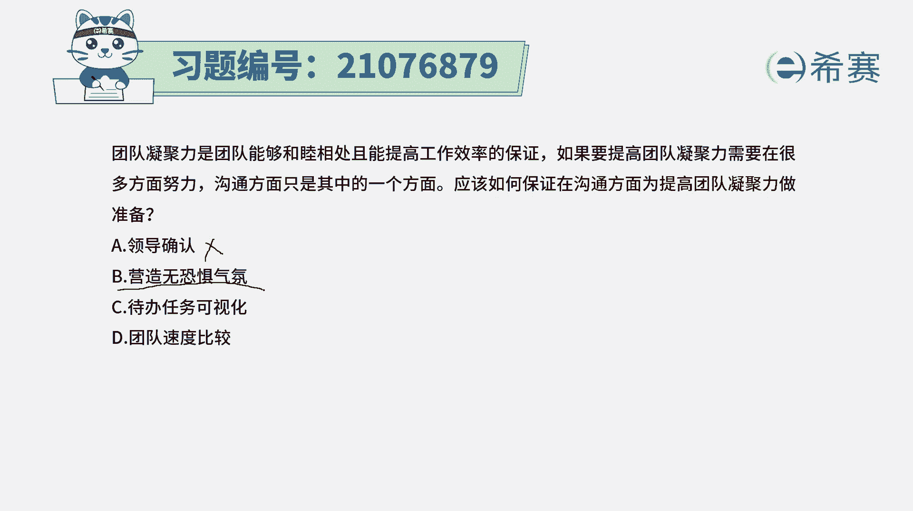
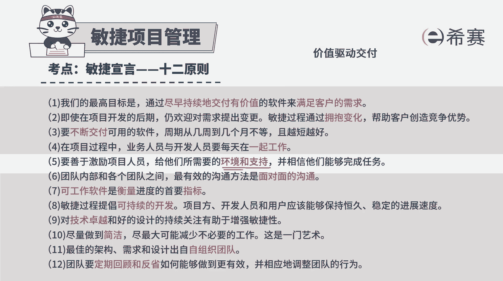
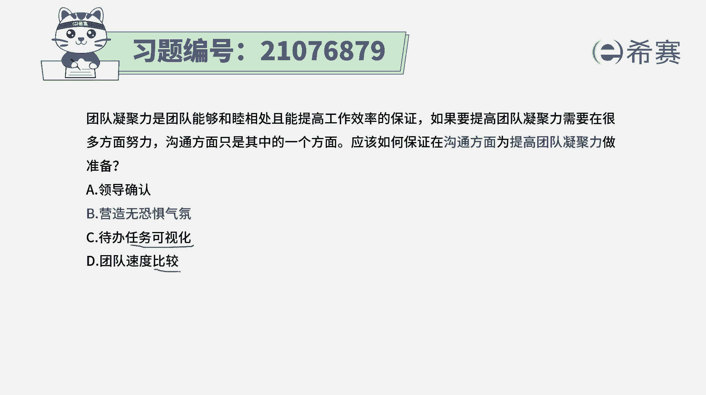
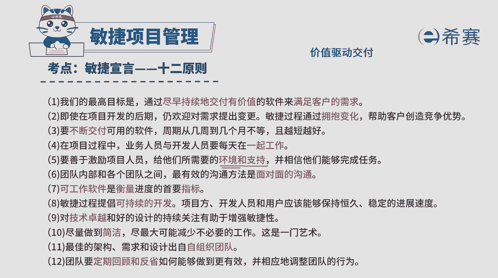
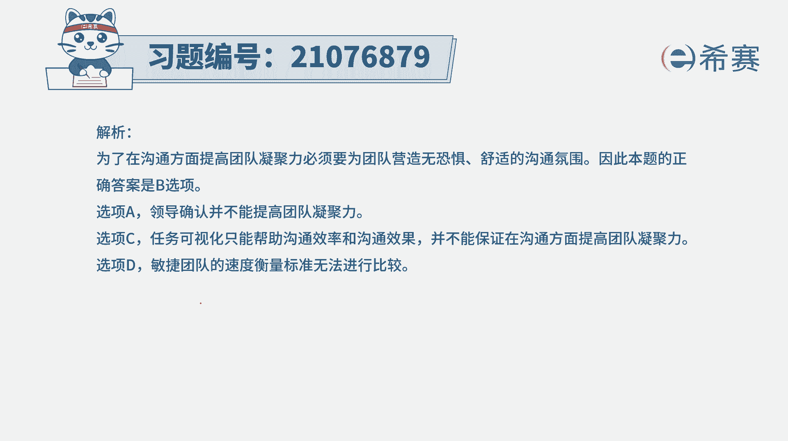

# 搞定PMP考试50%的考点，180道敏捷项目管理模拟题视频讲解，全套免费观看（题目讲解+答案解析） - P88：88 - 冬x溪 - BV1A841167ek

团队凝聚力是团队能够和睦相处，且能够提高工作效率的保证，如果要提高团队凝聚力，需要在很多方面努力，而沟通方面只是其中的一个方面，应该如何保证在沟通方面，为提高团队凝聚力来做准备，那这里面其实就告诉我们。

首先第一个敏捷团队，他是一个自组织团队，我们需要去让团队的成员，他的工作效率比较高的话呢，我们需要去提高团队凝聚力，能够让大家有更多的相互信任，而其中就包括要更好的去做沟通，那么在沟通这一方面。

我们要怎么做呢，我们来看一下选项A领导确认，那么也就是那种有管理的比较严格，从上往下的这种方式，这种刚好是跟敏捷就不太匹配，敏捷是一个自组织团队，并且会希望是信息透明，A选项B营造无恐惧气氛。

营造无恐惧气氛，你感觉好像是一个很怪异的词啊，但是我们需要去了解一下，所有的这些选项呢都是从英文翻译过来的，他其实他的意思是说要营造一种良好的气氛。

这种气氛中没有恐惧的信息，也就是换一个话来讲，在敏捷宣言，敏捷四大语言之中，有这样一条说，我们要善于去鼓励激励团队成员，给他们所需要这些环境和支持，所以营造好一个好的环境，替他去消除障碍，清除障碍。

那么在这种友好的环境中。

他才能够更好的去沟通和交流，才能够更专注的去做项目相关的这样一个事情，所以这个题目的答案呢就是选第二个选项，至于C选项，代办任务可视化，那么这种可视化的方式，确实是有助于信息的沟通。

确实是有助于信息的沟通，他对团队的这种沟通效率肯定是有提升的，但是至于说提高团队的凝聚力，这样一个事情上面呢，他不一定有这样一个直接的效果，而选项D团队速度比较，那很多时候只要一比较。

我们说人比人气死人对吧，然后货比货得扔，人比人得那啥，那通常这种比较的方式，其实会营造一个非常不友好的环境和氛围，肯定是不太合适的，所以这个题目的答案就是选，第二个，就是如果说我们在沟通方面。

要去提高团队凝聚力的话呢。

我们就是要去营造一个无恐惧的氛围，也就是这里的我们要去给团队。

他所需要的这些环境和支持，解析呢。

