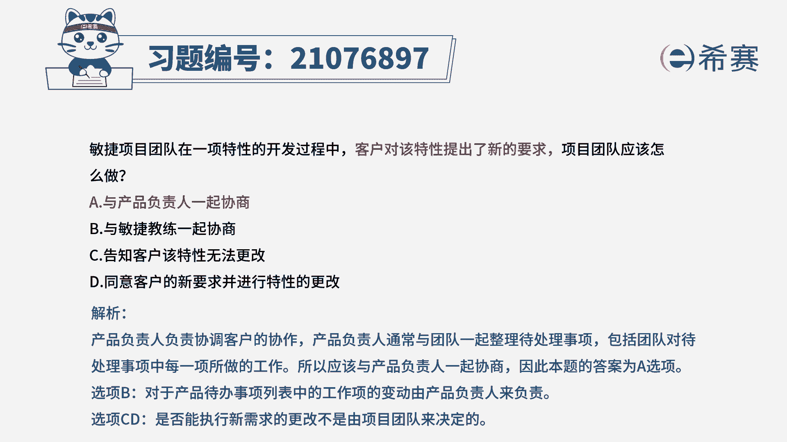

# 搞定PMP考试50%的考点，180道敏捷项目管理模拟题视频讲解，全套免费观看（题目讲解+答案解析） - P9：8 - 冬x溪 - BV1A841167ek

敏捷项目团队在一项特性的开发过程中，客户对该特性提出了新的需求，项目团队应该怎么做，A与产品负责人一起协商，B与敏捷教练一起协商，C告知客户该特性无法更改，D同意客户的新要求，并进行个性的更改。

解题思路，首先找到题干中的关键信息，题干中告诉我们，客户对特性提出了新的需求，也就是更改了用户故事，那我们要知道用户故事在产品待办事项列表中，产品待办事项列表由产品负责人来负责。

所以应该找到他和他一起商量，花正确答案A与产品负责人一起协商，看下其他三个选项，与敏捷教练一起协商，敏捷教练只负责敏捷践行和排除障碍，所以不选C，告知客户该特性无法更改。

团队存在的价值是为客户创造价值至低，第二团队也不能直接拒绝客户的需求，需求的调整与否是产品负责人确定D，同意客户的新需求。

并进行特性的更改，和C1样，需要产品负责人来进行决定，这是我们本题的解析。

大家可以暂停看一下，本题的考点是产品负责任的岗位职责，针对于此类型的题目，我们第一是要知道产品负责人的工作边界在哪，知道哪些事情是归他管，哪些事情不归他管，同时我明确知道敏捷教练他要做哪些工作。

开发团队要做哪些工作，这三个本系列的核心考点，他们之间互为分点，只有知道这三个。

