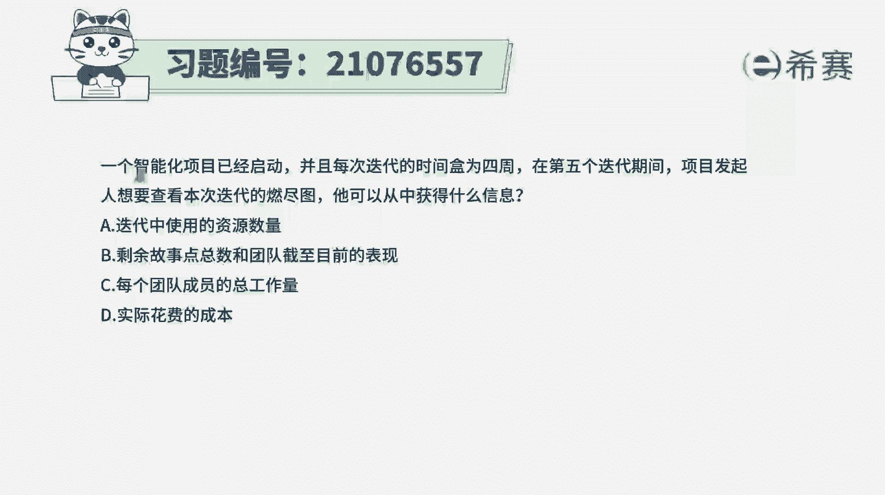
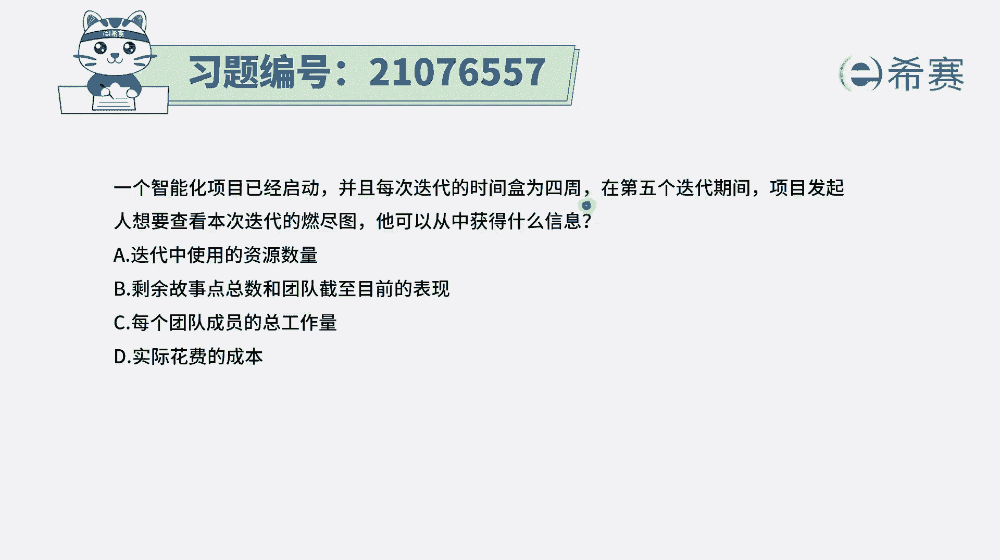
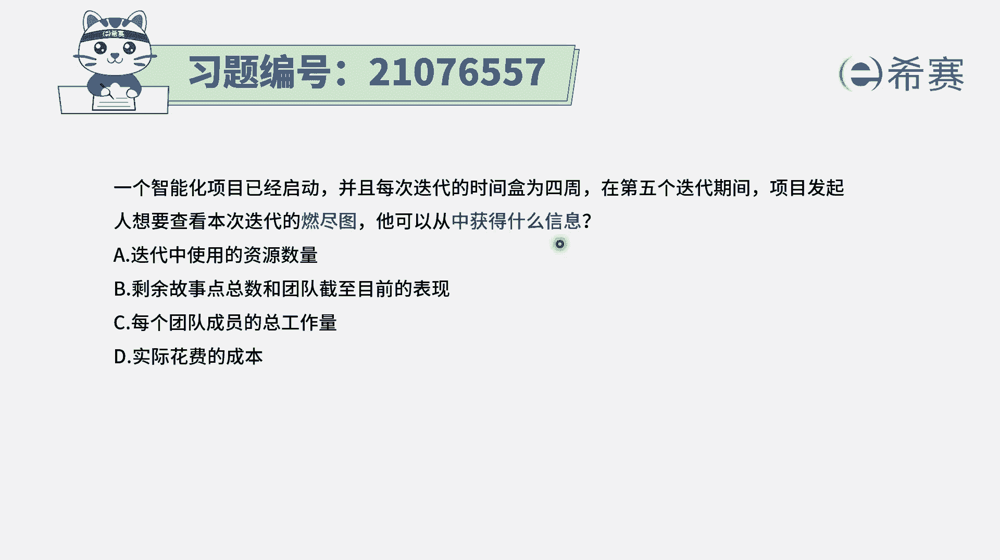
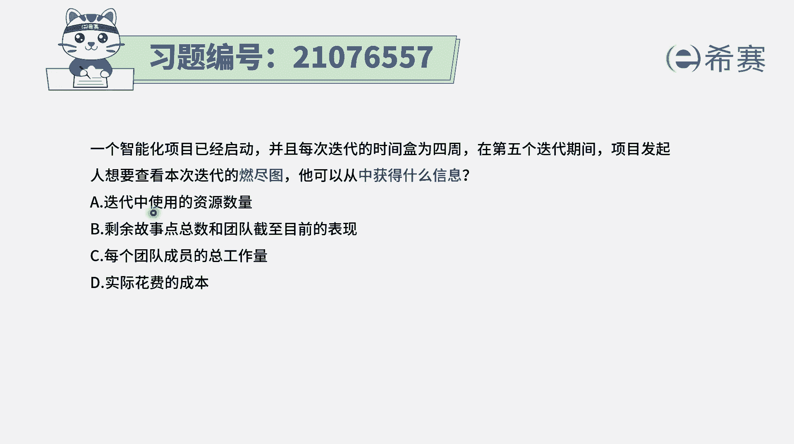
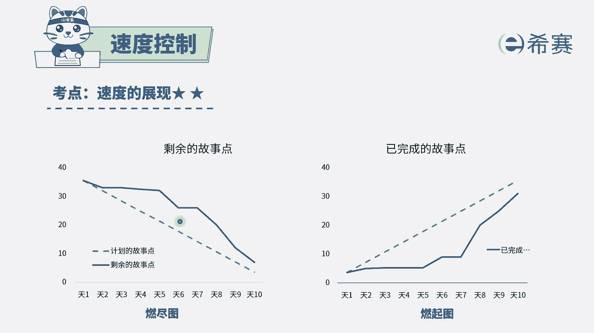
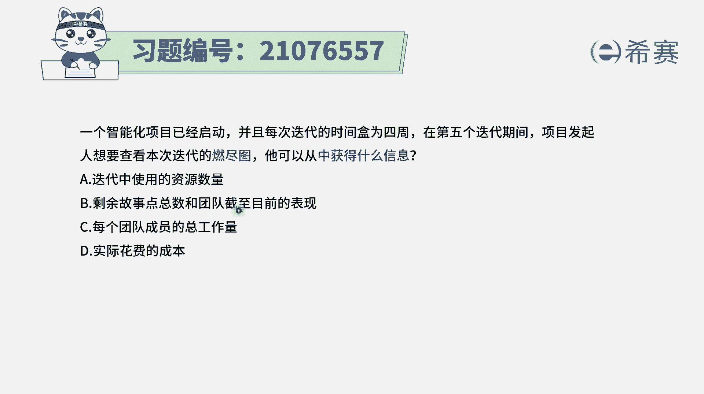
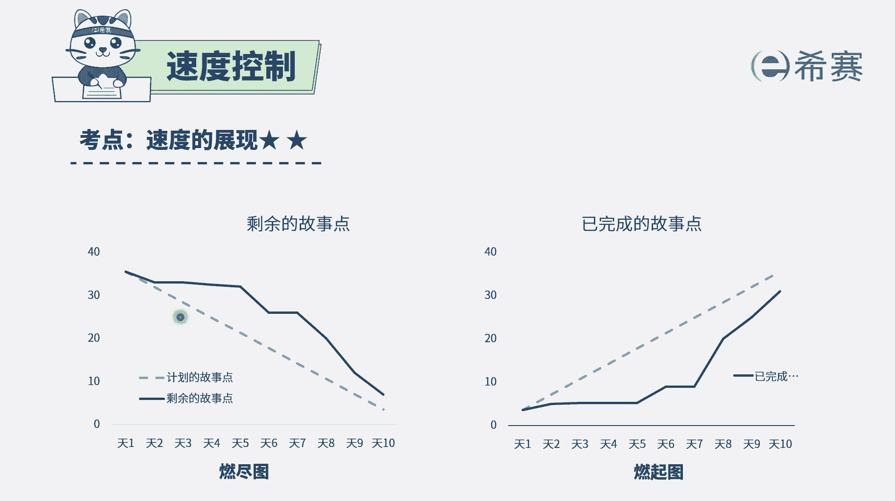
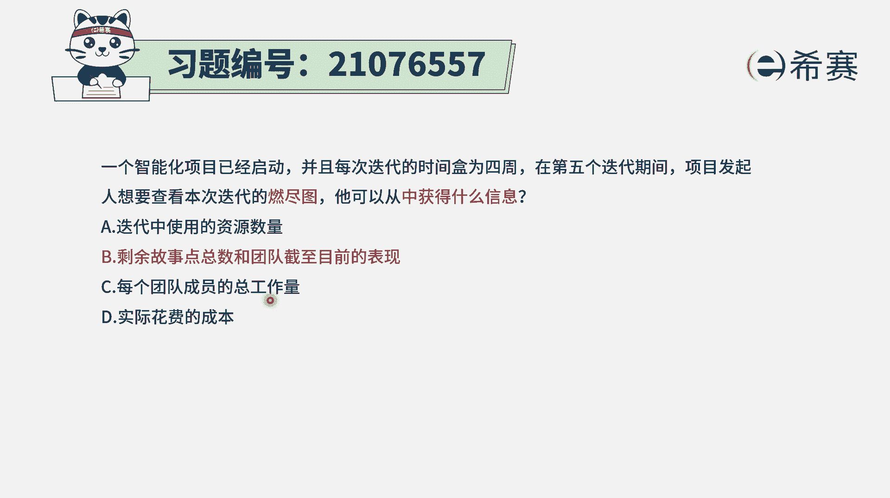
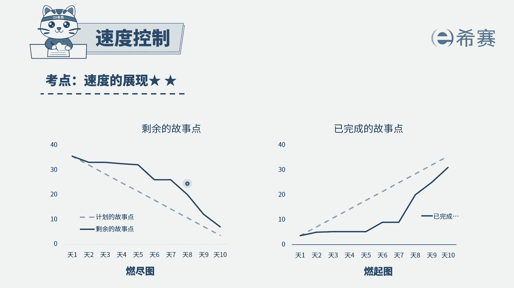
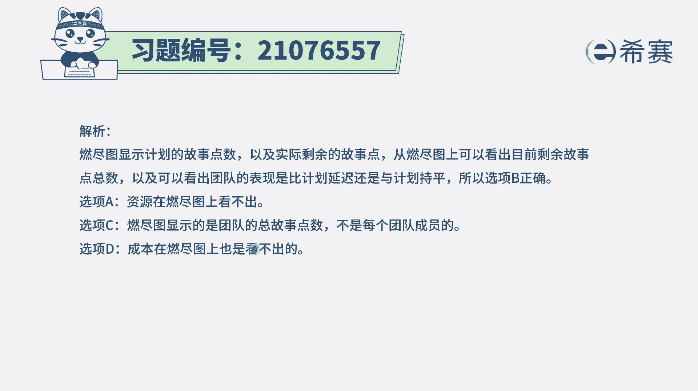

# 搞定PMP考试50%的考点，180道敏捷项目管理模拟题视频讲解，全套免费观看（题目讲解+答案解析） - P90：90 - 冬x溪 - BV1A841167ek

一个智能化项目已经启动，并且每次迭代的时间和为四周。

在第五个迭代周期期间，项目发起人想要查看本次迭代的燃尽图，它可以从中获取到什么信息，其实题目中就是告诉我们说。

你能够从燃尽图里面获取到什么信息，燃尽图是一个这样的图示，就是他会把每一轮迭代中，要做的用户故事展现出来，然后每一天我们来去统计，还剩多少用户故事没有完成，把这个信息写下来。

要把每一天的建议信息连连成一条线，这个线呢就是燃尽图，随着时间推进。

剩余的故事呢是越来越少，好有了这个信息以后，我们来看一下四个选项，选项A，我们能够从燃晶图中获取到，迭代中使用的资源数量。

你从这里能够看到资源数量吗，一点都看不到啊，请注意，一点都看不到，OK他只能看到这个用户故事的完成了，这样一个情况。

选项B剩余用户故事的总点数，以及团队截止目前的这一表现。

哎这刚好是能够看到的对吧，你能够从这里看到，比方说今天是第八天，第八天你会发现呢，这里还剩余20个用户故事没有完成，所以是剩余多少能够一眼看到，并且整个项目的一个表现情况，你看如果说今天是第八天。

你会发现大家整体进度怎么样，它是落后的，整个的完成情况它是没有达到预期这条预期线，所以它整体情况是落后的。

所以这个B选项是正确选项，我们能够从燃金图中来看到剩余的故事点数，以及能够看到项目目前的这一表现情况，其他的选项C，每一个团队成员的这样一个总工作量，我们能够看到那个每个团队成员的一个，总共能量吗。

我们只能看到整个团队的啊。

不能看到单个成员的，就整个这个燃尽图，它是整个团队，而不是某一个人，某一个人选项D实际的花费的成本，从这里看不到啊，你都看不到资元素两列，看不到时间，你怎么能看到花费的成本呢，肯定是看不到的。

你只能看到像我的一个当前的一个表现情况，或者是当前的这些迭代的一个进展速度，以及还剩多少用户故事没有完成，已经完全的恶搞用户故事，你可以看到这些情况。

所以答案是选第二个解析呢。

