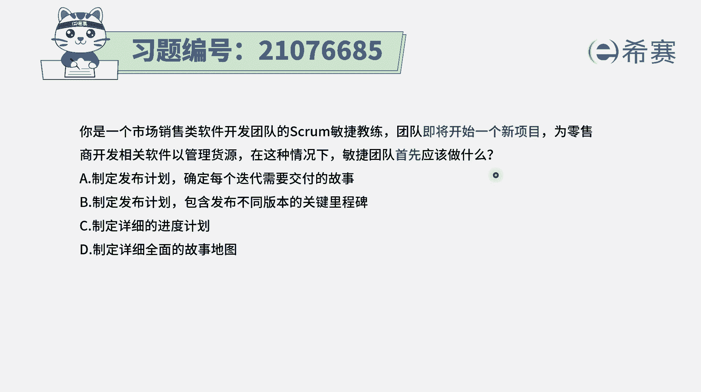
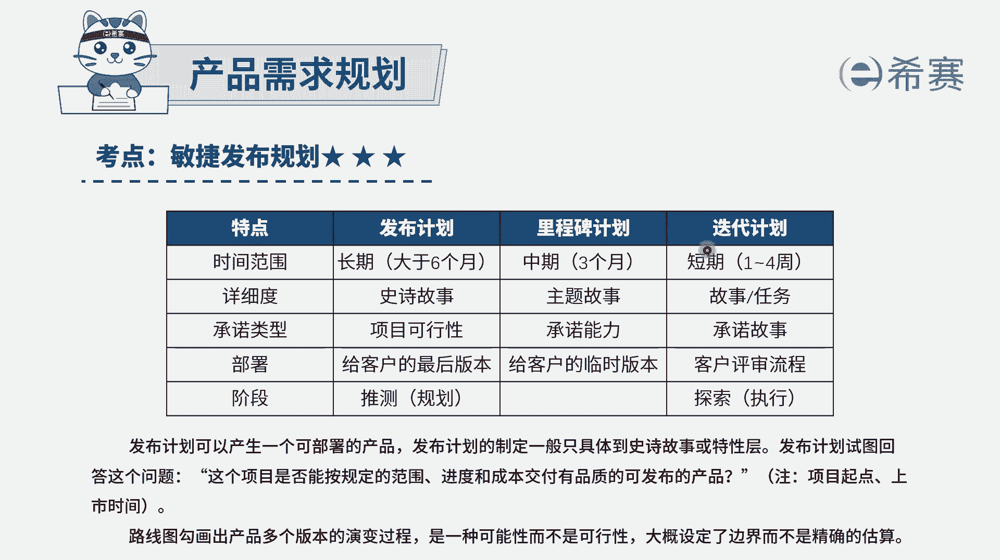
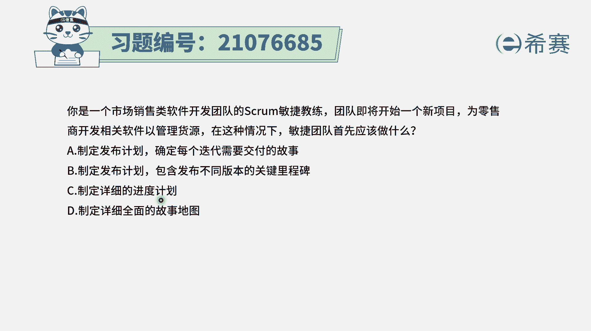
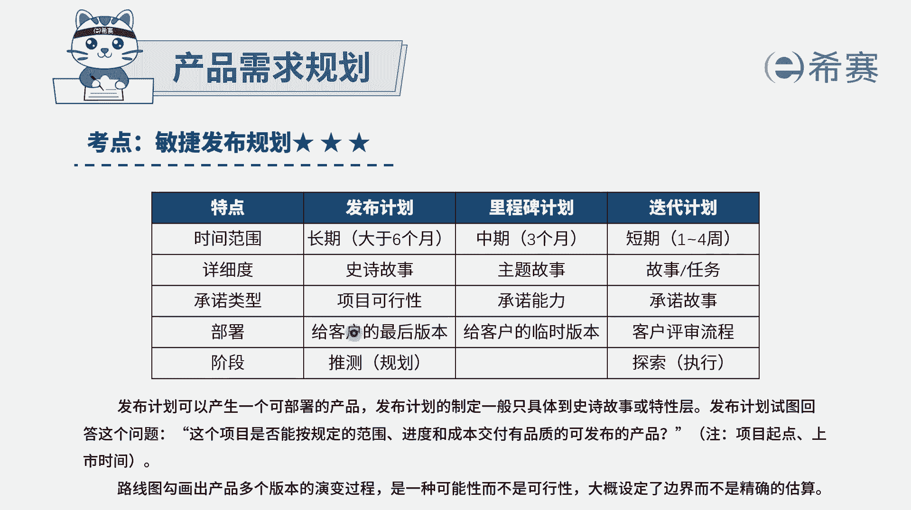
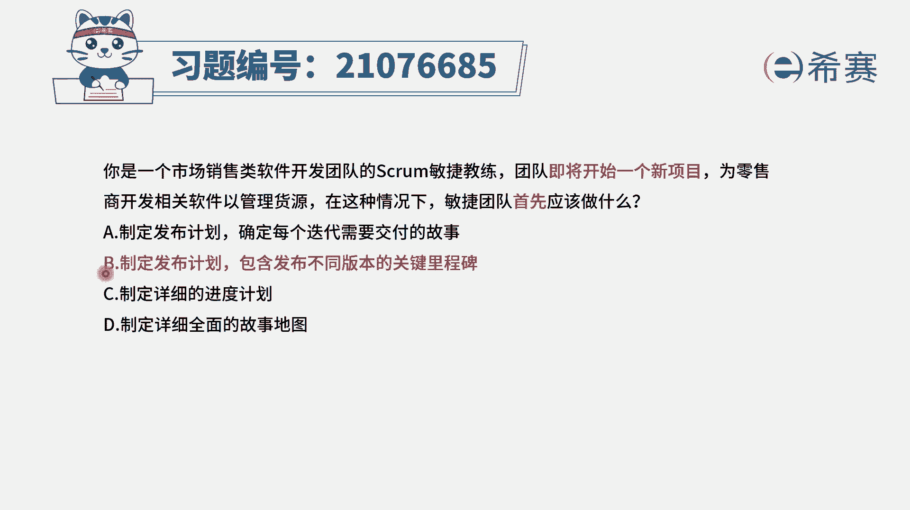
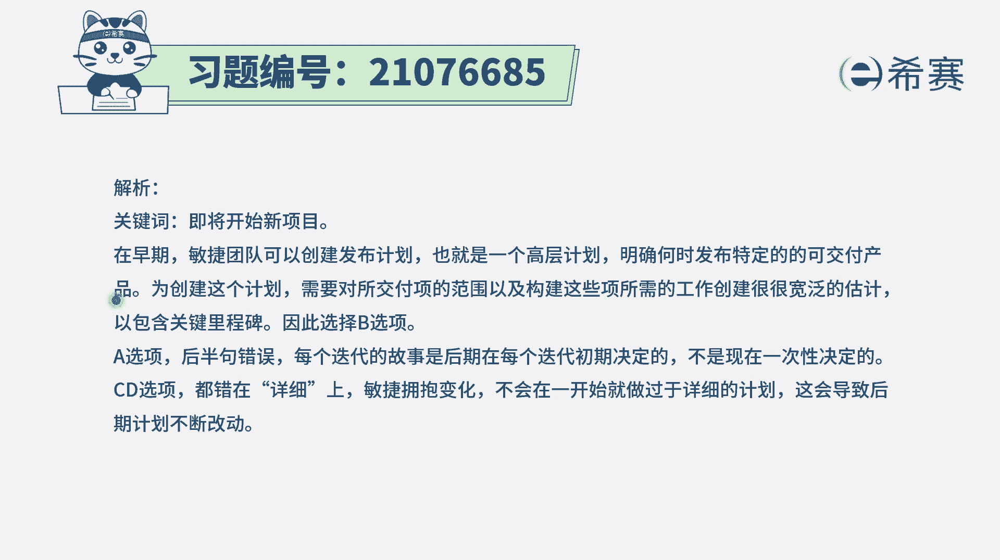
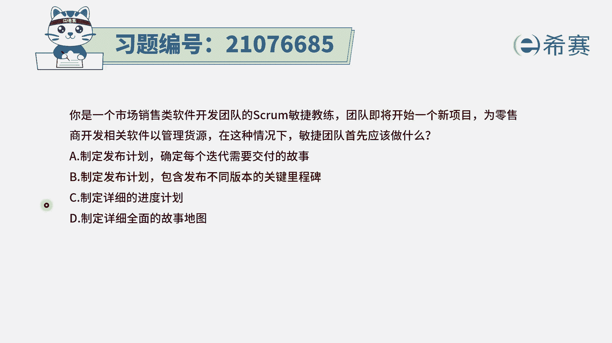

# 搞定PMP考试50%的考点，180道敏捷项目管理模拟题视频讲解，全套免费观看（题目讲解+答案解析） - P91：91 - 冬x溪 - BV1A841167ek

你是一个市场销售类软件开发团队的SCM，敏捷教练团队即将开始一个新的项目，为零售商开发相关软件，以管理货员，在这种情况下，敏捷团队首先应该要做什么，那也就是说我们要去开展这个敏捷项目的话。

首先先要去做一个什么样的东西，其实这里面的话呢我们知道一下。

就是整个在敏捷里面的话，先是有一个大的一个发布规划，我们是基于做这个项目客户的一些需求，对于这个需求我们能够去整理，明确出这个产品愿景，而对于这些产品愿景呢，我们会去设定这个产品路线图。

来去制定一个具体的发布计划，而这个发布计划中会告诉我们说，这一轮发布最终要交付给客户的，或者最终要部署出来的东西，可能包含哪些重要的功能和产品，然后再把这个发布中又会再拆分到。

比方说拆分到李先辈的计划呀，以及采用了更多的具体的这个迭代的计划，每一轮迭代中呢，它会是比方说以两到四周为例哈，那这一轮迭代中具体要做什么东西，在这一轮迭代计划中才会明确下来。

大概是这样的逻辑，有了这些信息以后，我们来看一下你刚开始来去接这个项目的话，首先应该干什么，那肯定是制定一个发布计划，而选项A和B都是制定发布计划，那到底选哪个呢，我们来看一下A选项说制定发布计划。

确定每一个迭代所需要去交付的故事，在我们在最早前开始的时候，能够确定出每一轮迭代要做的这一些，用户故事吗，肯定受不了，敏捷里面有一个很关键的词叫什么拥抱变化，你得要是发现过程中。

可能会有客户发生很多的这种变化，我们会不断去拥抱变化，从而是在每一轮迭代开始的时候，才去确定下来这一轮要做什么事情，所以这个A选项是错误的，B选项制定发布计划，包含发布不同版本的这个里程碑，这是OK的。

就说我们会大方向来给出，我们这一发布计划里面包含什么东西，一些大的节点上包含的东西，这是可以列出来，选项C制定一个详细的进度计划，这肯定是不对了，这是那种结构化项目管理方式，是传统项目管理方式。

选项D制定详细的全面的用户故事地图，这也不对啊，我们在整个发布的时候呢，其实还有很多东西都没有完全确定下来，只是把大方向的东西敲定下来。

所以在这个时候呢，只是有一些史诗级故事会说，这个项目应该是可行的，以及他可能在整个这一轮发布中，最终要去消费了一些重要的功能，把它给拎出来。

把这个要部署的重要的东西给拎出来就够了，所以项目在刚开始的时候，我们应该是要去制定这个发布计划，这个发布计划中包含一些关键的，一些理性的节点就够了啊。

答案选B。

