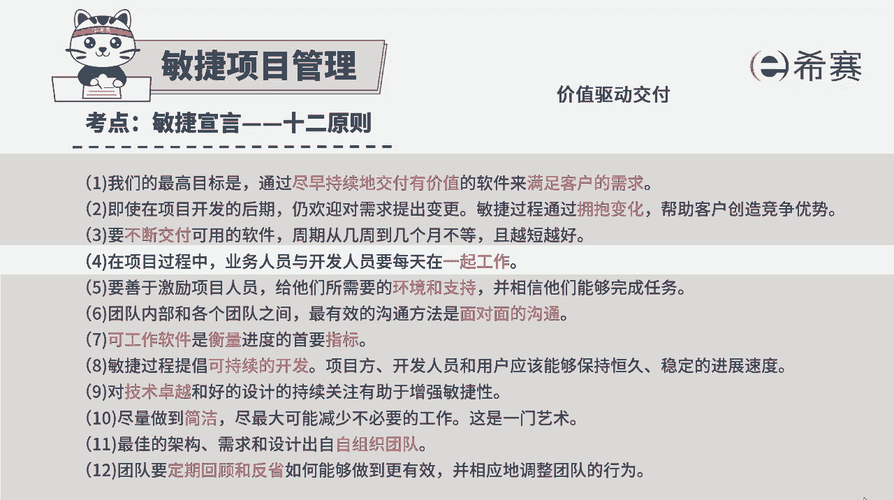
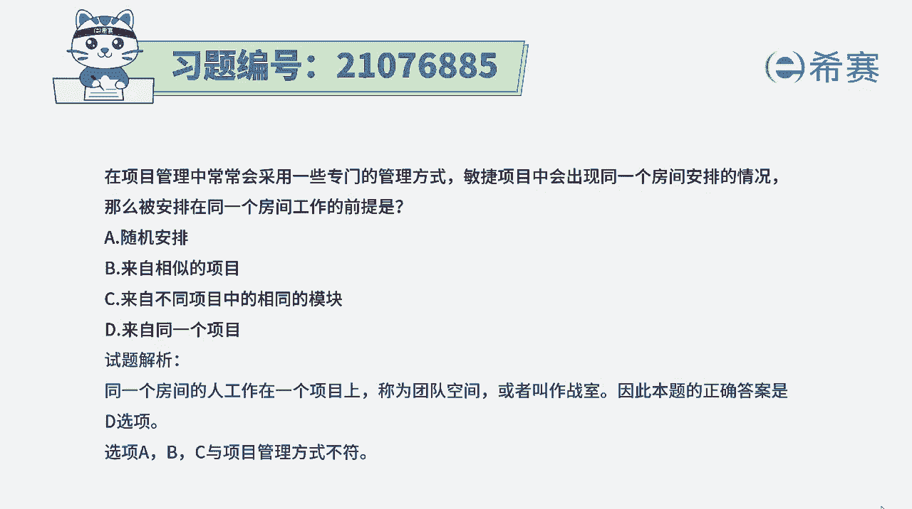

# 搞定PMP考试50%的考点，180道敏捷项目管理模拟题视频讲解，全套免费观看（题目讲解+答案解析） - P93：93 - 冬x溪 - BV1A841167ek

在项目管理中常常会采用一些专门的管理方式，敏捷项目中会出现同一个房间安排的情况，那么被安排在同一个房间工作的前提是什么呢，啊这个的话其实我们可以直接来看四个选项啊，啊这你不做任何学习。

我相信你都能选对选项，随机安排呀，那肯定是不合适，选项B来自相似的项目选项，C来自不同项目中的相同模块选项，D来自同一个项目，通常情况下，敏捷其实会提倡的是，一个项目组成员在一起工作。

所以这个题目答案肯定是选最后一个选项啊。

在敏捷里面呢，他的那个12条原则中有这样一条说，在项目过程中，业务人员和开发人员要每天在一起工作，他会提倡经常在一起工作，然后会提倡是面对面的交流。

所以这个题目的话就比较好选了，就是相比而言，应该是同一个项目组，我们就在一起工作，就安排在一个房间，并且我们有的时候会把那个某个项目组的，这样一个房间，我们会专门有个名字叫作战室。

叫war room解析，在这边需要同学可以自行查看，这样做最大的好处就是团队成员，他们可以更好的交流互动，能更好的去推进这样一个项目，有助于信息的同步共享，我们知道其实人和人之间的这些冲突矛盾。

很多时候是源于信息的不对称，那如果大家在一起工作，然后信息能够很好的去传递同步，那这样的话那种冲突就会减少很多，大家工作的话。

