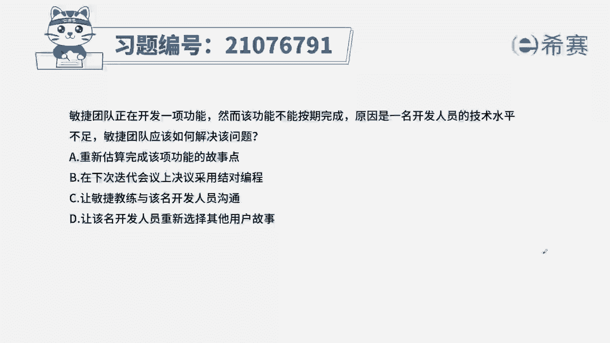
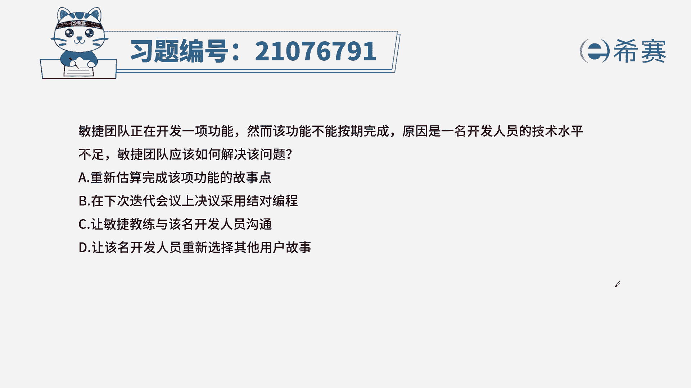
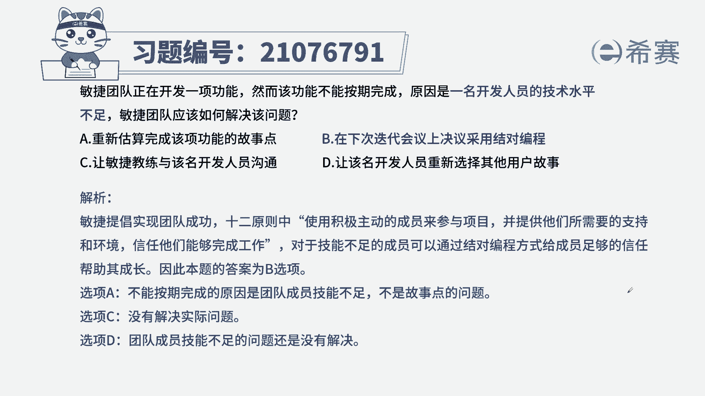

# 搞定PMP考试50%的考点，180道敏捷项目管理模拟题视频讲解，全套免费观看（题目讲解+答案解析） - P97：97 - 冬x溪 - BV1A841167ek

敏捷团队正在开发一项功能，然而该功能不能按期完成，原因是一名开发人员的技术水平不足，敏捷团队应该如何解决该问题，A重新估算完成该项功能的故事点，B在下次迭代会议上决议采用结对编程。

C让敏捷教练与该名开发人员沟通，D让该名开发人员重新选择其他用户故事，本题的考法是最佳实践，找到题干中的关键信息，提前告诉我们一个功能不能按期完成，其原因是开发人员的技术水平不足。

作为敏捷团队应该如何解决这个问题，来看四个选项，A重新估算故事点数，题目说了，是技术水平不足和故事解说之间没有关系，所以A不选B，在下次迭代会议上采取选用结对编程，结对编程是两个人同时工作。

一个人编代码，一个人进行审查，它的优势是可以共享信息，共享技能也能提高团队的效率，降低错误的出现率，那这里题干中提到开发人员技术不足，通过结对编程，一方面可以提高它的新技能，另外一方面。

也保证了团队的开发进度和团队绩效，所以符合刚才题干中给到的信息，C让敏捷教练与该名成员进行沟通，此项描述没有问题，但是没有解决题干中的情况，D让该名开发人员重新选择其他故事，这是一个消极的方式。

逃避在敏捷里面，作为敏捷团队以及敏捷教练，要相信自足的团队，要尊重他们，相信他们能胜任，基于这个价值观。

我们选择B为最佳时间，这是本题的解析。

