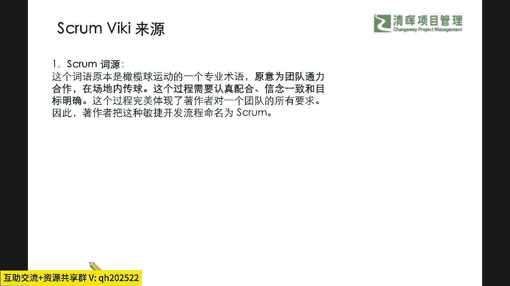
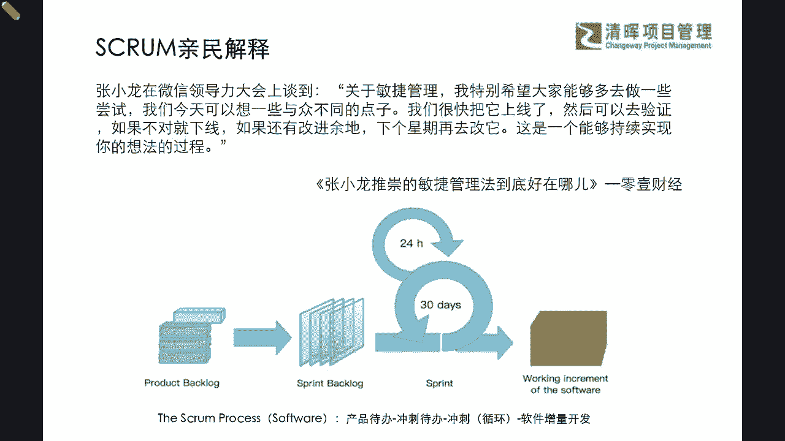
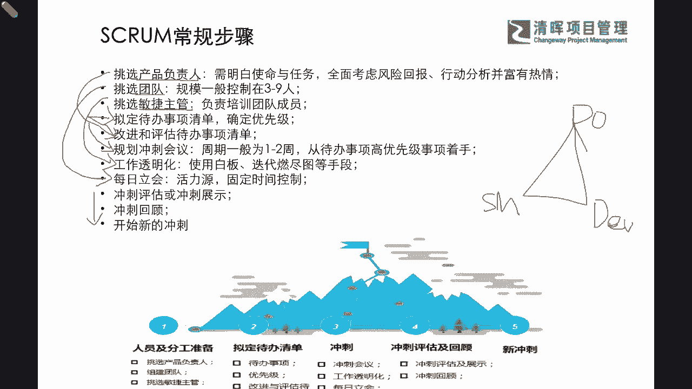
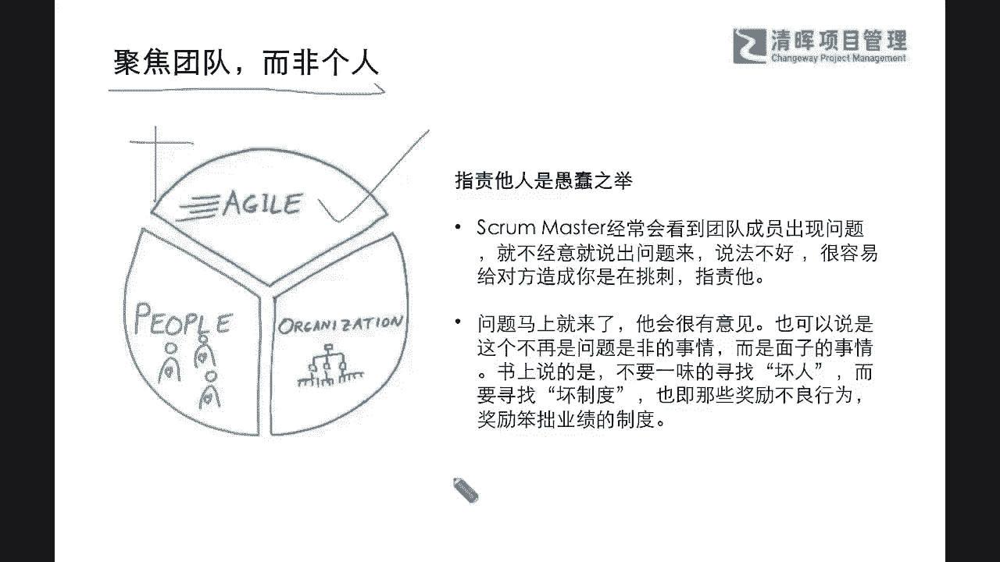
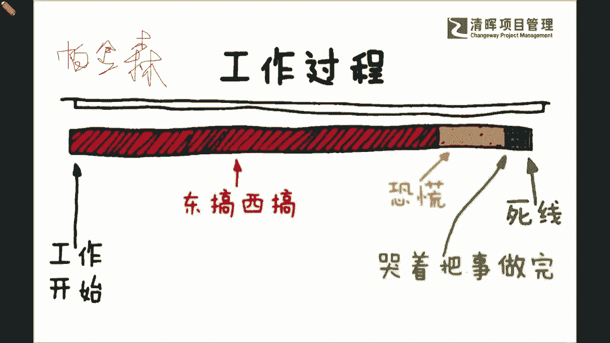
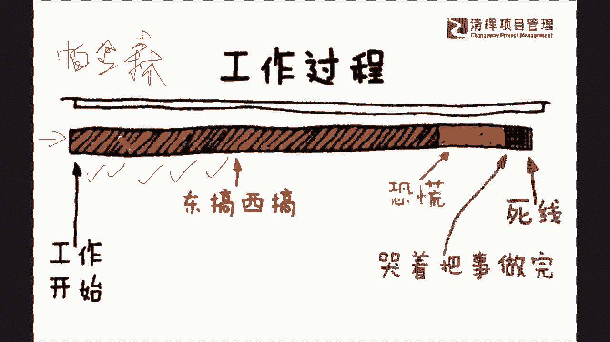
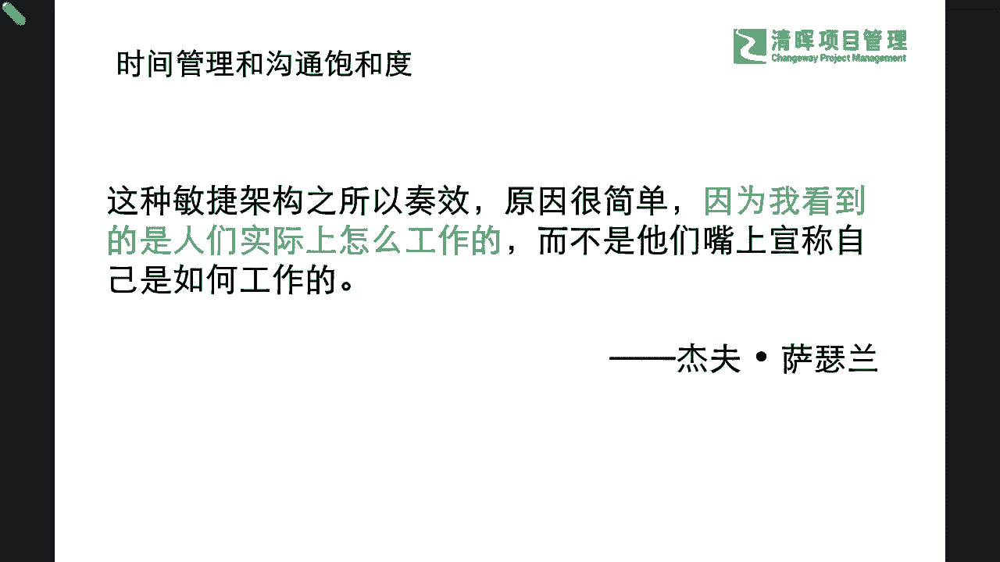

# 敏捷革命--Scrum常规步骤 - P1：1.SCRUM常规步骤 - 清晖Amy - BV1kr421F7AS

也非常明确的见识到了，这个最初敏捷的这个叫scrum啊，他在大维基百科里面的这个词源呢，其实就是源自于一个什么，大家可能在接触ACP，在接触敏捷项目管理的时候，多数都听到过这么一个名词叫scrap是吧。

那么这个名词到底什么意思呢，它其实源自于一个橄榄球的一个运动，那意思就是一个团队呢，大家通过这样的一个通力合作，在场地内互相的认真配合，信念一致，目标明确的去互相传球是吧。

也就是说大家协同作业能力是极其的高啊。

那么在这样的一个过程当中呢，我们这位著作者他就由这个最基础的词根啊，就是scrum，它的这个大家高效协同，这个去做好这样的一个场内传球的，这么一个动作呢，就把这个scrum变成了最早的敏捷项目。

管理的术语啊，术语也就是说在啊这个20呃2011年初啊，这位著作者，他和另外另外的这个16位，i it软件开发领域内的这个领军人物啊，在啊我们可能在学PMP的时候都听过啊。

在一次这个滑雪圣地的秘密会议上是吧，拟定了众所周知的敏捷软件开发宣言，那么scrum这个词呢正式成为了一个专业的敏捷，项目管理的代号和术语是吧，那么实际上我们听到这个SCM术语的时候。

我们不进又会去多问几个问题，问啥问题呢，就会去想想看，那既然它是形容这么一种，这个团队的精诚合作啊，快速去达到目标，那么它的方法核心到底是什么呢，其实他所强调的一个方法呢，就是我们所啊耳熟能详。

因为我们在讲适应型生命周期，我们在讲敏捷性生命周期，甚至大家听说过敏捷管理最早的一个词叫迭代，是不是，它其实就是以交付与迭代为核心的一种方法，是吧，里面就会包含了若干，像我们怎么样去确定优先级呀。

啊怎么样去定义这个最小的可行化产品MVP，以及怎么样去获取这种有效的，快速的这个反馈啊，进行这个快速升级和优化等等这些要素，那本质上讲呢，他就想通过这种短平快快速的交付和迭代，这种核心的理念。

让大家过一小段时间啊，不要一直埋着头，就是从一做到十才能交付是吧，而是你一做完了要看看二是吧，二做完了要看一看三，那么可能在每一小段工作结束的时候，你就需要快速去停下来，去检查一下已经完成了哪些任务。

并且还要再看一下这些任务是不是应该做的，并且有没有收到这些有效的反馈，那以及有没有更好的，能够截取进步的一些方法是吧，那么我们能够看到这样的一个部分的时候，那么不仅我们就非常明确了啊。

其实scorn方法它的核心就是，让我们要什么高效率的迭代，并且始终围绕着什么交付，要去快速给予这样的调整是吧，所以我们能够理解并且，清晰了这么一条路径之后呢，我们就可以继续深入到这本书的其他方面。

我们当然不限制于他的一些章节的组织啊，严老师尽可能把这个故事线给大家讲的，能够听得懂，并且可能结合你的工作更加什么形象一点啊，所以首先啊我们来看看除了术语之外，我们还能有什么接地气的。

对于这个敏捷术语的一个理解，因为我们通常来讲，这个在CP考试我们可能背了一堆的敏捷概念了，是不是啊，那我们在这样的一个概念之上，我们怎么样有一个SCM的一个亲民的解释呢。

那其实我们也专门去找了一个很典型的例子啊，就是我们这个微信的这个发明创造人啊，这个这个创呃，这个爆品的这个创始人张小龙是吧，张小龙，他在微信的领导力大会上，他就非常推推崇这个什么敏捷管理的这种方法。

那他就提到了他自己的一个想法啊，他说了这么一句话，他说关于这个敏捷管理啊，我特别希望大家能够多去做一些尝试，我们今天可以想一些与众不同的点子，我们很快把它上线了，然后可以去验证，如果不对就下线。

如果还有改进余地，那下个星期就去改进它，这是一个能够持续实现你的想法的过程，这是他非常非常，这个应该说是实践性极强和接地气的，去表明了啥，表明了我们的这个敏捷管理的一个理念的本质。

也就是说其实大家耳熟能详的，你可以看到啊，我们常见的这个scrum的process啊，他其实都会包含必要的，比如说我们熟知的产品待办事项列表是吧，冲刺代办，以及我们的深入到每一个环节的冲刺对吧。

以及我们怎么样在实际开发当中，不断地通过增量的一步一步的开发，来实现这样的一个什么，最终的一个交付的成果和价值是吧，所以学术化理论化来讲，大家可能都会多少接触过敏捷的一些流程是吧。

但是呢我们接地气的来说，其实大家就能从这一句话当中，get到不少的要点了是吧，那get到不少要点的时候，我们不仅要跟大家来提一提，拎一拎，那么在这本书当中，我们的著作者还会给大家讲述什么样的一些。

深入浅出的理念呢，首当其冲啊，除过我们的这些术语和接地气的。

实践的解释之外，我们还会在书中发现，他有介绍一些常规的SCM的步骤，当然这也是作为敏捷项目管理之父，他在介绍他的理念的时候，尝试性把它作为一个工作流程，把它具体化，具象化下来的一个过程，所以你会看到啊。

他所提倡的一些，比如说我们通常常见的一个常规步骤有哪些呢，就是我们通常先讲敏捷团队，这个scrum团队，这个经典的铁三角的一个搭配是谁啊，就是我们的一个什么PO是吧。

product owner产品负责人还有谁啊，还有我们的业务开发团队是吧，develop的一个团队，那么还有谁啊，还有我们的scar master是吧，我们的SM啊，我们的敏捷教练，那么这个铁三角呢。

他最优先的会去进行这样的一个选择，那么在选这个PRADOWNER的时候，产品负责人的时候是需要他这位PO，如果我们回忆一下啊，大家应该在社区啊，已经有会员的同学啊，你们应该是考过PMP的这个呃认证了。

所以你们多少有一些印象啊，所以我们的产品负责人，他是客户的一个什么窗口和代表，所以他必须非常清晰地明白自己的使命和任务，而且全面要考虑客户的一些什么这种啊，他的一个风险的项目评估，并且需要去应对客户。

并且富有热情地去协助客户和自己的开发团队，去解决这种什么项目的优先级问题是吧，所以可能看到这样的一个选择标准，我们就知道，肯定你第一个先要去挑一个合格的PO是吧，那么再来就要确定我们合格的开发团队。

那开发团队一般大家如果读过另外一本书，叫做这个敏捷项目团队，这个经典的7~9个人是吧，其实我们一般最小规模在三人啊，最大规模一般在九人是吧，3~9人就是他的一个敏捷团队的。

一个经典和typical的这么一个，典型的这个人员的数量，那么为什么是这么多人呢，不要急啊，我们后也会去跟大家解释解释是吧，那么有了这个团队啊，我们就知道了，接下来那就得再挑一位敏捷的。

非常有经验的主管，就scar master，为什么要第三步才挑这个敏捷的主管啊，因为我们知道，其实一般企业在挑这个敏捷教练的时候，它更像一个非常资深的这种coach。

那coach呢其实是需要非常非常具有这种实际的，这种经验，并且理论要非常深厚和强大，所以他要负责呢培训我们的这些什么开发团队，并且还要去为开发团队清除这些障碍是吧，所以他自己本身必须要实践加理论非常强。

所以他一般会被什么精挑细选一下是吧，所以这是我们先把三个角色给确定了，那三个角色确定之后，你就会发现就接着要干什么，PO把他的待办事项列表，然后代办清单要确定出来，然后还要什么规划冲刺会议是吧。

然后scar master呢就需要去工作透明化，给大家指导一些方式方法，那么我们的团队呢就开始要每日例会是吧，要去不断的要去有这样的一个啊，这个直接这个快速的互动来去啊，达成我们阶段性的一个目标。

并且呢大家一起呢去进行这样的一个冲刺，评审和冲刺回顾，并且计划啊来去确定，是不是可以进行到下一个冲刺当中去是吧，所以你会看到我们整体的步骤呢，它都是紧紧围绕着在这个铁三角之下。

大家的职责以及接下来的一些行动当中，你就会看到他的思路非常的清晰是吧，没有任何的这种啊非常复杂的流程啊，我们相对讲的复杂，什么意思呢，就是我们如果相较于传统，瀑布型的项目管理的话，那么什么是瀑布型呢。

就是大家通常所学到的，我们在PMP的第六版啊，我们可能会接触到了我们的传统型项目管理啊，我们是一步一步应该注意什么，比如说先制定项目章程，先去做什么，那其实这些部分呢我们也会在敏捷当中有。

但是他的做法和他的时间周期，是远远跟我们的这种瀑布形式，有非常巨大的差异的啊，那么我们在这样的一个差异环节当中呢，我也再跟大家分享一下，这本书当中所提到的一些非常经典啊，我觉得非常非常有意思的一些观点。

比如说啊他提到了一个聚焦在团队而非个人，这个这个话一出，可能我们有些同学，你如果是在PMP当中，有接触过这个什么敏捷宣言啊，四大价值观的话，你是否还记着我们，其实敏捷。

是不是感觉还挺挺强调这种个人的一个响应的，个人能力的是吧，但实际上我们不需要去什么特别的，这个有这个上纲上线哈，或者有这种这种非常边界感，非常清晰的这么一个这个这个认知啊。

因为这里他这个个人和那个个人不太一样啊，他所强调的这个聚焦团队而非个人呢，就是需要让这个敏捷团队当中的这个成员，要背靠背形成一个集体的意思啊，也就是说在这样的一个团队当中，在敏捷的团队当中。

他更要去实现的一个东西呢，就是不去什么轻易指责别人，甚至杜绝这种什么人身攻击，那不要轻易就把这些问题说出来，说这个不好，那个不好，很容易让对方感觉到你是在什么挑刺儿是吧，因为我们其实敏捷团队。

他就只有什么一般规模小3~9个人，那有什么话有什么这个问题都在每日例会，每天面对面就说了是吧，那么在这样的一个过程当中呢，我们其实还要去看到，如果问题来了的时候，我们也许不要去一味的想要找到那个什么。

责任人是谁，而是要干嘛呀，一起来共同快速的解决是吧，这其实就是一个非常重要的理念，其实大家都非常感同身受是吧，什么意思，就是你出现了一个问题，你看平常开会，如果说这个事情出现了延迟。

出现了重大的一个什么delay是吧，延迟那一般开会在说到这一项的时候啊，我们一般会说唉呀这个部门的这个DII是谁，谁来这个造成的这个影响是吧，但是可能这样的一个影响之下。

我们到底应该怎么样去这个啊解决这个问题呢，好像是下一步要做的事都是不断的在互相，这个说你是你的责任或者是是他的责任，是不是，所以可能在这样的一种情形之下呢，我们就有可能会造成团队极度不好的。

一些氛围是吧，所以我们需要了解到，在敏捷的项目管理当中，它其实是强调一个积极的正能量，一个态度聚焦在one team，而不是聚焦在互相独立的一些个体，这是他的一个这个思路是吧。

那么在这个思路之上呢，我们不仅又会看到我们正常的啊，我们每一位这个各位啊，可以说各位的这个同学啊，你们在自己的这个工作实践当中，是不是也会发现，当工作开始的时候，你没有办法去完全聚精会神地去解决它。

那等到中后期的时候一看哟，时间快到单line了，快快快到收尾的那个那个压压线，时间红线时间了是吧，着急了，所以就是赶紧要干什么，开始追赶你的进度，一定要在什么单line之前要把这个事儿给什么。

好歹交出去是吧，一般我们在PMP当中，把这个把这个过程叫做什么，或者把这个把这样的一个动作叫做什么，大家其实也熟悉的叫什么帕金森综合症是吧，什么意思啊，就是我们可能会发现，如果一件事情能被拖到最后一刻。

才去完成的时候，你会发现大家总是会倾向于拖的是吧，嘿为什么，因为前面感觉不到压力啊对吧，可能在这个帕金森综合症之下，大家你想想看啊，在这样的一个工作过程和心态之下，你怎么能够把这个工作做好呢。

当然你不能强制要求说唉，各位，这个我们就是从第一天开始就特别特别认真啊，当然这是最理想的状态是吧，但是你再想想看，如果你是这个项目团队的一个领导者，一个leader，你能怎么样去化解。

这样的一个看起来好像人人都会犯的一个，错误和问题呢，其实我们有更高明的一些方法，不是要求大家一开始就强迫是吧，重压，那其实你会发现你的重压，你的外力，它如果没有自驱的话，其实一样是什么无效的。

是不是啊，所以可能在这样的情形之下，我们就会发现啊，杰夫萨瑟兰啊，我们这位敏捷管理支付，他就提到了一个非常重要的理念，那这种敏捷的这个思维架构之所以奏效，原因很简单。

因为呢我看到的是人们实际上是怎么工作的，而不是他们嘴上宣称自己是如何工作的，这个什么意思啊，就回到我们刚才的这个图啊，我们平时在开项目周会的时候，大家仔细想想看啊，各位同学，你们平时在开这种项目的周。

会在看项目进展和风险事项，讨论问题的时候，一般都会以什么样的一种什么review的方式呢，讨论的方式呢，是不是大家都习惯于去看。

我们现在是不是进度的这个bar上，绿色绿色一项一项都是绿色是吧啊，我们就以为他的这个里面的核心也是绿色的，但是实际上你会发现你虽然这个是on schedule，这个是on time。

但是你真正往下面一挖，里面可能都是红色的，不合格的一个交付，是不是完全是这种我们在敏捷里面讲，这就叫西瓜原则，皮是绿的，瓤是红的是吧，也就是说外面看着是合格的，但是经不住深挖挖进去就是什么不合格的对吧。

所以我们有了这样的一个认知和这个过程，那我们也希望啊和各位来去对标。

我们杰夫萨瑟兰讲到的这个非常经典的这句话，就是他要看看人如何实际的工作，那这个实际工作它会包含什么样的一些理念呢，那么里面就包含了他所提到的，在这本书里面的一个时间管理和沟通管理的，一些经典的一个认知。

