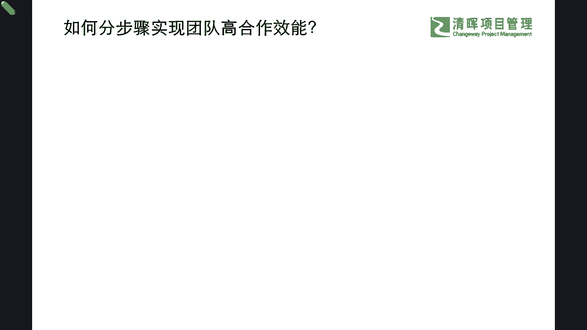
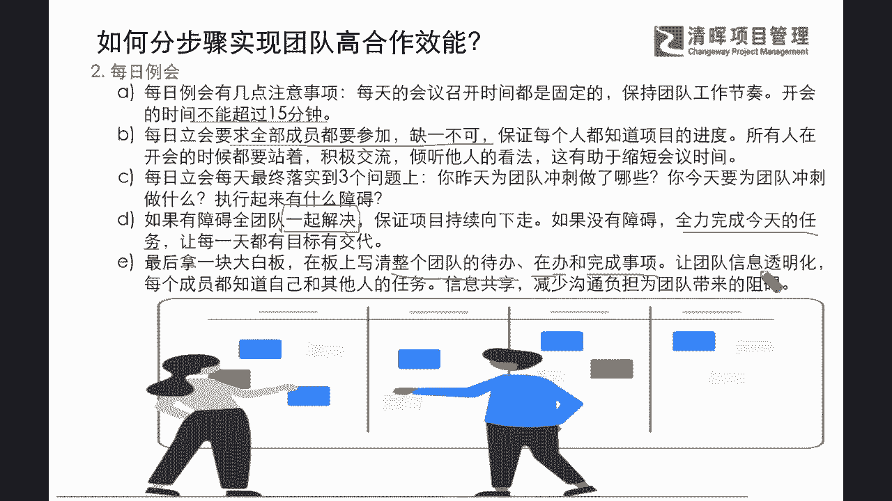
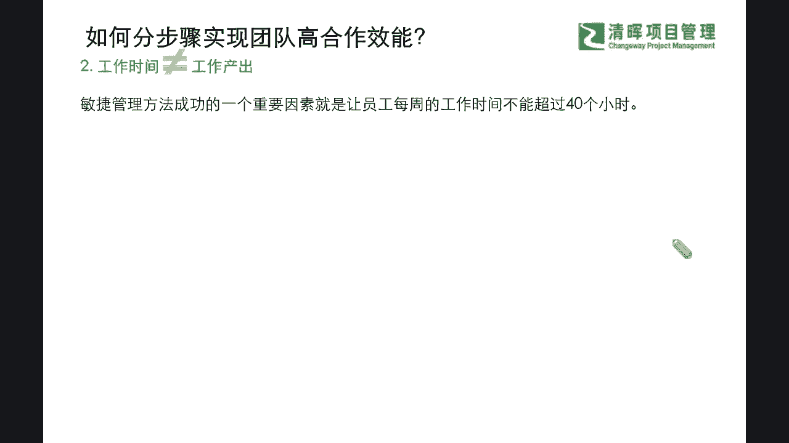

# 敏捷革命--Scrum常规步骤 - P5：5.如何分步骤实现团队高合作效能 - 清晖Amy - BV1kr421F7AS

不仅有再去问到一个问题，那我们知道有这种种种的现象，那怎么样能够一步一步的来实现敏捷团队的，这个高合作效能呢，那么在这本书当中呢，也同样给我们提到了很多非常好的建议啊，我也稍微把它提炼了一下精华啊。

我们不去抄书是吧，我们提炼一点精华，跟大家做一个简要的，这个非常实践性强的一个分项，那么首先他就利用啊这种敏捷的，他的一个理论的基础啊，来去提出，第一步就要去做好一个冲刺的管理和规划，那什么叫冲刺呢。

其实冲刺的本质啊，我们都知道冲刺一般是两到什么四周是吧，这个时间他要去围绕一个待办事项列表，要去输出这样的一个成果，是不是啊，所以它其实本质是利用一个什么周期性的视角，去看待时间。

那么在这样的一种周期性的视角之下，它会让团队明确地知道项目的截止日期，并且会让团队有紧迫感和新鲜感，就是把它透明化，可视化，而且冲刺也会聚焦在每次只解决一个问题，让目标非常明确，让每件事情有始有终。

并且件件有着落，事事有回音，这也是他的一个特点啊，重要的特点之一，那么同步呢，冲刺也会让产品以最快的速度出现在客户面前，两到四周，并且这个速度之后，他可以马上就获得什么及时的反馈。

这就是一个试金石啊是吧，我们不仅仅去完成我单方面的一个交付，我们还能快速拿到客户，对于这个产品产出成果的，第一直接的一个什么啊，这个反馈这将是一个非常重大的交包付节点，可以为我们提供下一次迭代。

并且提供给我们进一步这种提升和改进的，一个基础和参考是吧，那么同时呢，我们的冲刺周期也经常被接地气的称之为什么，时间和时间限制是吧，它的跨度是一定的，而且必须具有这种什么一致性。

就是你不能什么一会儿是一周，一会儿是三周，一会是怎么样是吧，他去你按照一周一周的这个颗粒度去迭代，那么就一直是什么一周一周的是吧，我们的这个颗粒度，它要一定程度上保持一致是吧，那么在这样的一个情况之下。

每个人啊，他都能非常清楚的知道自己，能在一个固定的期限内完成多少的工作，能对自己的工作有一个量化的评估，对自己的效率有一个量化的评估对吧，这也是非常重要的一个冲刺效能的一个定义，那在这个冲刺周期之外。

还有一个重要的元素，那就是我们一旦确定了冲刺的时间和，但团队就必须要什么使命必达，这些任务就被什么lock down了，什么意思，就是锁定了在这个两到四周之内，它就变成一个frozen window。

变成一个冻结的窗口期，我们这个窗口期之内的所有任务是必须要达成，并且可能团队之外的任何客户啊，甚至可能PO在一定的这个啊这个周期之内，它是不能再给他们增加额外的一个任务，也许要等到他们这个冲刺结束。

才能去进行下一轮的产品，待办事项列表和冲刺优先级的调整是吧，所以就可以充分让这个开发团队，在沉浸式的专注的去做好，产品的这样的一个交付和开发，那么这是他所宣传的和坚持的第一个步骤啊。

那么我们再来看看我们的著作者，他还提到了一个这个步骤，方法，来去提高我们的这个敏捷团队的高合作效能。

就是大家啊，以往可能耳熟能详的一个叫做daily standing meeting，叫每日例会是吧，每日例会大家可能都听说过啊，就是干什么呢，每天站在这个白板或者是一些电子显示屏，前面是吧。

大家来去什么，互相来碰一下关键的事项，一般通常只有三个问题是吧，就是诶你昨天做了些什么，你今天要做什么，那有什么障碍是吧，有什么风险，我们要去同步一下的是吧，一般这三个问题。

并且呢时间是坚决不超过15分钟的啊，而且每日例会要求全体成员都要参加，缺一不可是什么意思啊，也就是说我们是需要我们的铁三角都要来参加，而且铁三角开会的时候都是站着交流的啊，来去缩短会议的时间。

那么如果一旦大家在一起碰的时候，发现了有若干的一些什么障碍和问题的时候，怎么办呢，就要什么一起来共同讨论解决，那如果没有障碍，那就是什么来去全力完成今天的当下的任务，让每一天的目标都有结果和交代是吧。

这也是他的一个坚持的一个原则，那么最后呢，他会在白板或者是电子显示屏上面可视化，而且非常清晰地写，写清楚整个团队的代办再办和完成的事项，那么让团队信息足够的透明化。

而且呢每个成员都知道自己和其他人的任务，这个信息的共享来减少大批量的，减少大家的信息差和沟通上面的一些损失，信息损失来给团队什么，增加更好的一个效率是吧，所以每日例会你看啊。

他的作用还真是非常的大呢是吧，那么我们再接着来看看，还有什么能起到帮助性的一个。

提高团队合作效能的一个步骤呢，其实我们看到啊，通常我们会有一个理念是什么，工作时间和工作产出之间是什么样的一个概念，是相等还是不相等呢啊，一我们换很多时间去加班，花了很多时间去这个纠结一个问题。

你会发现你的产出效率高吗，啊，我们相信大部分的这个我们的同学和伙伴，都经历过这样的阶段是吧，我们会非常清晰的知道工作你所放呃，放在里面的这种时间长度，并不等于你工作的一个什么实际产出的价值。

而且敏捷项目管理，它的方法之所以成，能够带来成功的一个重要因素，它其实就是坚持，让员工每周的工作时间不超过40个小时。

那么在这样的一个理论指导之下呢，我们就可以看到它的来源是啥，就是因为有大量的我们的先哲们是吧，我们的这个前人们已经做了很多的实践了，那么这个就是来自于我们非常知名的这个，一个咨询公司，麦肯锡。

他之前采用的是七天的什么工作制，后来呢他们的高层就发现大量的优秀人才，因为无法忍受这个巨大的压力而选择了离职，这给公司造成了巨大的一些损失，并且他们雇来了这个业内非常有名的，这个一位咨询顾问啊。

就是马克思韦尔来去解决这个问题的时候，那这位马克思韦尔，这个就进入了这样的一个，这个麦肯锡的团队环境之后，深入研究了这个工作效率和，工作时间之间的关系，他发现呢工作时间为五天的这个员工。

完成的工作量可远远要比工作七天的人呐，要多得多，他根据不同员工的这个工作时间和效率，画出了一个曲线图，那他这个纵轴呢就代表这个工作效率，横轴呢代表他每周花的这个工时，那效率最高的时候。

每周工时是略少于40小时的，那获得这个数据之后呢，马克思韦尔第一时间就开展了一项改善的活动，就是干嘛让员工早点回去休息啊，早点下班，那么其实其他的，当时其他的一些公司看到了麦肯锡的一个改变。

也开始尝试让员工每周只上五天班，尝试之后呢，大部分公司的工作效率可能都比以前高了，从此呢这个大家的这个上午休二，就变成了一个业内广泛的一个，工作时间制度了是吧，大家目前基本上都是一个标准化了是吧。

所以这些也都是经过不断的实践和尝试和统计，来去统计出来的是吧，这也是我们的一个智慧的总结是吧，经验的总结，那么我们既然知道它不等同于这个时间，不等同于产出的话。

