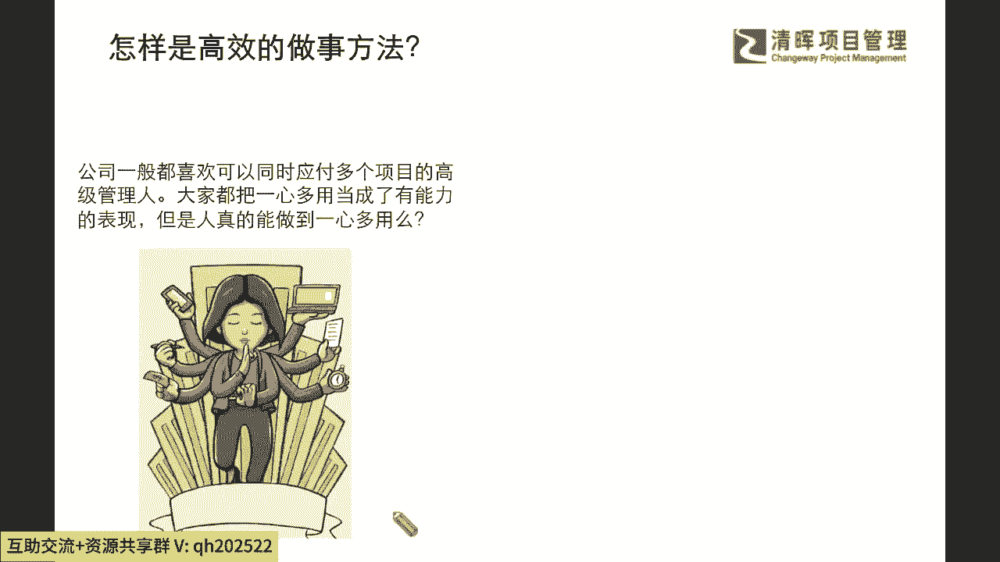
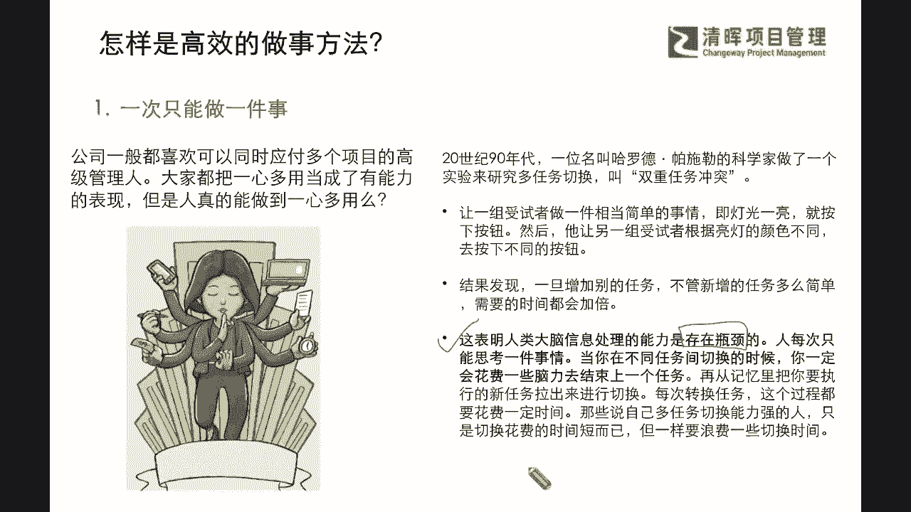
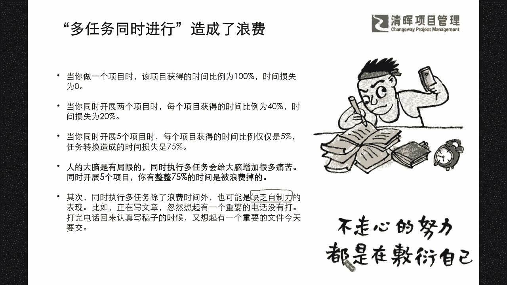
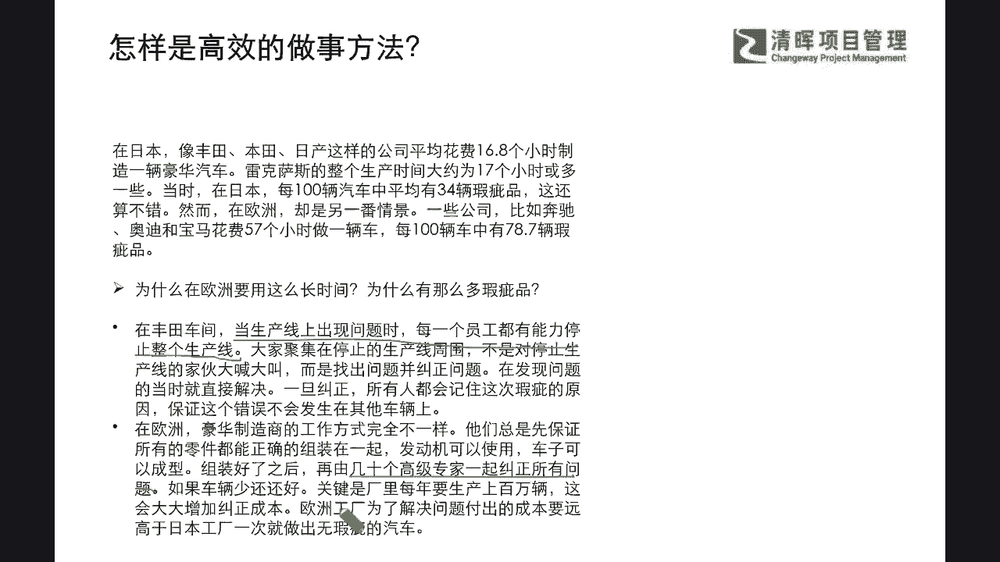
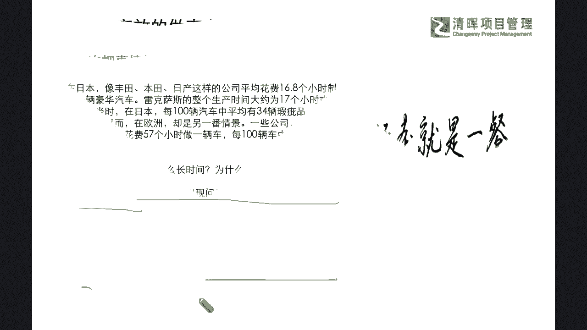
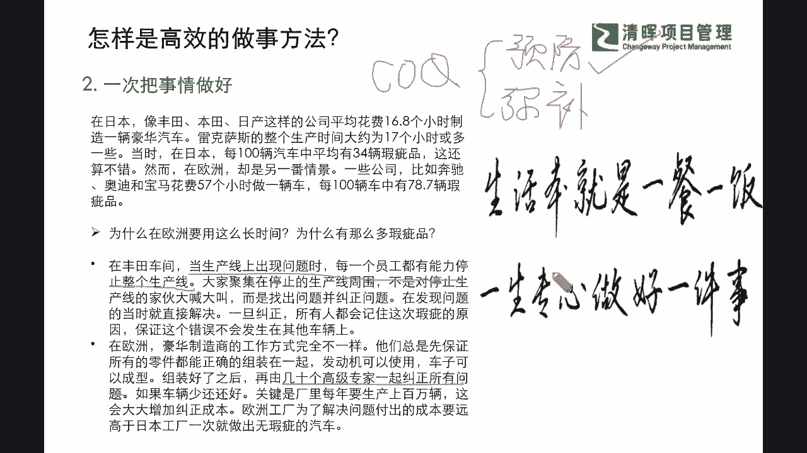
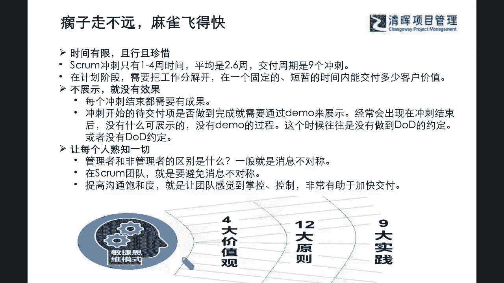
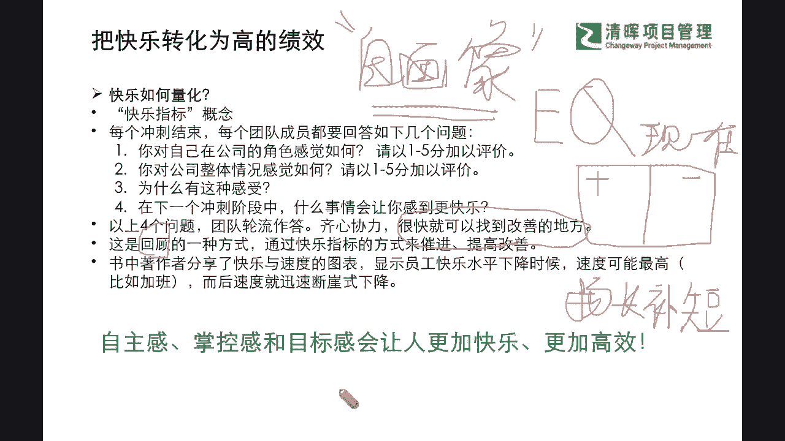

# 敏捷革命--Scrum常规步骤 - P6：6怎样是高效的做事方法 - 清晖Amy - BV1kr421F7AS

我们怎么样去更好地处理好，这个短时间内的一个交付呢，但这里啊我们可能会看到啊，其实在书中也会提出来一个这个疑惑，就是我们一般公司啊，我把它转述一下是吗，我们一般公司都喜欢什么雇佣和招募。

这种能够同时应付多元这种项目任务的，一些高级管理人，我们俗称为什么multi tasa，就是多任务什么多管道的这么一个什么责任人，就是大家可能都会把这种一心多用啊，当成了有高能力的一种表现是吧。

但是我们每个人啊，我们自己去想想看，人真的是能够做到一心多用吗，啊其实在20世纪90年代的时候啊。

一名叫做哈罗德踏施勒的科学家，就做了一个实验，叫做双重任务冲突的实验，他让一组的这个测试者啊，做一件非常简单的事情，就是当这个灯光亮了的时候啊，亮了的时候就按下按钮，然后他让另外一组这个测试者。

根据亮灯的颜色的不同去按下不同的按钮，结果就发现呢，一旦增加别的任务，不管新增的任务多么多么的简单，需要的时间都会加倍，那么这么一个结果，能够带给我们什么样的思考呢，这就说明什么。

我们人类大脑的信息处理的能力啊，是存在很大的瓶颈的，就是我们虽然说潜能是无限的，但是你在同一时间去处理任务，并行task的时候，他还是会有一些局限性的，所以人每次只能去思考一件事情。

那么当你在不同任务这个互相之间切换的时候，你一定会花费一些脑力去结束上一个任务，再从记忆里把你要执行的新任务拉出来，进行切换，每次任务的转换啊，这个过程都会浪费一定的时间，也就是说。

你要转换你大脑当中的思考的这么一个赛道，你也是需要花费额外的时间的，那那些说自己啊，一般会标榜自己，能有多任务切换能力的一些强人们啊，我相信啊大多数不一定是真正的效率高是吧，而只是可能切换频道的时候。

会比其他人稍微什么时间短一点点而已是吧，但是同样他会有一些什么损失，效率损失的时间是吧，所以我们一般能成为大师，匠心的这种这种成果的是吧，都是什么，一生只聚焦专注做好一件事情就了不起了是吧。

所以这是我们讲的这个我们著作者，他所强调的敏捷项目管理当中，是一定杜绝一心多用的是吧，那么在这样的一个过程当中，他就提出一次必须只能做一件事情啊，就是不要想变成这种什么all in啊，不要想什么都要。

你什么都要就会什么都没有是吧好，那么这是提出的一个高效的做事方法。

还有什么呢，其实在这个当中我们其实可以看到啊，在多任务同时进行，它虽然造成了很多的一个浪费，但其实他潜在的一个更大的一个什么，这种损失和破坏性，而不仅仅是在效率上，而是你会发现。

除了你的效率和处理时间浪费上的差异之外，你如果希望自己一心多用的时候，其实也是大家也有可能你欠缺一些什么自制力，也就是说你可能没那么用心，你比如说你像你这个又想看电视，又想写作业，是不是啊啊又想看手机。

又想去做报告，你永远是两者都不可能，什么达成一个很好的效率的，所以你除了这个大脑本质上的一个，这种损失之外，你还要注意一下自身的自控力，任何不走心的努力，其实都是在假装努力。

这种假装努力并不能给你带来真正的成功，那么我们会看到在这样的一个环节当中啊，我们也希望大家能够突破自身，心理学上的一些这种差异，也能突破我们自己的一些这种啊努力的边界，和我们走心上的一个这种盲区。

让自己能够专注沉淀，能够去做好这样的一个什么交付价值，真正让自己能够钻进去，并且产出这样的价值，这样才有助于你在职牙上的进一步，快速的一个提升，那么知道了这样的一个部分。

那我们来看看啊，我们另外所在书中提到的高效的做事方法，他其实还提出一个鲜明的一个理论的一个基础，就是他提到了在日本啊，就是有一些车企就是造车的企业，比如说像丰田啊，本田啊，日产这样的公司。

平均会花费大概16。8个小时，来去造一辆汽车，那雷克萨斯的整个生产时间大概是17个小时，可能还会多一点，当然当时呢在日本每100辆汽车当中啊，平均有34辆瑕疵品，这还算挺不错的，但是在欧洲呢。

这个车企当中却是另外一番的是吗，情景一些公司啊，比如说我们熟知的这些豪车，像奔驰宝马啊对吧，奥迪啊，那一般会花费57个小时坐一辆车，每100辆车当中有78。7辆的瑕疵品，那为啥在欧洲就要花这么长时间。

有那么多的瑕疵品啊，本质上就是做事方法不一样嘛是吧，那又有什么样的方法上的差异呢，我们就可以看到在丰田的车间，在生产线上出问题的时候，每一个员工都有能力停止整个生产线，这是一个非常了不起的一个什么。

这种理念和思路，大家就会立即聚集在什么停止的生产线周围，而不是在互相推卸责任，大喊大叫，或者是只是不断地叫，出问题却不解决问题是吧，所以大家不断的来去互相讨论，来去快速发现问题的根因。

来直接解决和纠正掉，一旦去把它解决了，所有人都会记住这次瑕疵的原因，并且保证这个错误，不会发生在其他的这个车辆之上，那么在欧洲它是怎么样一种做事的逻辑呢，其实他们完全就不一样了，因为他们总是会先保证。

所有的零件都能正确地组装在一起，发动机可以用，车子可以成型起来是吧，等组装好了之后，再有几十个高级专家是吧，一起开始专家判断啦啊，再有几十个高级专家一起纠正所有问题好嘛，如果车车辆少。

可能还好一点点是吧，关键是这个厂里每年要生产上百万辆车，这会大大增加这种什么时间和成本呀，这几十个专家你想想都已经接近尾声了，他们加入进来还需要耗费什么样的一些成本，他还得想想以前发生了啥。

再把当时的背景啊，原因啊，责任单位啊再去梳理一遍是吧，所以在这样的一个过程当中，欧洲工厂为了解决问题付出的成本啊，原远大出了这样的一个日本的这个成本的消耗。

所以我们就会知道啊。

他所提倡的第二个重要的点就是，我们要一次把事情做好，并且我们要专心去第一次把事情做对，而不是后面来找补，这个在我们PMP当中呢，我们有介绍过一个概念术语叫做COQ，就是叫做质量成本，大家还记得吗。

coast of quality是吧，那质量成本我们就介绍过两个概念，一个概念叫做一致性成本，另外一个概念叫做非一致性成本，那么一致性成本指的就是什么，预防失败的成本是吧。

那我们的非一致性成本呢就是什么，弥补失败的成本，所以你会看到日本企业更多的是把什么成本，花在了预防成本上，而欧洲的车企更多花在了弥补失败的成本上，这俩哪一个花的值啊，那我们肯定不言而喻啊。

我们TMP就学过了，肯定是什么预防成本更加什么有先见之明，并且能够节约这样的一个有效的一个成本是吧，所以我们知道了这样的一个思路，我们就不仅啊对这个著作者提，这个他的一些思维啊，更加什么认可了。

那么可能在这个过程当中，我们就知道我们任何事后的修复，需要付出的时间和成本，都是立即修改的24倍还多，这也是有一定的理论的一个基础支撑的是吧，所以我们想要确保效率，就要承认我们大脑的局限性。

一次只做好一件事情，那么在做一个项目的时候，如果遇到了问题就立即去解决，不要等到拖延症拖到后面再一起集中解决，如果有几个新区已经过去了，再去改，你根本就没有办法，什么立竿见影就会耗掉一些不必要的。

什么这样的一个损失和这样的浪费啊，好那么我们有了这样的一个理念，同样啊在我们的书中，也会不断的跟大家去提到，一些非常接地气的一些劝诫语啊，就跟我们开头讲的，它还有提炼了一个说什么哦。

我们的这个啊这个瘸子走不远，麻雀飞得快是什么意思啊，其实就是提醒我们，我们并不能去面面俱到，但是我们可以小而美的快速交付，那么我们会认知到我们的时间是非常有限的，并且我们如果不能去及时地展示成果。

不能及时的去啊来去让客户给予反馈，我们就达不到我们的效果，那么并且我们在过程当中，如果不能让每一个人都清晰的可视化的来，去熟知一切的背景信息，那么我们可能就没办法确保。

我们SQUAM团队的一个沟通的效率，大家感觉不到自身能够掌控，并且能够预知我们的风险和步骤的时候，都往往会选择相对保守的一些做法，会影响我们快速交付的一个落地，当然这些通通都是什么。

符合我们在提到的敏捷思维当中的四大价值观，是22大原则，以及我们的各个非常知名的一些，九大实践当中啊，当然这里感兴趣的同学也可以进一步去啊，通过学习PMI的ACP，也可以让自己更加深入的了解。

我们敏捷目前在前沿发展的一个什么，理论的深度，也可以切实的结合自己的这个什么啊，我们的工作管理的范畴，来去把它应用回我们自己的工作当中，来去实践实践，看是不是真如所说的这么什么敏捷和高效是吧。

那么有了这样的一个这个啊解释。

诠释以及理念的一个铺垫，我们就更加有信心的去看到，我们的敏捷项目管理理念，是一个非常实用的一个这个理念和思维，在一个实用呢，它也会体现在我们的书中提到的，另外一个非常有趣的点，就是如何把我们情绪能力啊。

把快乐也转为这种高绩效的一种方式，那其实我们就会提到，这种人情绪上的开心和快乐，怎么能够转化为工作上的一个效率呢，其实这里面我们书中，我们著作者提到了，一个快乐指标的这么一个概念，那怎么样去量化呢。

我们可以看到在每一个冲刺结束的时候啊，我们每一个团队成员可能都会被scar master去问到，如下四个问题是吧，啊被这个敏捷教练要去问到这四个问题，哪四个呢，就是第一个你对自己在公司的角色感觉如何。

1~5分打个满意度是吧，那么第二个呢啊你对公司整体情况感觉如何，就是你感觉你做的这个，对公司整体有没有什么帮助是吧，啊感觉如何1~5分再打个满意度，那么第三个问题呢，可能会围绕你为什么会有这种感觉是吧。

这个就是主观了啊，你可以去简要的描述一下你的一些思维的要点，那么第四个问题呢，就是如果在下一个冲刺阶段当中，那么你认为需要去做一些什么样的事情，会让你感到更加的快乐呢，那么在这四个问题问下去之后。

你就会发现什么团队轮流来作答的时候，你就会发现很多可以干嘛改善的地方，你很快就能找到这种什么能够改善的地方，是不是，那么可能在这样的一个环节当中，我们就能够把我们的这种情绪力叫做EQ是吧。

我们叫emotional的一个他的一个什么价值是吧，情绪力，那我们不仅仅把它叫做情商是吧，也叫做情绪的一个价值，那情绪力呢，它其实更多的就是通过啊，著作者所建议的这种方式呢，来让我们的团队齐心协力。

来去找到共同的一个这种快乐的量化指标，来去提升我们的项目的这样的一个改善效率，那么同步呢这也是一种非常好的回顾的，和什么反思的一种方式，来不断地升级我们管理的一些什么这种绩效，那么同样啊。

著作者其实在书中呢，也画了一个这个快乐与速度的一个图表，大家如果阅读到这本书啊，也可以看到它就显示啊，员工快乐水平下降的时候，速度可能最高啊，比如说加班哈哈，但是呢随后呢速度就开始迅速断崖式的下降。

什么意思啊，就是这个什么你去你去加延长工作时间，虽然刚一开始他觉得他能赚钱是吧，哈哈有加班费，但是其实这种快乐并不长久，甚至可能会带来极大的什么负面影响是吧，所以我们就会知道啊，真正的情绪力。

它是让每一个团队成员都有自主感，掌控感和目标感，它必然会让每一个人更加的快乐，更加的高效率，这里面我要非常去强调一点，因为我们很多的我们国人啊，我们暂且说我们国内的这个职场环境，大家一般都会轻视这一点。

就觉得哪有那么多开心的工作，是不是，但实际上不急，不其然啊，我们一定要纠正，甚至可能让自己开心起来，因为我们现在太多不仅仅是卷孩子是吧，教育上我们让孩子有很多这种抑郁症，其实大人也有很大的这种压力。

成人我们在植牙发展上都想好了更好，但是实际上这个好了更好，它有一个重要的基础，就是你一定是需要做你擅长并且感兴趣，对你未来发展有更大价值的事情，你才会开心，你才会越干越起劲儿。

是不是真正我们沉淀下来的时候，你一定能够有一个正确的，实话实说的这么一个心态，是不是啊，那我们在面对真实的自己的时候，你才能真实的提升，不要去尝试遮掩，说大家其实都没有那么开心，并不其然啊。

你仔细去想想，真正能够走上那个成功的舞台，我们通常所说的这个更成功的一些典型的代表，他们一定是在做自己开心并且擅长的事情的，没有人能被迫着去做了一件事情，还把它做好，也许是一时半会儿。

他不得不为五斗米折腰，但是不长久是不是啊，所以我们一定让我们每一位同学啊，你们一定要思考好你们的一个职涯规划，这也是我非常非常强烈要去强调的一点，这个质押规划是个大学问，也就是很简单。

我告诉给大家一个问题，你不妨啊趁着过年休假期间，你回去思考一下，拿一张白纸啊，想一想这个问题，你先不用去管那些质押规划的模型啊，也去也不用去管怎么去用sword分析自己啊，你先去给自己做一个自画像。

什么意思啊，就是你先去拿一张纸，把你现在什么样子啊，开诚布公啊，这个东西自画像就是自己看，你不会给任何人看啊，也不用端着，也不用去写一些别人眼中的你自己啊，就是你自己对自己才会有了解你。

你的好的与不好的方面尽可能把它列下来，然后我们在一张A3纸上很简单啊，你把它一分为二，A3指，左边画个加号，右边画个减号，左边呢就是画，就是写你这些你认为好的一些地方，右边呢就是写。

你认为你现在目前还不太行的地方是吧，你把你自己做一个，现在这是现在的一个自画像，是不是啊，现在的一个自画像好啦，你现在先别去放眼说，我要宏图大愿，我要成为什么什么，你现在要做的一个事情就是什么。

扬长补短，听懂了吗，各位同学，扬长补短，你只有不断加强你的强项强项，你之所以能够做好，之所以你能认为这是你的强项，一来你自己本身亮点，擅长点的确在这里对吧，你能够带来一些自我认可和成就度是吧。

那么这些就一定要去扬长，不能说因为他已经很亮点了，我就暂时放掉它，我去不断补我的缺项，其实缺项也重要，但是扬长更重要，这其实跟我们的这个教育是一模一样，就我们不要总去看这个。

为什么有些科目就总考不到90分，有一些可能考到100分，就感觉已经习以为常了，就不在乎了，结果以后考不了100了，那个考不了90分的，你可能一直也考不了90分是吧，所以我们要扬长补短。

你就去沉淀一个自画像，然后做到扬长补短，请注意啊，我用的是补短，不是B短，所以同志们，你也不要去有任何的遮着眼睛啊，说我这些缺点啊，我天生就是这样，没有人天生是怎么样的啊。

不要给自己设任何的有色眼镜和边界，你需要做的就是木桶效应，把你那个最差的里面的一些部分，想办法列一些行动来去把它补足起来，比如说有些人就说我欠缺计划性，那么你是否现在就能先给自己排一个。

这个我们过年期间的一个计划呢是吧，你想让你的假期变成什么样呢，总归不想天天吃吃喝喝，直到最后一天才反馈反映出来，我们连哪都没有去旅游一下，没去走一下是吧，没有没有发挥这个假期的作用是吧。

其实不需要这些后悔，你要做的就是凡事预则立，不预则废，从身边做起，所以从这个自画像，给自己一个什么情绪力的转变，就是凡事啊大道至简没有那么复杂啊，所以我们本次读书会的每位同学啊。

尝试给自己一次沉淀的机会，一年总归要给自己一次自省和提升的机会，是吧好，那我们接着来看啊。

