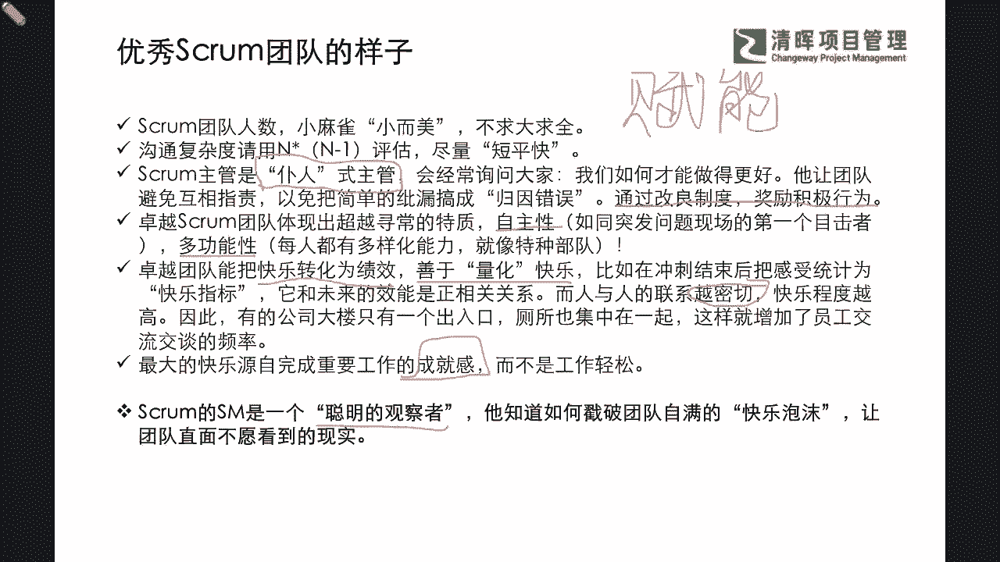
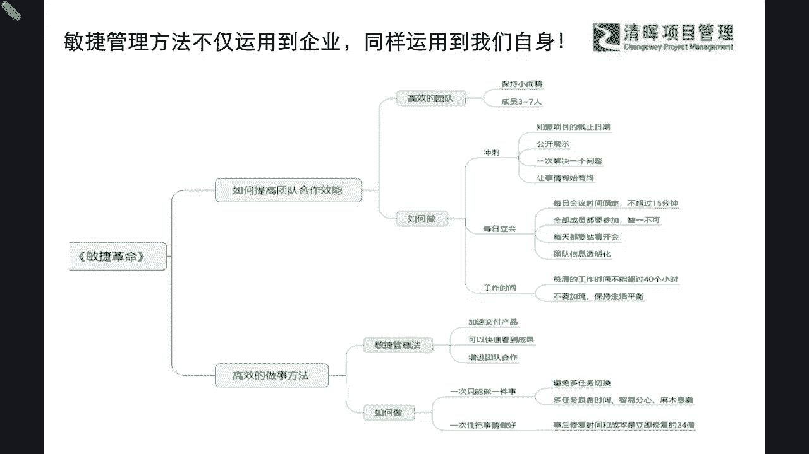
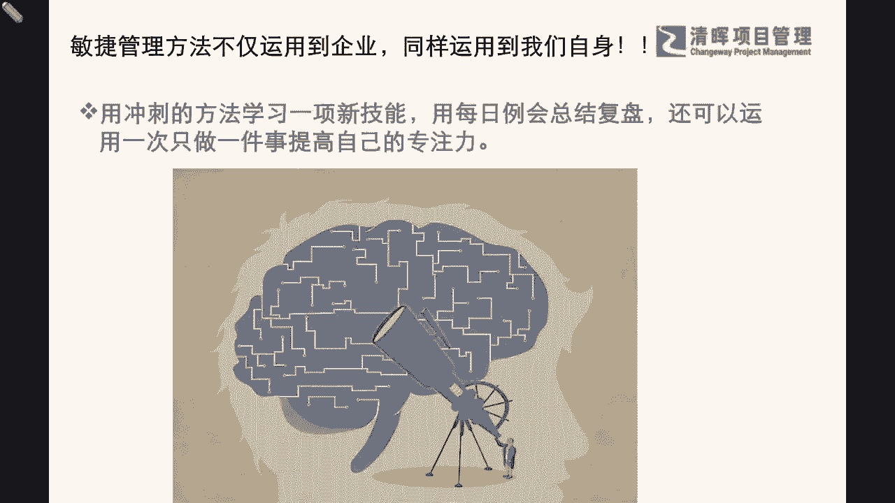

# 敏捷革命--Scrum常规步骤 - P3：3.优秀Scrum团队的样子 - 清晖Amy - BV1kr421F7AS

之后呢我们就会啊，从而总结出来一个小小的一个这个愿景啦，也就是说我们会有一个小型的画像啦，我们的这个优秀的scram团队是长什么样子的，那么通常啊我们一般给这个优秀的这个个人啊，优秀的团队。

甚至优秀的企业都会有一些画像，所以刚才严老师所提到的自画像啊，其实就是同你自身开始，那么我们现在提升到团队啊，你就给自己再总结一些嘛，你怎么样做嘛对吧，如果你是这个SQUM的一个leader。

那你就让你这个什么小而美，就是小麻雀，不要大而全，一下子招那么多人，一开会十几20个人进来，结果讲话讲问题，解决问题的只有那么几个人，是不是，所以这样子可能会给大家造成一些不必要的。

一些什么资源浪费是吧，这是其中非常重要的一点，那么同步呢，我们也需要结合咱们前面前这个讲到的，一个沟通的一个效率和饱和度，来去考虑咱们沟通的复杂程度，比如说我们用N乘以N减12，这个公式来去评估。

尽量做到什么短平快是吧，也就是说我们不要去什么降低我们的效率，任何的效率损失都会是一个什么巨大的浪费，那同步呢，你作为一个这个敏捷团队的一个leader是吧，你其实更应该是以什么样的一种领导力模式啊。

这个我们在PMP的第七版啊，也会有讲到，有称之为管家式和仆人式的这样的一种主管，也就说我们通常都会去主动询问大家，我们怎么样才能做得更好是吗啊，那么这位scar master啊。

他让团队避免互相指责指责啊，聚焦团队的共赢，而不是个人的成败是吧，以免把简单的这种错误搞成了一个什么，就是你推我我推你的一种归因了是吧，那通过改良这种制度奖励正能量的行为是吧，我们通常讲啊。

这个大家不要比较简单的忽视了，这个什么正能量，它其实就在管理学上，我们听了很多的这种叫什么负能是吧，我们想一个领导者想把自己的一些什么经验，教训，自己的一些这种能力来去赋能给团队的时候。

其实就要打破这种什么制度的边界，让大家积极能够参与进来，并且能够吸收可视化的，吸收到这些好的经验和做法是吧，所以我们的负能，就是一种正能量的赋予的一个过程，那么除此之外呢，我们的卓越的敏捷团队啊。

还会体现出非常非常卓越的一些特质，比如说非常的积极自主，如果出现了任何的异常问题，他们一定会第一个出现在现场是吧，来去解决和号召大家来，共同关注和解决这个问题，那么同样我们也会在这个团队当中发现。

我们各自都是什么多样化的，一些专业能力的一些player是吧，一些成员大家就像这个特种作业部队一样啊，有狙击手呀，有骑射手呀是吗，有我们的这个坦克手啊等等，大家都有自己擅长的领域，并且能够严丝合缝。

非常高效率的什么去配合在一起，打赢这场仗是吧，那除那同步呢，我们其实在刚才分享当中提到的，这个优秀的这个敏捷团队，他一定是能够把快乐情绪力，能够转化为什么绩效的一种能力。

善于量化的去管理这种快乐的情绪力，比如说啊我们在每一次这个冲刺结束之后啊，我们的scar master就会把这种每个成员的感受，统计为这种所谓的叫快乐指标，它也会和未来的这个效能啊，是正相关的一个关系。

而且人与人之间的联系，你会发现越密切的时候，快乐程度就越高，啥意思，就是当你感觉团队越来越默契，越来越和谐，这个在我们提到这个PMP啊，这个资源管理那个章节的时候，提到过一个塔克曼团队管理的五阶段。

其实我们经过前期的什么这种震荡啊是吧，我们的规范呐成型啊，一直到我们的成熟阶段时候，大家就越来越有什么默契和背靠背的，一种信任了，那么有了这种默契和背靠背的信任，你会觉得你还有什么担心的吗。

有人都提前帮你什么去把风险排除了是吧，所以这也是为什么你会看到有些办公楼，你有没有观察到，我们一般只有一个主要的出入口，而且这个卫生间啊也都集中在一起，这其实也是在隐形的增加员工交流。

交谈的一些频率是吧，所以这也是一个非常重要的啊，我们著作者认为很有帮助的一个啊团队的画像，那么同时呢，我们也要再次去纠正一个可能性的误解啊，就是我们这个团队虽然是量化了快乐这个指标。

但是这个最大的快乐的源泉，它不完全是源自于什么，重要工作的一些成就感啊，也就是说它不是仅仅看你有没有什么诶，比如说一周工作是不是时间越短越好呢，越轻松越好呢，也不是啊。

他重要的奖就是你有没有获得你的成就感，刚才啊严老师所讲的成就感，就是你要去找到你二八原则的那个部分，你要去列一列是吧，你要去沉淀一下，哪些能够带给你这种个体和公知的，这种价值认可。

这就是你的成就感来源呀是吧，所以你要抓的是这种成就感的效率，而不是轻松，越轻松越好，那不是躺平了吗是吧，那么同步啊，作为我们的这个敏捷教练，我们的scar master。

他也必须要去承担一个比较有挑战的角色，就是一个非常非常聪明的什么官观察者，就是一个smart的一个observer是吧，那么这个聪明的观察者他是非常清晰的，知道如何戳破团队这个自满的快乐泡沫。

让团队直面不愿看到的一个什么现实是吧，所以在这样的一个情形之下，我们更加坚信了一点，就是什么，我们的敏捷团队，他是一个非常非常什么配合极度高效率，并且能产生产生出特别巨大能量和价值，的一种运作模式是吧。

所以我们能看到这样的一个优秀，这个敏捷团队的画像的时候，我们自己都不进，会非常赞同和认可这种理念，只是我们可能也许啊在我们实际落地当中，会有种种的这种啊不适应，或者是有一些需要待改善的部分。

但是我们会知道这肯定是一个正确的，什么趋势和做法，那同步呢在这本书当中。

我们看到的这个敏捷项目管理的方法，它不仅能够运用在企业和项目管理当中，同样啊也能运用到我们的自身，那么在这个环节当中，我会发现敏捷革命这本书，它通过介绍，如何提高团队合作效能和高效的做事方法。

那我们也会去深入啊，引出刚才严老师跟大家通过一些例子呀，通过一些这种啊提纲携领啊，所介绍的如何去形成高效的团队呀，那怎么做呢是吧，怎么做才高绩效呢是吧，也介绍了我们的冲刺啊。

例会和工作时间的这样的一个呃方法，那同步呢通过高效的做事方法，我们也会认可我们敏捷的这种管理法的价值，知道让我们如何短期快速的去交付产品，并且能够快速地看到成果，以及我们在落地当中我们必须要去实现的。

比如说一次只能聚焦一件事情，并且一次要把事情做好做对是吧，在我们整篇的这个书当中，你会发现啊，我们不知不觉也步入了尾声，但是我们刚才所跟大家分享的逐一的模块，其实都是来源于我们这个整本书的。

思维框架当中，非常完整的一个故事线了，那么我们也会希望啊，我们大家如果听完的，这个咱们线上读书会的同学啊，不管你有没有自己还看过这本书，如果没看的就去看一下是吧，看过的你可以二刷一下，看看里面的这些点。

你是否有了一个更深层次的一个理解和认知呢，其实同步啊，我们也在这样的一个环节当中，在我们的读书会当中啊，我们也会去希望大家能更多地把我们的理论。

应用在我们的自身实践，比如说啊，我们就用冲刺的这种方法来去学习，一项新的技能是吧，用每日例会来去总结复盘，还可以运用一次只做一件事儿，这种提高自己的专注力是吧，非常明确。

就是在我们的实践当中来去用到这些理论，那么我们也许有部分的同学，已经给自己了一个新的学习计划了，比如说我们会在年后啊，3月份，也有部分同学也许会考取PMP之外，下一个认证证书。

那么你是否就可以用这个冲刺的方法来，然后每天来啊有这样的一个复盘，并且你一次聚焦，比如说做题就是做题啊，绝对不是什么碎片式的去做题是吧，我们一次只做一件事来提高自己的专注力，提升自己的输出效率和效果。

那么这其实就是切切实实的在我们身边，能够去助力到我们的一些敏捷管理方法，的一个落地应用，那么我们分享完这本书的整体啊，我也严老师也想啊，再次来去啊，送给大家一句话啊，也是这本书当中我们的著作者。

他其实啊虽然没有在这本书当中提到，但是他其实一直会有一个理念啊，灌输于我们整个他的一些著作书。

这个这个价值当中，就是他会需要啊能让大家感受到敏捷的价值，就是一般啊，我们不夸张地讲，它是用一半的时间能够做两倍的事，就是我们通常讲就是事半功倍是吧，事半功倍，那么在这样的一个基础之上呢。

其实这才是我们职场人学习职场人做管理，应该去走的一个方向，因为我们永远是什么，时间是价值，时间是生命，甚至时间是不可再生资源是吧，所以我们希望我们在一定的时间颗粒度之内。

我们能够尽可能的完成更多的成果交付，这也是为什么严老师在本次读书会开始的时候，一再跟大家强调，如果大家今天投入了两两个小时的时间，那么就请认真的专心的来去听，来去互动是吧。

我们不希望你在边做其他的事边听啊，还有没有听到的是或者是遗漏的是吧，这样效率可能就会相对比较弱啊，也就是说我们花了时间，但是你没有达到效果，其实不怪别人是吧，一定要专心啊。

你会知道专心的能量是非常非常大的，也就是说我们的日光灯和激光，激光之所以能够穿透日光灯，不能穿透，就是在于是否能够聚焦是吧，所以我们一再也在跟大家强调，我们敏捷的理念，实实际上是非常适用于。

我们平时的学习和工作当中的那同步呢，我们也到了我们的这个分享结束的尾声了。