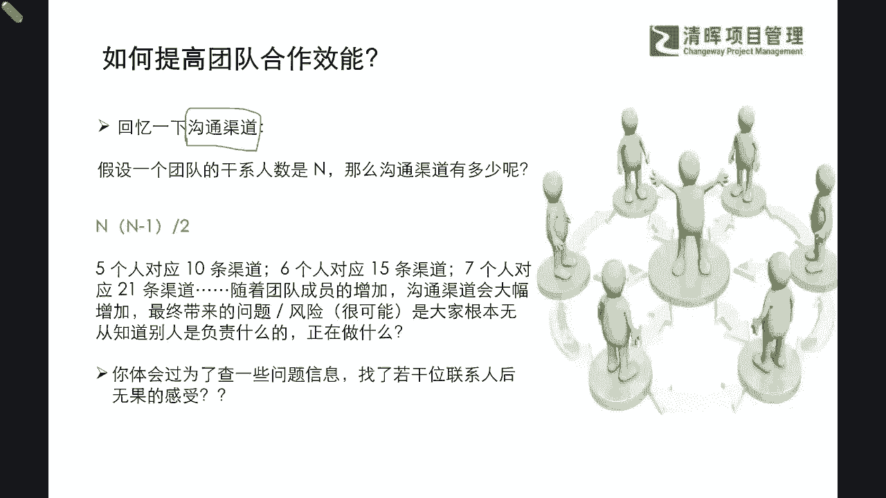
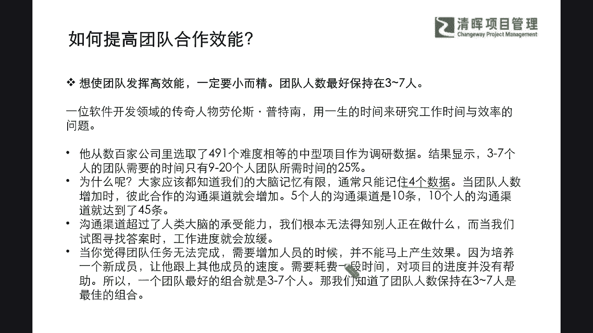
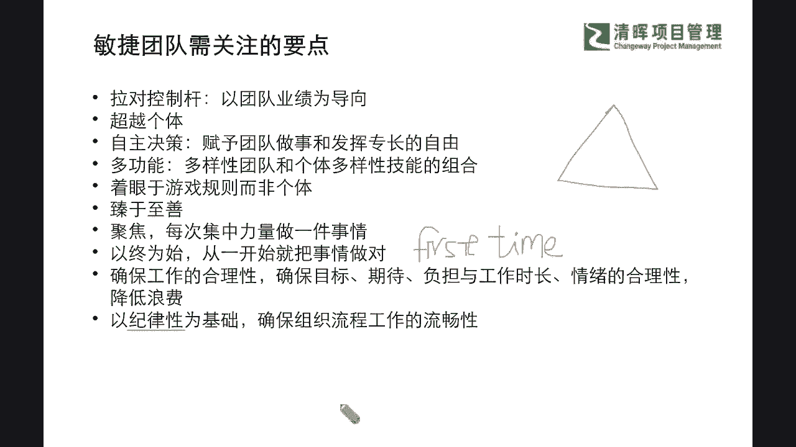
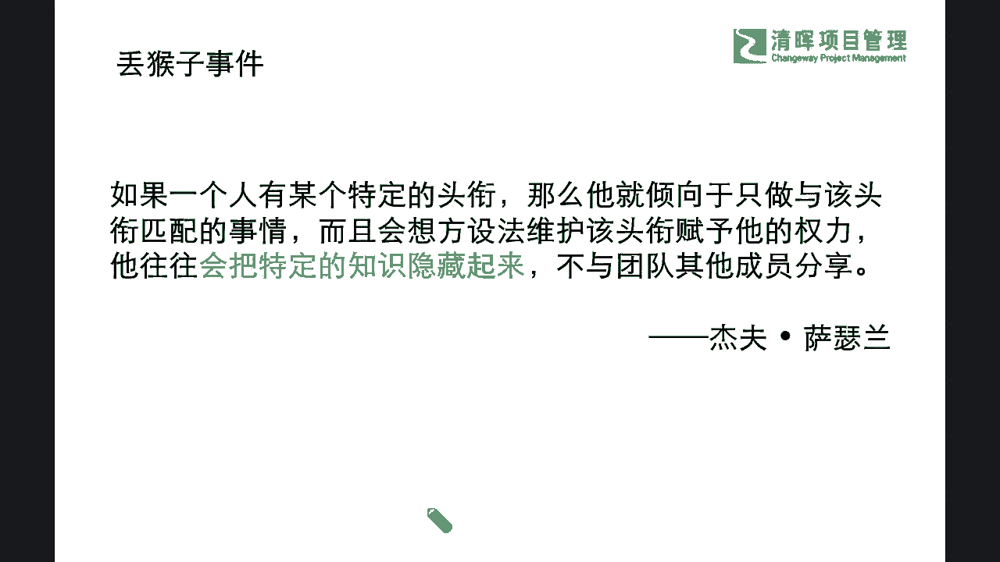
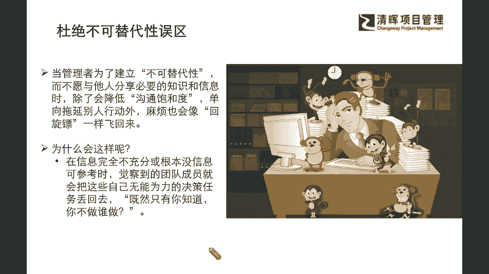

# 敏捷革命--Scrum常规步骤 - P4：4.如何提高团队合作效能 - 清晖Amy - BV1kr421F7AS

企业来看看啊，首先他提到了，那我们既然知道要时间管理，要去做这样的一个沟通管理，那么如何提交啊，如何进一步的这个提交更好的一个结果，并且提高切实提高团队的合作的一个效能呢。

那我们先暂且回忆一个简单的一个，这个理论点啊，就是大家在PMP之前都已经是非常熟悉啊，我们也希望在评论区啊，在评论区大家也可以抠一下啊，我们之前提到过一个术语叫做沟通渠道，大家是不是还有一些印象啊。

那么假设一个团队的干系人，这个人数是N，那么沟通渠道有多少条呢，我们有没有同学还记得，这个沟通渠道的一个计算方法呀，如果还记得的话，可以在你的评论区抠出来啊，抠出来啊。

我们也会结合大家的这个讨论的积极程度，和大家参与活动的积极程度啊，我们也会把我们的这个书啊赠给大家啊，因为永远，我们都是希望大家把这种他区变自虚是吧，大家还记得吗，这个怎么来去算这个沟通渠道呢，啊。

我们在PMP当中是不是多少有一点点印象啊，啊我看到这个媛媛同学说了，N乘以N减12，非常好啊，非常好啊，看起来记得这个非常利索，那我们其他同学，你是不是考完证之后还记得这些呢。

你你会觉得这个东西没有用吗，啊哈我们很多同学可能严老师问的这句话，也许问出了一部分同学的心声是吧，就是很多同学也是考完了证之后呃，很迷茫的去咨询，说我怎么感觉这个没有帮到我的实际工作呢，其实在这里啊。

我们再次去强调，不是没有帮到，而是我们真的不要把它完全当应试是吧，所以可能在这样的一个过程当中呢，他一定你记住了，你一定有所帮助，我看豪文同学也敲出来了，说这个啊这个是不可能拿着手机啊，N乘以N减12。

没错啊，好非常好啊，媛媛同学，豪文同学记得非常牢啊，那我们既然知道这样的一种计算方法，理论我们是get到了，我相信可能有一部分同学啊，如果大家还是一样的啊，如果你没有在一个相对嘈杂的环境。

或者是在开车啊，当然安全第一啊，或者是你不方便手部操作的话啊，我们希望大家尽可能的参与到，咱们的互动当中来啊，因为毕竟沟通只有闭环了才是起作用的是吧，大家都学过吗啊，那么我们既然知道了这么一个公式。

那我们来看看啊，那这个N乘以N减12，它有什么样的一个作用呢，啊比如说我们今天有五个人是吧，你五个人的话就会对应到十条的这个，沟通渠道是吧，六个人就对应了15条，那七个人呢就对应21条。

随着这个团队成员不停的增加，沟通渠道会大幅度的增加，那最终会带来什么，你要跟很多个人去沟通，就会带来很多的这种什么精力的分散呀对吧，问题的这种触答上的一些这种效率低呀，风险不可控啊对吧。

那大家可能都不知道这么多人，你到底哪个人是在负责什么东西，应该找谁呢，是不是，所以谁现在又在做些什么呢，那其实这些看起来很简单的一些问题，你可能在增加了关系人之后，你都会发现。

你根本无法做到第一时间的一个什么掌控是吧，所以你无法掌控不确定性变强，你就风险越来越高嘛，那么在这样的情况之下，我们不仅要问一问大家啊，你在看到这样的一种情形的时候，你是不是有一些潜在的记忆呀。

你可能原来为了去查一些什么问题的，信息和背景，你会找了很多个什么干系人，结果打听了很多的信息是吧，结果呢这个信息他还是没有拿到正确的完整的，你也非常的什么沮丧是吧，所以可能在这个过程当中呢。

我们也能够去体会到，我们的团队合作效能的提升有多么的关键。

多么的重要，那么在这样的一种情形之下呢，我们就可以再去看看，那么我们具体要怎么样去提高团队合作效能呢，从我们的这个沟通渠道数上，我们就能得出一个结论，就是什么，我们想要使团队发挥高效能。

那就一定要小而精，就是当然我们也不是讲越少越好，如果变成你一个人，那就什么这个就是你这个孤胆英雄了是吧，我们至少要3~7人或3~9人，这样的一个这个数量是吧，那一般推荐的是3~7人，那为什么这个推荐呢。

是因为我们曾经有一位啊，这个软件开发领域的一也是一位大师级的人物，叫劳伦斯普特南，他用一生的这个时间来去研究，这个工作时间和效率的这样的一个，互相的这个影响的一个问题啊。

那么他也从数百家公司里面选了490一个，难度相等的一个中型项目，作为他的一个调研样本，那么这个结果里面就看到了，通常呢在3~7人的团队当中呢，啊，他就可以用一个比较少的时间啊。

因为他会发现如果是超出了九个人，比如说9~20个人的团队，他可能就会多出25%的时间，就是浪费了25%的效率是吧，为啥为啥会浪费这部分的效率，为啥人多就会浪费，除了我们要不断的去沟通之外呢。

其实最根本的一个原因就是，因为咱们大家都知道，我们的大脑是有遗忘曲线的，我们的记忆力，我们的经历都是非常有限的，而且我们非常量化的，大家如果稍微去了解过一些心理学的话，就会知道有部分的著述也会告诉我们。

我们一般通常能记住，就是四条左右的一个数字啊，多了记不住对吧，那当团队的人数要不断的增加的时候，你的沟通渠道变得更复杂的时候，你十个人的这种沟通渠道就会达到45条了，你想想看啊。

这样子的一个大批量的沟通渠道，原，远远超出了你大脑的一个什么合理的承受能力，你根本没有办法得知，批人正在做什么，是不是，所以当我们试图去找答案的时候，工作进度他就一定会被影响，一定会放缓。

因为你就像CPU一样，已经在用一个电脑一样，你同时开了很多个文件，大家都有背CPU烧爆的时候是吧，也就是说你同时开了很多，你发现它一直在转圈不动了，其实大脑也有这样的时候是吧，它就一定会影响他。

你并行很多工作，他就一定会影响这样的一个效率，当你觉得这个团队任务为无法完成，你要不断去增加人员的时候，你就必须要去考量到你增加了一个干系人，你怎么样能够去解决我们的一个，什么速度的问题是吧。

这就是他讲的小而精的一个重点，那么在这个重点之上呢，我们这本书当中也提出了非常重要的一，些精华的点啊，我也用一些比较更加简要的方式，给大家呈现一下啊，那他提出了敏捷，所谓叫敏捷团队。

你能形成一个敏捷团队，你必须要去关注的一些要点，比如说你需要去拉对这个控制的杠杆，以团队业绩为导向，而不是个人这个某一个功能的团队是吧，不互相推诿，就是刚才所说的什么，不以个人而已。

聚焦团队的输出为导向，那么同样我们在这个过程当中就会超越个体，并且通过快速的决策来去让团队，有赋予团队这样的一个发挥专长的自由是吧，而且我们你会发现啊，这个敏捷团队一般都是什么，个体多样性非常强的。

就是大家你看开发团队，他是深深专于技术开发的，那敏捷教练呢又是非常懂这种管理的，并且可能我们的这个呃产品负责人，我们的PO呢他又非常懂客户，懂这个产品的一个用户故事，怎么切分，怎么管理这些优先级的是吧。

所以大家都是多样性的团队和个体，多样的一个组合，那么通常这样的一个多功能团队呢，也会去注重非常重要的，比如说我们讲的铁三角的规则，你干你的，我干我的，各司其职的效率是吧，就是我们通常一般来讲。

我们不希望项目经理去什么变成救火是吧，当然也不希望其他人啊，去做项目经理的职责是吧，这其实也是不太专业的对吧，所以我们就是要建立这样的一个，各司其职的游戏规则，那么把自己把每一个专精的职能来去臻于至善。

要去深度的去做好是吧，而且我们聚焦每次集中力量去做好一件事情，以终为始，一开始第一次first time啊，第一次就把这个事情做对，其实我们讲怎么样能杜绝这个浪费呢，也就是说你第一次啊。

就是我们非常简单一个问题，你怎么样能不去订正错误呢，就是你第一次就考100分是吧，所以可能我们讲的first time，这个时效性和它的重要的一个交付成果，是非常非常关键的一个指标，同步呢。

我们也要确保我们团队的一个什么这个啊，多元性之下的和谐程度，就是要确保工作的合理性啊，因为在我们这本书当中，还提到非常有趣的快乐指标啊，稍等我们也会去跟大家分享他的这个理念，那么在这样的一个过程当中呢。

我们要确保目标期待和负担与工作的时间长短，情绪的这种什么周期，它能够形成一个比较好的平衡来去，最大可能降低浪费，并且呢我们能形成这种纪律性，其实所谓的纪律性就是什么，就是默契啊。

默契也就是说我们不需要有这种特别强的，有一个监管的人不停在给什么，给我们抽鞭子是吧，我们自己非常清晰的知道我们组织过程工作，谁应该去做什么任务，谁应该怎么去配合谁是吧，所以这是他所提到的需要关注的要点。

那么除此以外呢，我们在这本书当中还会看到非常有趣的讲到的。

在这个敏捷过程当中会发生的一些长见的问题，什么问题呢，比如说第一个叫丢猴子的事件，那杰夫萨瑟兰呢他提到这个问题的时候，用一句话来去概括了一下，说我们其实每个团队当中啊，如果有一个人，他有某个特定的头衔。

那么他就倾向于只做与该头衔匹配的一些事情，而且会想方设法维护该头衔赋予他的权利，那这个人呢往往会把特定的知识隐藏起来，而不与团队其他成员来分享，这句话什么意思啊，其实大家有没有get到，实际上就是什么。

你的屁股决定了什么脑袋是吧，也就是说，其实往往我们一个人的潜能是非常非常巨大的，那如果你在这样的一个组织当中，能够充分啊做好背靠背，能够提醒到互相的这样的一个啊风险事项。

并且能够快速的去做好迭代和反应的话，那实际上这是一个团队的好的效率的一个体现，那在这个团队效率体现之上呢，我们也会去看到，将如何看到我们整整体的一个呈现是吧，那么在这个整体呈现当中。

我们就会发现我们有一些管理的误区。

什么误区啊，其实所谓的丢猴子，就是你自己认为你自己的不可替代性误区是吧，如果你觉得你自己是一个什么专家啊，别人干的活都不如你啊，就是我们而不愿与他人分享一些必要的，这种关键信息和这种知识的时候。

除了会去降低这种沟通的一个什么，充分性和饱和度之外，你可能会拖延对方的和团队的一些行动，而且你会发现推来推去什么丢来丢去，还会再回到你自己的什么身上是吧，那为啥会这样子呢。

其实最常规的一个点就是我们的信息差，你的团队成员，当他没有知道跟你一样的一些必要信息的时候，他就会觉得你是不是在什么丢问题给我，而干什么，可能想要丢一个锅，让我来背是吧。

因为他不知道你的同等信息的一些背景，他会认为这个事情可能只有你知道，只有你能解决，那既然这样的话，那既然只有你知道，那何不把这个事情再丢回去给你自己做呢是吧，所以可能会发现发现和发生这种丢来丢去。

推卸责任的这种丢猴子的现象是吧，所以我们要杜绝这种感觉，我自己不可替代，我就不愿意跟团队去分享一些必要的一些信息，当然是敏感的商业信息不去赘述，但是我们讲了毕业必要信息，就是要去辅助你的项目管理。

要去辅助你的工作开展的一些，关键的项目的背景信息，这些是一定要透明化的，比如说敏捷，他就会非常非常强调，我们要可视化，去管控进展和交付的一个反馈和成果是吧，也就是说你不仅要看到。

而且要实实实在在的演示出来，并且交付了这样的东西，它才算是真正的交付和这个什么绿色是吧，所以这些就是来杜绝它的这种什么，盲区和黑盒子事件是吧。

所以我们知道了这样的一个理念之后。