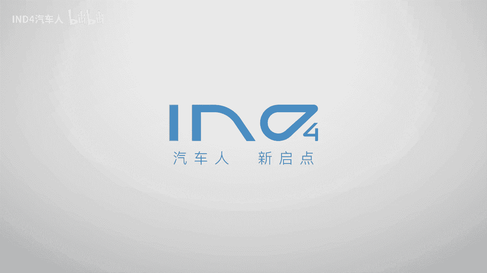
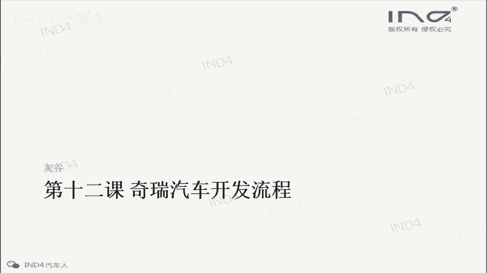
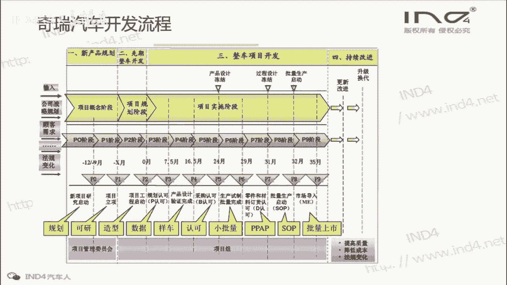
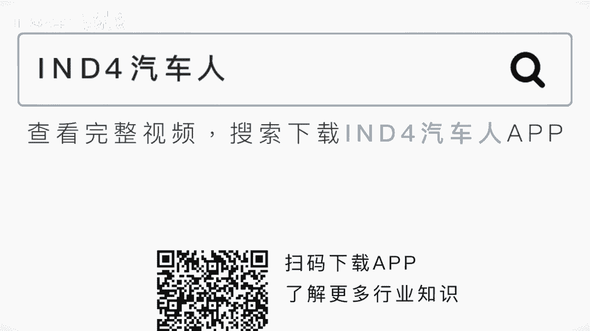

# 整车开发-如何做好项目管理（十二） - P1 - IND4汽车人 - BV1vV4y1h7RS

🎼。

大家好，又到了这个整策新项目开发，如何做好项目管理的课程时间。今天呢我们来到了这个第十二节课，也是呃奇瑞汽车开发流程这个板块的第二节课。

上节课呢我们讲了这个奇瑞汽车开户流程的整个大的版概要。

这节课呢我们来讲细节啊，首先啊。首先一个嗯节点就是P0。上节课我们讲到了它一共有10个10个节点，从P0到P9。那么第一个节点呢P0。P0的意思呃意思是什么呢？它是新项目研究启动。嗯。

这个节节点呢这个定义我就不读了，大家看一下啊。呃，怎么理解呢？这个节点其实我们如果作为这个项目经理来说是比较简单的啊，只是给公司的高层写一个项目立项的报告。论述一下这个车型的定位啊，外形的风格啊。

准备销售的地区啊，市场前景等等内容。然后呢等待老就是这个公司老板的批复啊，是否同意。呃，这个工作呢虽然简单，但是这个阶这个阶段是非常重要的一步，是整个项目这个可以说是垫击之笔，这一步不能有大的错误。

就是差错啊。如果。在这一步就这个方向就错了啊。那定位就错了，就整个项目后面不管做的多么的好，都是一个失败的项目。🎼。

