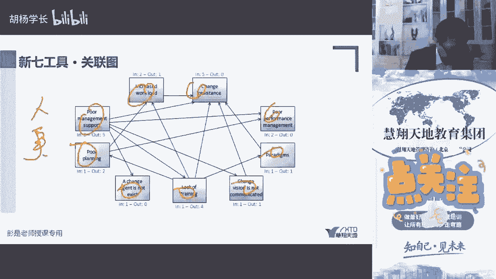
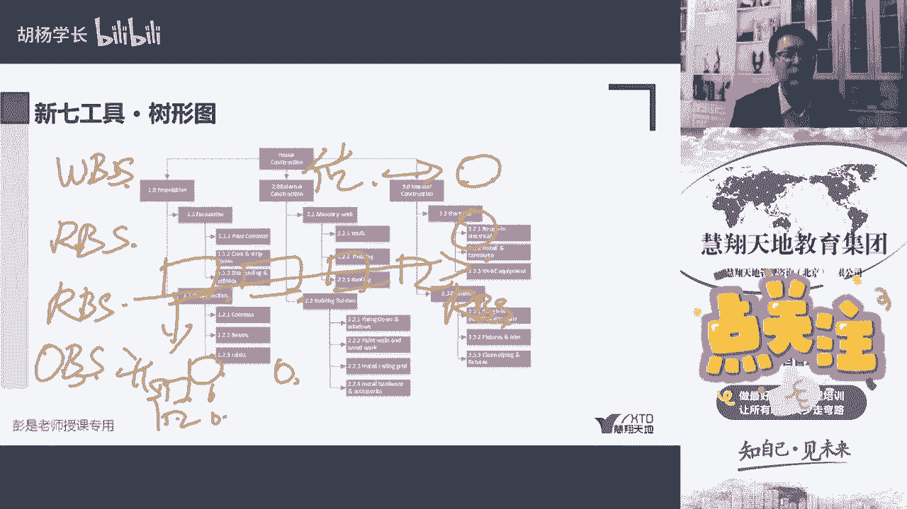
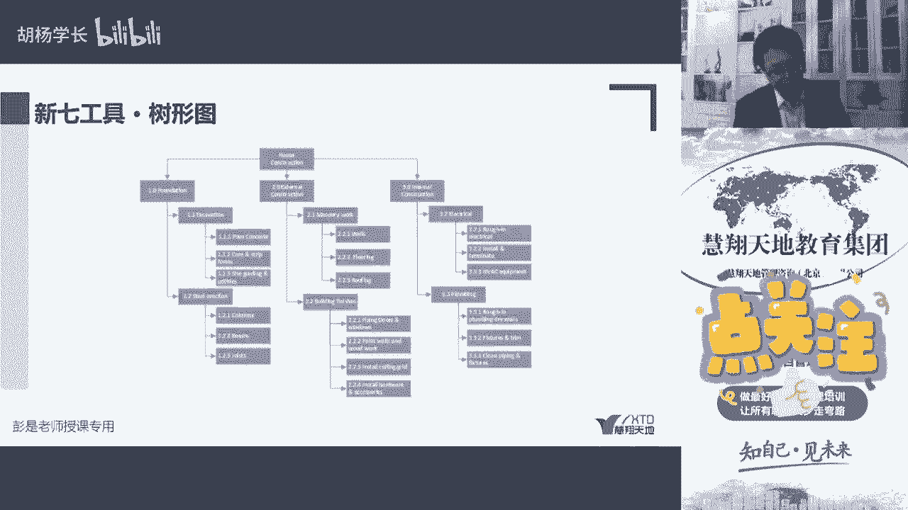

# 新七工具 - 树形图 - P1 - 慧翔天地软考 - BV1EM41157TX

然后再往下一个叫树形图，这个听一听就完了，树形图wb，以及啊咱还没讲到啊，讲了资源估算，活动估算活动资源估算活动资源输出，活动资源需求估算依据，以及rbs 2 bs就是人对吧，物料横向类别。

纵向类型人由开发人员，测试人员，设计人员，开发人员又可以问对吧，什么前台的，后台的高级的中级的一层一层，通过这种结构化的东西，通过这种结构化的东西体现我们的工作，我们的资源，我们的风险。

后面还会学一个2b我们的工作，我们的资源，我们的风险以及我们的各个团队，各个部门o b s organization。

体现他们的构成，就像咱们这个教材书上这个最开始那个章，节目录，第一章，第二章，第三章，第一章下面有啥内容，第二章下面有啥内容，也是一种树形结构，有兴趣的小伙伴可以去找研发人员聊一聊，哈对吧。

什么什么塑形算法算了什么什么的，聊一聊，写数形结构很讨厌，很恶心啊，逻辑思维不清楚，写不好啊，这是树形图，展现各种各样的层级层级分解结构啊。

